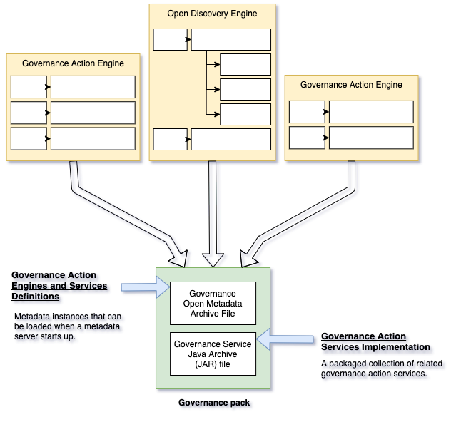

<!-- SPDX-License-Identifier: CC-BY-4.0 -->
<!-- Copyright Contributors to the ODPi Egeria project. -->

# Building a Governance Pack

A governance pack is a collection of pre-defined governance engines
and services definitions plus governance service implementations.
This is illustrated in Figure 1.

A team can use the governance pack to distribute the governance engine function
to different metadata ecosystems.

----
* Return the [Open Survey Framework Overview](..)

----
License: [CC BY 4.0](https://creativecommons.org/licenses/by/4.0/),
Copyright Contributors to the ODPi Egeria project.