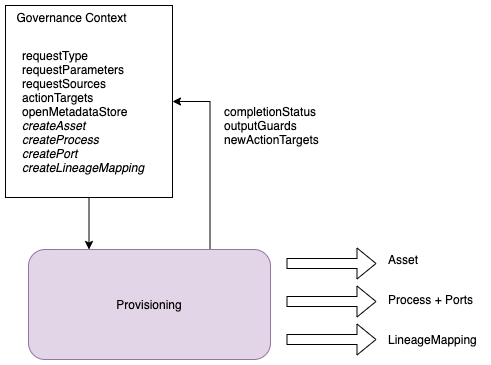

<!-- SPDX-License-Identifier: CC-BY-4.0 -->
<!-- Copyright Contributors to the ODPi Egeria project. -->

# Provisioning Governance Service

Invokes a provisioning service whenever a provisioning request is made.  Typically the
provisioning service is an external service.  It may also create lineage metadata to
describe the work of the provisioning engine.

> **Figure 1:** Governance context for the provisioning governance service

----
* Return the [Open Survey Framework Overview](..)

----
License: [CC BY 4.0](https://creativecommons.org/licenses/by/4.0/),
Copyright Contributors to the ODPi Egeria project.