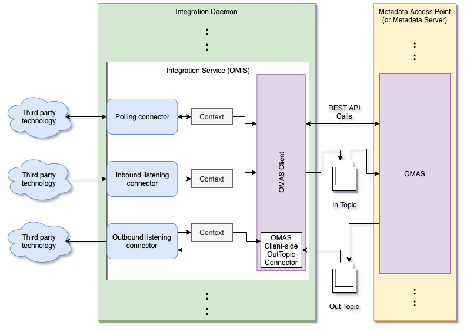

<!-- SPDX-License-Identifier: CC-BY-4.0 -->
<!-- Copyright Contributors to the ODPi Egeria project. -->

# Integration Daemon Services Server

The integration daemon services server module contains the server-side
implementation of the integration daemon services.

Figure 1 shows the internal workings of the integration daemon.

> **Figure 1:** Inside the integration daemon

----
* Return to the [Integration Daemon Overview](..)

----
License: [CC BY 4.0](https://creativecommons.org/licenses/by/4.0/),
Copyright Contributors to the ODPi Egeria project.