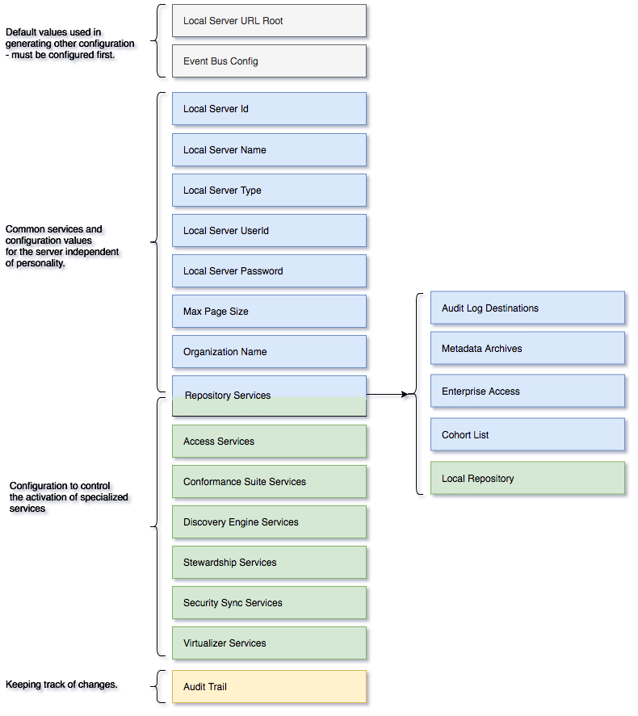

<!-- SPDX-License-Identifier: CC-BY-4.0 -->
<!-- Copyright Contributors to the ODPi Egeria project. -->

# Configuration Documents

A configuration document provides the configuration parameters for a single
[OMAG Server](omag-server.md).
It is structured into elements that each describe the
configuration properties of an aspect of the OMAG Server.

Figure 1 provides more details.

> **Figure 1:** Structure of the configuration document

At the top are **Local Server URL Root** and **Event Bus Config**.
Both of these elements provide default values for other configuration
elements.

Local server

The sections are as follows:

* Common default values to use when creating other configuration elements.
* Basic properties of the logical OMAG server.
* Configuration for specific subsystems.

# Further reading

* [OMAG Server Personalities](omag-server-personalities.md) - configuration
patterns for different types of OMAG servers.
* [Open Connector Framework (OCF)](../../../../frameworks/open-connector-framework) -
to understand more abut open connectors and connections.

----
License: [CC BY 4.0](https://creativecommons.org/licenses/by/4.0/),
Copyright Contributors to the ODPi Egeria project.