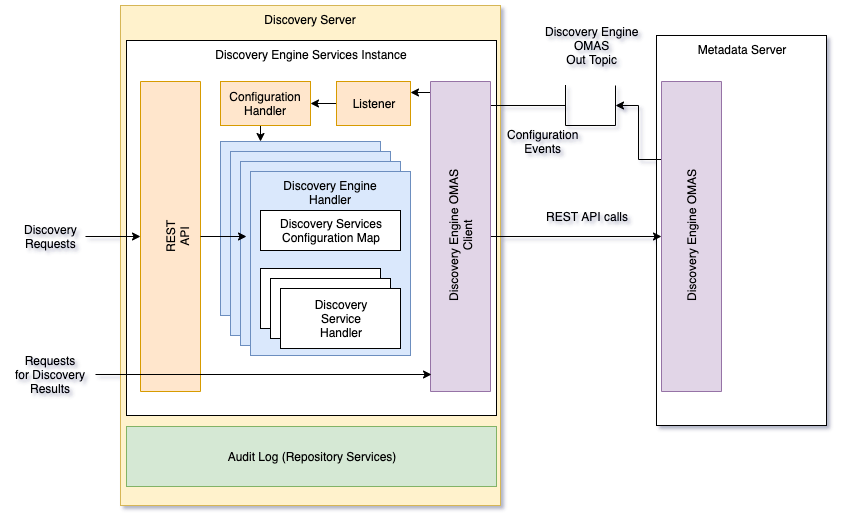

<!-- SPDX-License-Identifier: CC-BY-4.0 -->
<!-- Copyright Contributors to the ODPi Egeria project. -->

# Discovery Engine Services - server side

The **discovery-engine-services-server** module contains the server-side
implementation of the server that hosts one or more discovery engines.

It is shown in figure 1:

> **Figure 1:** Structure of the discovery engine services running in a discovery server

----
License: [CC BY 4.0](https://creativecommons.org/licenses/by/4.0/),
Copyright Contributors to the ODPi Egeria project.