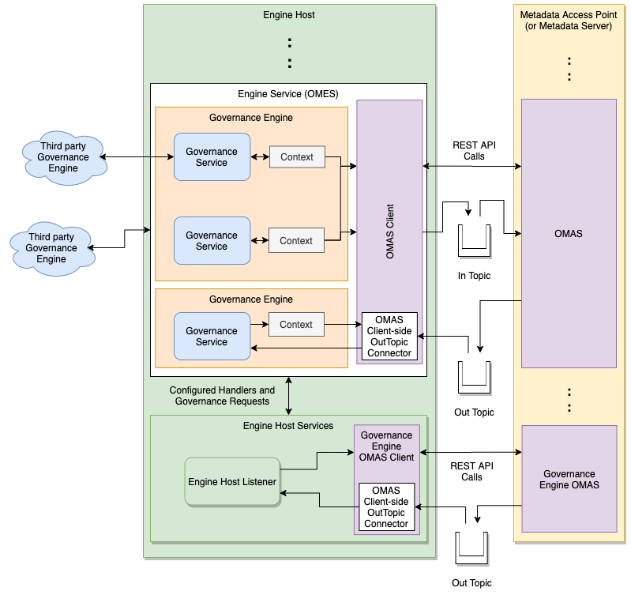

<!-- SPDX-License-Identifier: CC-BY-4.0 -->
<!-- Copyright Contributors to the ODPi Egeria project. -->

# Engine Host Services

The engine host services provide the base implementation of the
[Engine Host](../../admin-services/docs/concepts/engine-host.md) OMAG Server.

It manages the start up and shutdown of the 
[Open Metadata Engine Services (OMES)](../../engine-services)
as well as retrieve the configuration of their governance engines
and governance services through the 
[Governance Engine OMAS](../../access-services/governance-engine)
running in a [Metadata Server](../../admin-services/docs/concepts/metadata-server.md).

The engine host services also provide a REST API to
query the status of the governance engines running in the server.

The internals of the Engine Host OMAG Server are shown in Figure 1:

> **Figure 1:** Inside the Engine Host OMAG Server

## Further information

There is more of an overview of open governance in the
[Governance Action Framework (GAF)](../../frameworks/governance-action-framework).

Instructions for [configuring an Engine Host OMAG Server](../../admin-services/docs/concepts/engine-host.md) are found in the
[Administration Guide](../../admin-services/docs/user).

Instructions for defining Governance Engines and Governance Services are
located under the [Governance Engine OMAS User Guide](../../access-services/governance-engine/docs/user).

----
* Return to the [Governance Servers](.).

----
License: [CC BY 4.0](https://creativecommons.org/licenses/by/4.0/),
Copyright Contributors to the ODPi Egeria project.