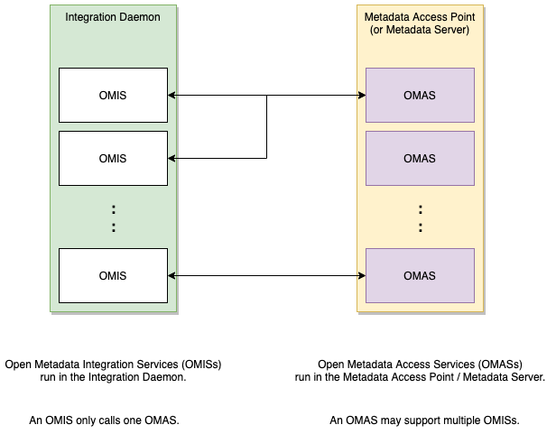

<!-- SPDX-License-Identifier: CC-BY-4.0 -->
<!-- Copyright Contributors to the ODPi Egeria project 2020. -->

## Integration Daemon Services

The integration daemon services provide the implementation
of the [Integration Daemon](../../admin-services/docs/concepts/integration-daemon.md)
OMAG Server which is responsible for operating the 
[Open Metadata Integration Services (OMISs)](../../integration-services).
The integration services are responsible for running connectors that exchange metadata with third party
technology.

Each type of integration service supports a particular type of connector interface that is designed to exchange
metadata with a specific [Open Metadata Access Services (OMAS)](../../access-services).
For example, the [Database Integrator OMIS](../../integration-services/database-integrator) calls the
[Data Manager OMAS](../../access-services/data-manager).

> **Figure 1:** The pairing of integration services with access services

Inside the Integration Daemon, the integration services
host the [integration connectors](docs/integration-connector.md) that manage the
exchange of metadata with third party technology. 

> **Figure 2:** Inside the integration daemon

## Further information

* [Trouble shooting issues](../../../open-metadata-publication/website/diagnostic-guide/integration-daemon-diagnostic-guide.md) with the integration daemon
* [Configuring](../../admin-services/docs/concepts/integration-daemon.md) the integration daemon
* Learning more about [integration connectors](docs/integration-connector.md)
* [Solutions](../../../open-metadata-publication/website/solutions/data-manager-integration) using the integration daemon

----
* Return to the [Governance Servers](.).

----
License: [CC BY 4.0](https://creativecommons.org/licenses/by/4.0/),
Copyright Contributors to the ODPi Egeria project.