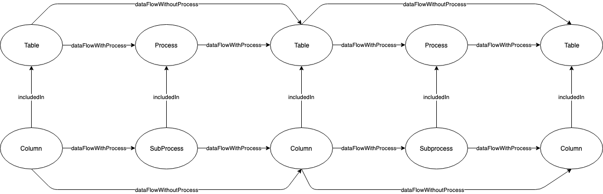
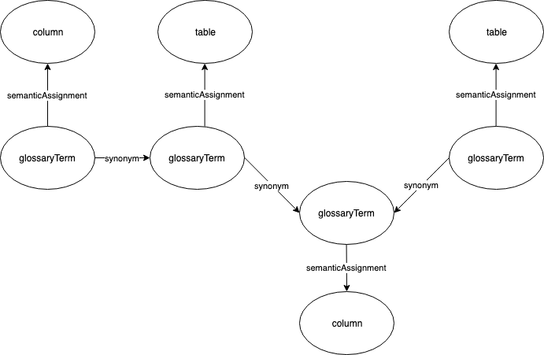

<!-- SPDX-License-Identifier: CC-BY-4.0 -->
<!-- Copyright Contributors to the ODPi Egeria project. -->


# Open Lineage Services

The Open Lineage Services provides a historic reporting warehouse for lineage. It listens to events that are sent out 
by the Asset Lineage OMAS, and stores lineage data in a database. This lineage can then be queried through
the Open Lineage Services client and by its REST API, for example by a lineage GUI. 

While the data format of events sent
out by the Asset Lineage OMAS are in the Open Metadata format, Open Lineage services store lineage data in a very basic
data format in order to optimize query performance. Instructions on how to configure an OMAG server to run the 
Open Lineage Services can be found further below.

## Starting the Open Lineage Services

1. Build the open-lineage-janus-connector jar by running:

```
mvn clean install
```

The jar can now be found in the target directory of the open-lineage-janus-connector module:

```
/open-metadata-implementation/adapters/open-connectors/governance-daemon-connectors/open-lineage-connectors/open-lineage-janus-connector/target/
```

Add the jar (with dependencies included) to the classpath of the server-chassis-spring module.

2. Start the [OMAG Server Platform](../../../open-metadata-resources/open-metadata-tutorials/omag-server-tutorial) and
run the default calls for setting the server URL, eventbus and the cohort.

3. Set the configuration for the Open Lineage Services by providing a database connection object and setting the topic name of Asset 
Lineage OMAS Out topic via the following HTTP request:
```
POST {serverURLRoot}/open-metadata/admin-services/users/{userId}/servers/{serverName}/open-lineage/configuration
```
With the following body: 
```json
{ 
    "class":"OpenLineageConfig",
    "openLineageDescription":"Open Lineage Service is used for the storage and querying of lineage",
    "inTopicName":"server.omas.omas.assetlineage.outTopic",
    "openLineageBufferGraphConnection":{ 
        "class":"Connection",
        "displayName":"Buffer Graph Connection",
        "description":"Used for storing lineage in the Open Metadata format",
        "connectorType":{ 
            "class":"ConnectorType",
            "connectorProviderClassName":"org.odpi.openmetadata.openconnectors.governancedaemonconnectors.openlineageconnectors.janusconnector.buffergraph.BufferGraphConnectorProvider"
        },
        "configurationProperties":{ 
            "graphDB":"berkeleydb",
            "graphType":"bufferGraph",
            "storageBackend":"berkeleyje",
            "indexSearchBackend":"lucene"
        }
    },
    "openLineageMainGraphConnection":{ 
        "class":"Connection",
        "displayName":"Main Graph Connection",
        "description":"Used for storing lineage in a format optimized for querying lineage",
        "connectorType":{ 
            "class":"ConnectorType",
            "connectorProviderClassName":"org.odpi.openmetadata.openconnectors.governancedaemonconnectors.openlineageconnectors.janusconnector.maingraph.MainGraphConnectorProvider"
        },
        "configurationProperties":{ 
            "graphDB":"berkeleydb",
            "graphType":"mainGraph",
            "storageBackend":"berkeleyje",
            "indexSearchBackend":"lucene"
        }
    }
}
```

4. Start the instance of the OMAG Server by issuing the following HTTP request:
    
```
POST {serverURLRoot}/open-metadata/admin-services/users/{userId}/servers/{serverName}/instance
```

## Removing the Open Lineage Services from the server configuration

Remove the Open Lineage Services from the server configuration by issuing the following HTTP request:
    
```
DELETE {serverURLRoot}/open-metadata/admin-services/users/{userId}/servers/{serverName}/open-lineage/configuration
```

## Inside the Open Lineage Services

The Open Lineage Services data format is structured as follows:


*The labels of the edges between columns, tables and processes. Glossary term nodes have been omitted for clarity.*


*The labels of the edges between glossary term nodes and column and table nodes.*

The nodes have the following properties:

**Glossaryterm**

- Guid
- nodeID
- displayName
- qualifiedName
- glossary.guid
- glossary.name
- category

**Table**

- guid
- nodeID
- displayName
- qualifiedName
- glossaryTerm.displayName
- glossaryTerm.guid
- host.displayName
- host.guid
- database.displayName
- database.guid
- schema.displayName
- schema.guid
- Zones
- System
- Organization
- Geographical Location

**Column**

- Guid
- nodeID
- displayName
- qualifiedName
- glossaryTerm.displayName
- glossaryTerm.guid
- host.displayName
- host.guid
- database.displayName
- database.guid
- schema.displayName
- schema.guid
- table.displayName
- table.guid

**Process**

- guid
- nodeID
- createTime
- updateTime
- formula
- displayName
- processDescriptionURI
- version
- processType

**SubProcess**

- guid
- nodeID
- process.guid
- createTime
- updateTime
- formula
- displayName
- processDescriptionURI
- version
- processType


----
License: [CC BY 4.0](https://creativecommons.org/licenses/by/4.0/),
Copyright Contributors to the ODPi Egeria project.