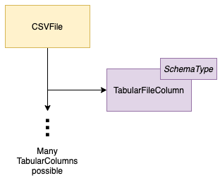

<!-- SPDX-License-Identifier: CC-BY-4.0 -->
<!-- Copyright Contributors to the ODPi Egeria project 2020. -->

# Files Integrator Open Metadata Integration Service (OMIS)

The Files Integrator OMIS supports the collection of information about files
stored in a filesystem for and then storing it in the open metadata ecosystem.

It supports a type of [integration connector](../../governance-servers/integration-daemon-services/docs/integration-connector.md)
that are able to create [DataFile](../../../open-metadata-publication/website/open-metadata-types/0220-Files-and-Folders.md)
and [FileFolder](../../../open-metadata-publication/website/open-metadata-types/0220-Files-and-Folders.md) assets of various types
along with descriptions of the structures of the data that they store.

Optionally, this metadata can be tied to an [FileSystem](../../../open-metadata-publication/website/open-metadata-types/0220-Files-and-Folders.md)
or a [FileSystem](../../../open-metadata-publication/website/open-metadata-types/0220-Files-and-Folders.md).

## CSV Files

Figure 1 shows the types of metadata for CSV files that integrators connectors can create with this integration service.

> **Figure 1:** CSV File metadata supported by the Files Integrator OMIS 

The structure of a CSV file is made up of [TabularColumn](../../../open-metadata-publication/website/open-metadata-types/0530-Tabular-Schemas.md)s.

Figure 2 shows the open metadata types used to represent the CSV File metadata created through this service.

> **Figure 2:** CSV file open metadata types supported by the Files Integrator OMIS 

If a FileSystem or FileManager is defined, any CSVFile asset created is automatically linked to it using the
[ServerAssetUse](../../../open-metadata-publication/website/open-metadata-types/0045-Servers-and-Assets.md)
relationship.
When a TabularColumn is created for the file,
the service automatically inserts the
[AssetSchemaType](../../../open-metadata-publication/website/open-metadata-types/0503-Asset-Schema.md) relationship,
[TabularSchemaType](../../../open-metadata-publication/website/open-metadata-types/0530-Tabular-Schemas.md) entity and
[AttributeForSchema](../../../open-metadata-publication/website/open-metadata-types/0505-Schema-Attributes.md) relationship
in between the file and the TabularColumn.

The tabular columns use
the [TypeEmbeddedAttribute](../../../open-metadata-publication/website/open-metadata-types/0505-Schema-Attributes.md)
classification [method for defining the schema type](../../../open-metadata-publication/website/modelling-technology/modelling-schemas.md).

## Avro Files

Figure 1 shows the types of metadata for CSV files that integrators connectors can create with this integration service.

> **Figure 1:** Avro File metadata supported by the Files Integrator OMIS 

The structure of an Avro file is made up of nested [ObjectAttribute](../../../open-metadata-publication/website/open-metadata-types/0532-Object-Schemas.md)s.

Figure 2 shows the open metadata types used to represent the Avro File metadata created through this service.

> **Figure 2:** Avro file open metadata types supported by the Files Integrator OMIS 

If a FileSystem or FileManager is defined, any AvroFile asset created is automatically linked to it using the
[ServerAssetUse](../../../open-metadata-publication/website/open-metadata-types/0045-Servers-and-Assets.md)
relationship.
When an ObjectAttribute is created for the file,
the service automatically inserts the
[AssetSchemaType](../../../open-metadata-publication/website/open-metadata-types/0503-Asset-Schema.md) relationship,
[ObjectSchemaType](../../../open-metadata-publication/website/open-metadata-types/0532-Object-Schemas.md) entity and
[AttributeForSchema](../../../open-metadata-publication/website/open-metadata-types/0505-Schema-Attributes.md) relationship
in between the file and the ObjectAttribute.

Any object attributes created through this interface will use the
[ObjectAttribute](../../../open-metadata-publication/website/open-metadata-types/0532-Object-Schemas.md) subtype
to allow for find requests that only return schema information for object type schemas.  The schema attributes also use
the [TypeEmbeddedAttribute](../../../open-metadata-publication/website/open-metadata-types/0505-Schema-Attributes.md)
classification [method for defining the schema type](../../../open-metadata-publication/website/modelling-technology/modelling-schemas.md).

## JSON Files

Figure 1 shows the types of metadata for JSON files that integrators connectors can create with this integration service.

> **Figure 1:** JSON File metadata supported by the Files Integrator OMIS 

The structure of an JSON file is made up of nested [DocumentSchemaAttribute](../../../open-metadata-publication/website/open-metadata-types/0531-Document-Schemas.md)s.

Figure 2 shows the open metadata types used to represent the JSON File metadata created through this service.

> **Figure 2:** JSON file open metadata types supported by the Files Integrator OMIS 

If a FileSystem or FileManager is defined, any JSONFile asset created is automatically linked to it using the
[ServerAssetUse](../../../open-metadata-publication/website/open-metadata-types/0045-Servers-and-Assets.md)
relationship.
When a DocumentSchemaAttribute is created for the file,
the service automatically inserts the
[AssetSchemaType](../../../open-metadata-publication/website/open-metadata-types/0503-Asset-Schema.md) relationship,
[DocumentSchemaType](../../../open-metadata-publication/website/open-metadata-types/0531-Document-Schemas.md) entity and
[AttributeForSchema](../../../open-metadata-publication/website/open-metadata-types/0505-Schema-Attributes.md) relationship
in between the file and the ObjectAttribute.

Any object attributes created through this interface will use the
[DocumentSchemaAttribute](../../../open-metadata-publication/website/open-metadata-types/0532-Object-Schemas.md) subtype
to allow for find requests that only return schema information for object type schemas.  The schema attributes also use
the [TypeEmbeddedAttribute](../../../open-metadata-publication/website/open-metadata-types/0505-Schema-Attributes.md)
classification [method for defining the schema type](../../../open-metadata-publication/website/modelling-technology/modelling-schemas.md).

## Module Implementation

The modules are as follows:

* [files-integrator-api](files-integrator-api) - defines the interface for an integration
connector that is supported by the Files Integrator OMIS.  This includes the implementation
of the context that wraps the Data Manager OMAS's clients.

* [files-integrator-server](files-integrator-server) - implements the context manager for
the Files Integrator OMIS.

* [files-integrator-spring](files-integrator-spring) - implements a rest API for validating that a specific
integration connector is able to run under this service.

* [files-integrator-client](files-integrator-client) - implements a Java client for the REST API.

This integration service is paired with the [Data Manager](../../access-services/data-manager)
Open Metadata Access Service (OMAS).

----

* Return to the [Integration Services](..)

----
License: [CC BY 4.0](https://creativecommons.org/licenses/by/4.0/),
Copyright Contributors to the ODPi Egeria project.