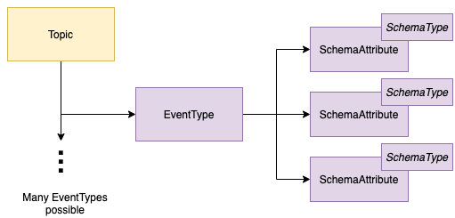

<!-- SPDX-License-Identifier: CC-BY-4.0 -->
<!-- Copyright Contributors to the ODPi Egeria project 2020. -->

# Topic Integrator Open Metadata Integration Service (OMIS)

The Topic Integrator OMIS supports the exchange of topic-based assets and the open metadata ecosystem.
Typically these topics are managed by an event broker such as Apache Kafka.

It supports a type of [integration connector](../../governance-servers/integration-daemon-services/docs/integration-connector.md)
that are able to create [Topic](../../../open-metadata-publication/website/open-metadata-types/0223-Events-and-Logs.md)
assets along with descriptions of the structures of events that pass through the topic.
Optionally, this metadata can be tied to an [EventBroker](../../../open-metadata-publication/website/open-metadata-types/0050-Applications-and-Processes.md).

Figure 1 shows the types of metadata that integrators connectors can create with this integration service.

> **Figure 1:** Topic metadata supported by the Topic Integrator OMIS 

The structure of an event is called an [EventType](../../../open-metadata-publication/website/open-metadata-types/0535-Event-Schemas.md).
The details of this structure such as the data fields in the event are described using
[SchemaAttributes and SchemaTypes](../../../open-metadata-publication/website/modelling-technology/modelling-schemas.md).

Figure 2 shows the open metadata types used to represent the metadata created through this service.

> **Figure 2:** Topic open metadata types supported by the Topic Integrator OMIS 

If an EventBroker is defined, any topic created is automatically linked to it using the
[ServerAssetUse](../../../open-metadata-publication/website/open-metadata-types/0045-Servers-and-Assets.md)
relationship.
When an event type is created for the topic,
the service automatically inserts the
[AssetSchemaType](../../../open-metadata-publication/website/open-metadata-types/0503-Asset-Schema.md) relationship,
[EventTypeList](../../../open-metadata-publication/website/open-metadata-types/0535-Event-Schemas.md) entity and
[SchemaTypeOption](../../../open-metadata-publication/website/open-metadata-types/0501-Schema-Elements.md) relationship
in between the topic and the event type.

Any schema attributes created through this interface will use the
[EventSchemaAttribute](../../../open-metadata-publication/website/open-metadata-types/0535-Event-Schemas.md) subtype
to allow for find requests that only return schema information for events.  The schema attributes also use
the [TypeEmbeddedAttribute](../../../open-metadata-publication/website/open-metadata-types/0505-Schema-Attributes.md)
classification [method for defining the schema type](../../../open-metadata-publication/website/modelling-technology/modelling-schemas.md).

## Module Implementation

The modules are as follows:

* [topic-integrator-api](topic-integrator-api) - defines the interface for an integration
connector that is supported by the Topic Integrator OMIS.  This includes the implementation
of the context that wraps the Data Manager OMAS's clients.

* [topic-integrator-server](topic-integrator-server) - implements the context manager for
the Topic Integrator OMIS.

* [topic-integrator-spring](topic-integrator-spring) - implements a rest API for validating that a specific
integration connector is able to run under this service.

* [topic-integrator-client](topic-integrator-client) - implements a Java client for the REST API.

This integration service is paired with the [Data Manager](../../access-services/data-manager)
Open Metadata Access Service (OMAS).

----

* Return to the [Integration Services](..)

----
License: [CC BY 4.0](https://creativecommons.org/licenses/by/4.0/),
Copyright Contributors to the ODPi Egeria project.