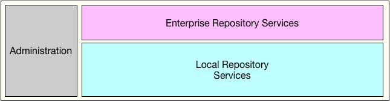
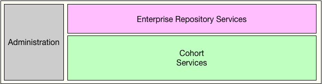
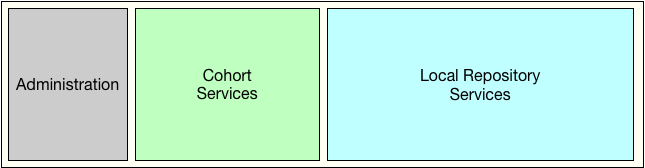
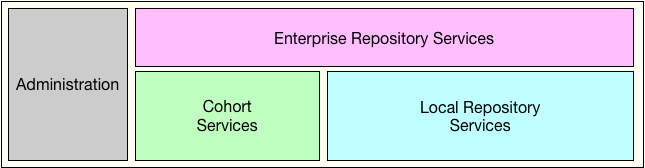

<!-- SPDX-License-Identifier: CC-BY-4.0 -->
<!-- Copyright Contributors to the ODPi Egeria project. -->

# Open Metadata Repository Services (OMRS) Design

Figure 1 shows the external APIs for the OMRS.

> Figure 1: OMRS System Context Diagram

On the left hand side is the **[administration interface](../../governance-servers/README.md)** supported by the OMAG server.
This is where configuration is passed to the OMRS, and status and other
relevant information is made available to the OMAG Administration Services.

Along the top is the interface with the **[Open Metadata Access Services (OMAS)](../../access-services/README.md)**.
The OMRS provides access to the open metadata repositories
through both a call API (see **[Enterprise OMRS Repository Connector](component-descriptions/enterprise-repository-connector.md)**) and an event topic
(see **[Enterprise OMRS Topic](omrs-event-topic.md)**).

Along the bottom are the **[six types of connectors](component-descriptions/connectors/README.md)** that
provide the OMRS with access to the stores and system resources it needs to support the OMAS.

These connectors enable the OMRS to be deployed into different
types of server environments and connect with different types
of infrastructure and services.

Repository connectors provide a common interface for metadata repositories.
The OMRS store connectors can range from simple file stores to
enterprise / cloud provider admin repositories and the event topic can
support different types of messaging infrastructure.

## OMRS Subsystems

Inside the OMRS are 4 major subsystems (groups of components):

> Figure 2: Component Overview (level 1)

* **[Enterprise Repository Services](subsystem-descriptions/enterprise-repository-services.md)** provides a virtual
metadata repository by combining the content of multiple open metadata
repositories and delivering this metadata through a single API and event topic.
The Enterprise Repository Services provide the enterprise access metadata
support for the OMASs.

* **[Administration Services](subsystem-descriptions/administration-services.md)** drive the
initialization of the OMRS at server startup, provide access to the OMRS's internal status and
coordinate the orderly termination of OMRS when the open metadata services
are deactivated. OMRS's administration services are called by the server's administration
services.   It is supplied with configuration information including:
  * Connections for the connectors it should use.
  * Information about the local repository (if any).
  * Whether the enterprise repository services should be initialized.
  * Details of any cohorts it should join.

* **[Cohort Services](subsystem-descriptions/cohort-services.md)** manage the local
server's membership in one or more open metadata repository cohorts.

* **[Local Repository Services](subsystem-descriptions/local-repository-services.md)** manage the local
server's open metadata repository.

The OMRS is highly configurable and runs in every type of [OMAG Server](https://egeria-project.org/concepts/omag-server).
The figures below show the different combinations.

Figure 3 shows the OMRS supporting the OMASs with access to a single,
local-only repository - with no connectivity to other open metadata repositories.
This is what runs in a [Metadata Access Store](https://egeria-project.org/concepts/metadata-access-store)
that is not connected to an [open metadata repository cohort](open-metadata-repository-cohort.md).

> Figure 3: Local only

Figure 4 shows the OMRS supporting a server with no local repository - so that all
metadata for the OMASs is coming through the cohort services from remote metadata repositories.
This is the **caller integration pattern**
supported by the [Metadata Access Point OMAG Server](https://egeria-project.org/concepts/metadata-access-point).

> Figure 4: Metadata Access Point OMAG Server

Figure 5 shows OMRS supporting a server where 
the OMASs are not deployed and the local repository is configured
to connect as an adapter for a non-native open metadata repository.
The cohort services connect this metadata repository with other
members in one or more cohorts.
This is called the **adapter integration pattern**
and is used in a [Repository Proxy OMAG Server](https://egeria-project.org/concepts/repository-proxy).

> Figure 5: Repository proxy

Figure 6 shows all the OMRS components in operation, supporting
the OMASs with a local repository and connectivity to other
repositories through the cohort servers.

This is what runs in a [Metadata Access Server](https://egeria-project.org//concepts/metadata-access-server)
that is connected to an [open metadata repository cohort](open-metadata-repository-cohort.md).

> Figure 6: Metadata Server

Finally, the administration subsystem alone is active in the servers that are not
[cohort members](https://egeria-project.org/concepts/cohort-member), that is the 
[Governance Servers](https://egeria-project.org/concepts/governance-server)
and the
[View Servers](https://egeria-project.org/concepts/view-server.md).

> Figure 7: Minimal OMRS for Governance Servers and View Servers

## OMRS Components

Figure 8 shows the main components of OMRS within each subsystem.

The different combinations of operation required means that the OMRS
components need to be flexible and communicate with one another through
well-defined interfaces so that component implementations can be swapped
in and out to support different configurations.
In addition, there is a new subsystem that appears at this level call the
[Event Management Services](subsystem-descriptions/event-management-services.md)
that provides event passing:

* Inbound event passing from the cohort services to the optional local repository services and enterprise repository services.
* Outbound event passing from the local repository services to the optional cohort services and enterprise repository services.

The event management services ensure that the other subsystems do not need to be aware of whether the
other subsystems are active or not.

> Figure 8: Component Overview (level 2)

Follow the links for more details of 
these **[subsystems](subsystem-descriptions/README.md)**
and **[components](component-descriptions/README.md)** within.

----

* [Return to repository services overview](..)

----
License: [CC BY 4.0](https://creativecommons.org/licenses/by/4.0/),
Copyright Contributors to the ODPi Egeria project.