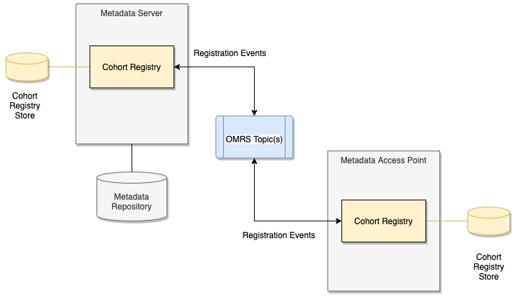

<!-- SPDX-License-Identifier: CC-BY-4.0 -->
<!-- Copyright Contributors to the ODPi Egeria project. -->

# Cohort Registry Store Connector

The OMRS Cohort Registry Store stores information about the repositories registered in
the **[open metadata repository cohort](../../open-metadata-repository-cohort.md)**.  

Each server in the open metadata repository cohort has
a **[Cohort Registry](../cohort-registry.md)** component to manage
its registration with the cohort and maintain the contents of
its local cohort registry store.

Figure 1 shows a cohort with two members.  Notice that each server has its own
cohort registry store - there is no central store.

> Figure 1: Cohort Registry Stores within a Open Metadata Repository Cohort

Figure 2 shows the logical structure inside the cohort registry store.

> Figure 2: Internal structure for the information stored inside a single cohort registry store.

There is one local registration record describing the information sent to
the other members of the cohort and a list of remote registration records received from
the other members of the cohort.

A implementations of this type of connector is located in the
[adapters/open-connectors/repository-services-connectors/cohort-registry-store-connectors](../../../../adapters/open-connectors/repository-services-connectors/cohort-registry-store-connectors)
module.

----
* Return to [repository services connectors](.).
* Return to [open metadata repository cohort](../../open-metadata-repository-cohort.md).

----
License: [CC BY 4.0](https://creativecommons.org/licenses/by/4.0/),
Copyright Contributors to the ODPi Egeria project.
