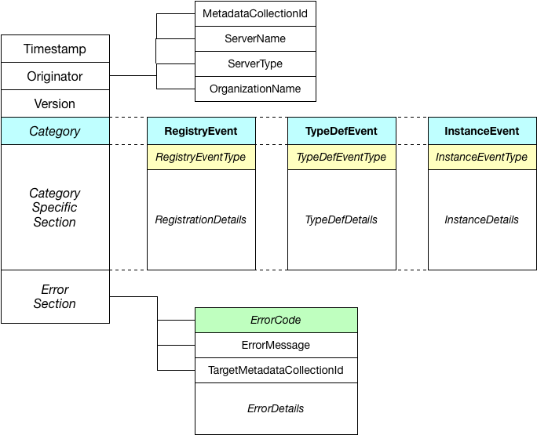

<!-- SPDX-License-Identifier: CC-BY-4.0 -->
<!-- Copyright Contributors to the ODPi Egeria project. -->

# OMRS Events

**OMRS Events** are messages used to notify **[members](../cohort-member.md)** of 
an **[open metadata repository cohort](../open-metadata-repository-cohort.md)**
of changes to:

* The membership of the open metadata repository cohort.
* The types of metadata being managed by members of the open metadata repository cohort.
* The changes to the metadata instances stored by each of the members of the open metadata repository cohort.

The motivation for sending OMRS Events between the members of the open metadata repository cohort
is to ensure open metadata is as widely available as security-permitted and access to it is as efficient as possible.
The events are broadcast to the membership of the open metadata repository cohort through
an **[OMRS Topic](../omrs-event-topic.md)** and no replies are expected.
Each member is expected to receive each event and make
a **[local decision](../open-metadata-exchange-rule.md)** on whether
to act on it or ignore it.

## OMRS Event Formats

Figure 1 shows the structure of version 1 on an OMRS Event.

> Figure 1: OMRS Event Format (version 1)

Every event has a:

* Timestamp - indicating the time the event was created.
* Originator - details of the server that originated the message. 
  * The **[metadata collection Id](../metadata-collection-id.md)** is the unique identifier for an open metadata repository's metadata collection.
  The only time this is not set is when a message is sent from a server that does not have a
  local metadata repository configured.
  * The server name, type and organization are optional descriptive fields used in audit logging and problem determination.
  These values are set up through the **[administration services](.https://egeria-project.org/guides/admin/servers)**.
  * Version - the version number of the event (set to "OMRS V1.0" in the initial version).

Next is the category.  There are three categories of OMRS Events:

* **[Registry events](registry-events.md)** - used by metadata servers to register with (and unregister from) an open metadata repository cohort.
* **[TypeDef events](typedef-events.md)** - used to exchange type definitions (TypeDefs) between members of an open metadata repository cohort to verify that there are not conflicts in the types they are using.
* **[Instance events](instance-events.md)** - used to synchronize updates to reference (cached) copies of metadata instances (entities and relationships) amongst the membership of an open metadata repository cohort.

The setting of the category determines which category-specific section is used.
Each category-specific section begins with a category-specific event
type that describes the type of the event, and hence the properties that
will be found in the category-specific section.

If the event is reporting an error, there is also an optional error section.
The error section has an error code, error message and a target metadata
collection id.  The target metadata collection id indicates which member
of the cohort is the target for the error message.
Other members may pick up the error and act on it as well.

----
* Return to [repository services design](..)
* Return to [open repository repository cohort](../open-metadata-repository-cohort.md)

----
License: [CC BY 4.0](https://creativecommons.org/licenses/by/4.0/),
Copyright Contributors to the ODPi Egeria project.