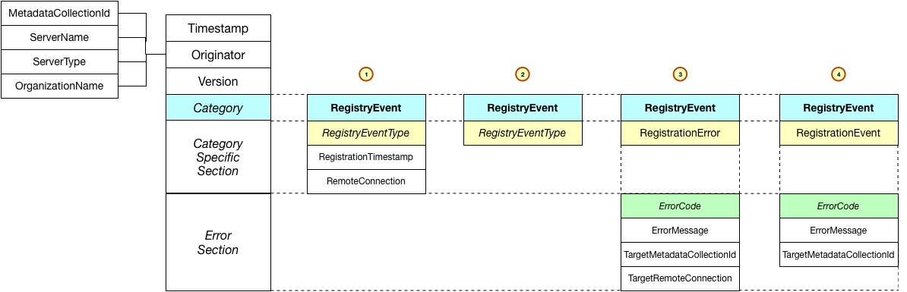

<!-- SPDX-License-Identifier: CC-BY-4.0 -->
<!-- Copyright Contributors to the ODPi Egeria project. -->

# Registry Events (OMRS)

Registry events are used by metadata servers to register with an 
[open metadata registry cohort](../open-metadata-repository-cohort.md).

> Figure 1: Different formats of a registry event

----
* Return to [Event Descriptions](.)
* Return to [Cohort Registry](../component-descriptions/cohort-registry.md)
* Return to [Repository Services Overview](../..)

----
License: [CC BY 4.0](https://creativecommons.org/licenses/by/4.0/),
Copyright Contributors to the ODPi Egeria project.

