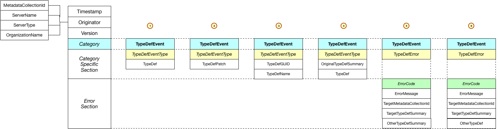

<!-- SPDX-License-Identifier: CC-BY-4.0 -->
<!-- Copyright Contributors to the ODPi Egeria project. -->

# TypeDef Events (OMRS)

TypeDef events are used by members of an
[open metadata registry cohort](../open-metadata-repository-cohort.md)
to exchange information about the 
[open metadata types](https://egeria-project.org/types)
they support.

> 
> Figure 1: Different formats of a TypeDef event

----
* Return to [repository services event descriptions](.)

----
License: [CC BY 4.0](https://creativecommons.org/licenses/by/4.0/),
Copyright Contributors to the ODPi Egeria project.
