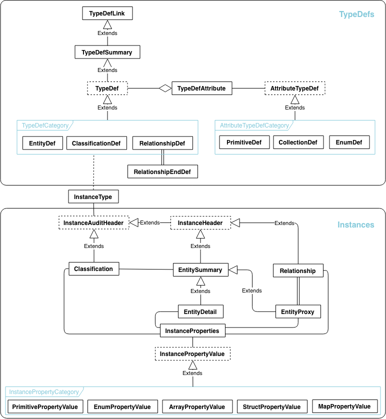
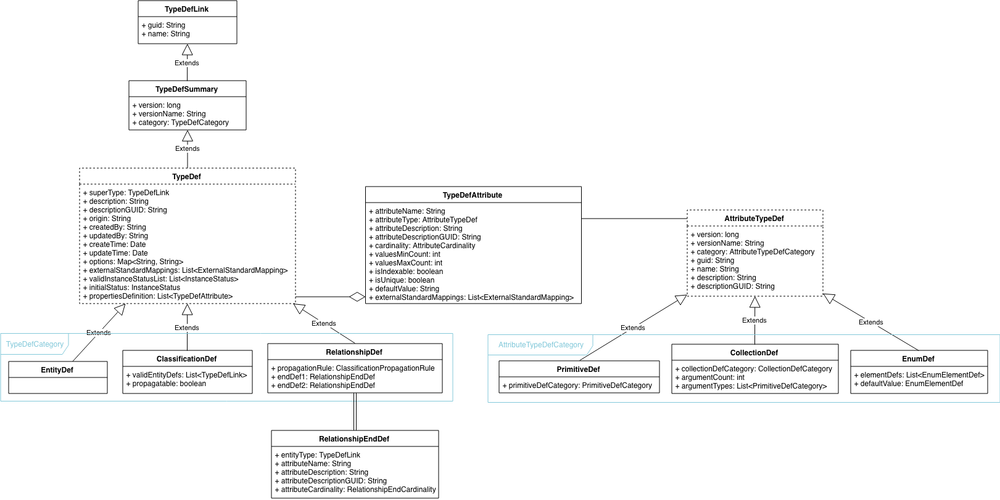
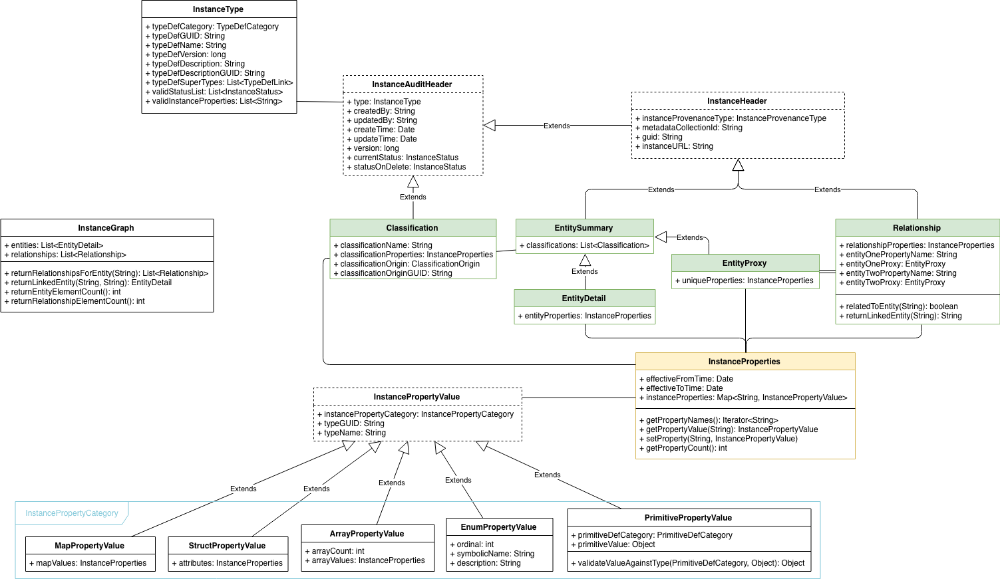

<!-- SPDX-License-Identifier: CC-BY-4.0 -->
<!-- Copyright Contributors to the ODPi Egeria project. -->

# Egeria Type System

> Figure 1: Overview of Egeria's type system

Egeria's type system is implemented within the `repository-services`, 
and can be broadly broken into the following areas:

- Type Definitions (TypeDefs)
- Instances

## Type Definitions (TypeDefs)

TypeDefs define the general characteristics that are used to describe any 
general type -- whether native or not -- and typically fit into one of 
the following three general types (`TypeDefCategory`):

- `EntityDef`: the definition of a type of entity
- `RelationshipDef`: the definition of a type of relationship
- `ClassificationDef`: the definition of a type of classification

TypeDefs are implemented as Java classes in Egeria (those with dotted 
outlines are abstract).

> Figure 2: Type Definitions

**Examples**

Rather than being another set of classes that inherit from those above,
implemented type definitions in Egeria are instantiated objects of the
classes defined above.

For example, the native **[`opentypes`](../repository-services-implementation/src/main/java/org/odpi/openmetadata/repositoryservices/archivemanager/opentypes/OpenMetadataTypesArchive.java)** 
that Egeria defines include instantiated objects for three `EntityDef`s:

- one defining a generic `Referenceable` entity type,
- another defining a `GlossaryCategory` entity type,
- and a third defining a `GlossaryTerm` entity type.
- (and many others!)

A set of `TypeDefAttributes` defines the list of additional 
characteristics (properties) that each of these entity types can 
possess -- things like names, descriptions, etc -- which may naturally
vary from one entity type to another.

An example of a `RelationshipDef` is the linkage between `GlossaryTerm`
and `GlossaryCategory` known as a `TermCategorization`, which is further
defined to allow any number of linkages between the two, in either 
direction.

An example `ClassificationDef` is `Confidentiality`: that can apply to 
any `Referenceable` entity (hence including both `GlossaryTerm` and 
`GlossaryCategory`, as both of these extend the `Referenceable` entity 
type).

> Figure 3: Example Type Definitions (from opentypes)

## Instances

Instances define individual instantiations of the TypeDefs: for example,
individual `GlossaryTerm` or `GlossaryCategory` entities, 
`Confidentiality` classifications, etc.

Implemented instances will generally instantiate one of the following
classes:

- `EntitySummary` / `EntityProxy` / `EntityDetail` : information about 
one specific instance of an entity, at varying levels of detail 
(listed here from highest to lowest level of detail)
- `Relationship`: information about a relationship between entities; 
the endpoints of the relationship are specified as `EntityProxy` objects
- `Classification`: information that provides additional contextual 
information about a given entity, and is included in both the 
`EntitySummary` and `EntityDetail` views of an entity

Each of these will typically be further described by an 
`InstanceProperties` object that instantiates one or more properties 
used to describe the instance (whether those are additional details 
about an entity or the relationship between entities).

Instances as a concept are implemented as generic Java classes in Egeria 
(those with dotted outlines are abstract).

> Figure 4: Instances

**Examples**

Like the implementation of TypeDefs, instances are *not* implemented as
new classes that inherit from those above, but as instantiated objects
of the classes above.

For example, to represent an "Address Line 1" `GlossaryTerm`, there can 
be:

- an instantiated object for an `EntitySummary` providing a headline
set of information about "Address Line 1" (ie. its classifications),
- an instantiated object for an `EntityDetail` providing the full 
details of "Address Line 1" (all of its classifications and properties),
- an `EntityProxy` defining the unique properties of "Address Line 1" 
(ie. a `qualifiedName` property inherited from `Referenceable` which
must be unique across all instances of the object)

The `InstanceProperties` associated with the `EntityDetail` and 
`EntitySummary` objects give the further detail on the object (ie. its 
name, summary, etc).

- To represent a "Sensitive Confidentiality" concept that can be used 
to classify other information (like "Address Line 1"), we could have a
"Confidentiality" `Classification` defined with a specific level 
("Sensitive") through its `InstanceProperties`
- To represent the linkage between "Address Line 1" and a specific
category location (like "Coco Pharmaceuticals/Terms") we could have 
a `Relationship` representing the `TermCategorization` with one end 
pointing to an `EntityProxy` for "Address Line 1" and one end pointing 
to an `EntityProxy` for "Coco Pharmaceuticals/Terms"

> Figure 5: Example instances (using opentypes)
