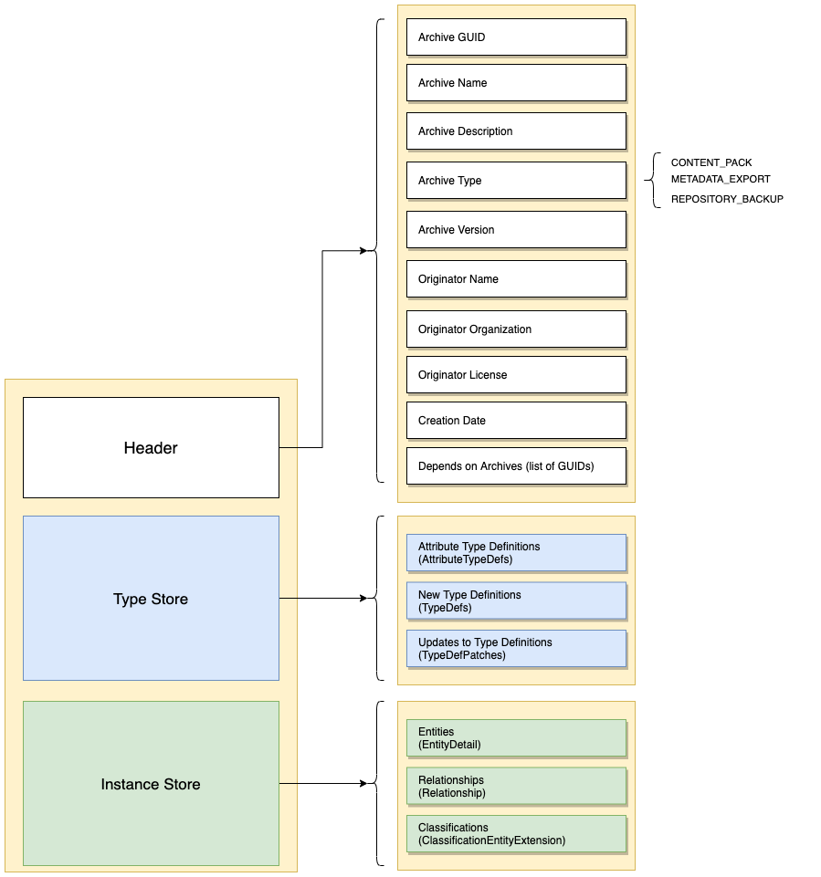

<!-- SPDX-License-Identifier: CC-BY-4.0 -->
<!-- Copyright Contributors to the ODPi Egeria project. -->

# Open Metadata Archive

An open metadata archive is a document containing open metadata [type definitions](open-metadata-type-definitions.md)
and [instances](open-metadata-instances.md).

The open metadata archive has two types:

* A **Content Pack**: reusable definitions that are generally useful.  They may come from the Egeria community or
third parties.
* A **Metadata Export**: an export of metadata from a repository.  Used to transfer metadata
between repositories that are not connected to the same [cohort](open-metadata-repository-cohort.md).

## Structure of an open metadata archive

The logical structure of an open metadata is shown in Figure 1:


> **Figure 1:** Logical Structure of an Open Metadata Archive

Figure 2 shows how the instances are linked together.
Entities are stored as `EntityDetail` structures.
Relationships are stored as `Relationship` structures and link to their entities through the embedded entity
proxies.
The entities will include their classifications.  However for classifications that
are attached to entities that are not included in the archive, they are stored in an `ClassificationEntityExtension`
structure.


> **Figure 2:** Instance structures in an Open Metadata Archive

Typically, open metadata archives are encoded in JSON format and stored in a file.
Figure 3 show an example of the `archiveProperties` header from the Cloud Information Model Archive

```json
{
  "class":"OpenMetadataArchive",
  "archiveProperties":
      {
          "class":"OpenMetadataArchiveProperties",
          "archiveGUID":"9dc75637-92a7-4926-b47b-a3d407546f89",
          "archiveName":"Cloud Information Model (CIM) glossary and concept model",
          "archiveDescription":"Data types for commerce focused cloud applications.",
          "archiveType":"CONTENT_PACK",
          "originatorName":"The Cloud Information Model",
          "originatorLicense":"Apache-2.0",
          "creationDate":1570383385107,
          "dependsOnArchives":["bce3b0a0-662a-4f87-b8dc-844078a11a6e"]
      }, 
   "archiveTypeStore":{},
   "archiveInstanceStore":{}
}

```
> **Figure 3:** Example of an open metadata archive header encoded in JSON

However, both the format and storage method can be changed by changing the 
[open metadata archive connector](component-descriptions/connectors/open-metadata-archive-store-connector.md).

## Processing Design

Open metadata archives are introduced into the server through the admin services either provided
as part of the contents of the server's configuration document or through the operational command that added
the archive directly into the running server's repository.
These entry points are shown as (1) and (2) respectively on Figure 1.


>> **Figure 4:** Processing of an open metadata archive

The archive is passed to the repository services' [Operational Services](component-descriptions/operational-services.md)
which in turn passes it on to the [Archive Manager](component-descriptions/archive-manager.md).
Type information is passed to the [Repository Content Manager](component-descriptions/repository-content-manager.md).
Both the Types and Instances are passed to the local repository (if there is one).
* TypeDefs added through `verifyTypeDef` and then `addTypeDef` in the following order:
    * AttributeTypeDefs
    * New TypeDefs
    * TypeDefPatches
* Instances loaded as reference copies in the following order:
    * Entities
    * Relationships
    * Classifications

If the server is connected to the cohort, the new content is send as notifications to the rest of the cohort.

## Archive Load Order

The archive loads in the following order:

* Attribute Type Definitions (AttributeTypeDefs) from the type store.
  * PrimitiveDefs
  * CollectionDefs
  * EnumDefs
  
* New Type Definitions (TypeDefs) from the type store.
  * EntityDefs
  * RelationshipDefs
  * ClassificationDefs
  
* Updates to types (TypeDefPatches)

* New Instances
  * Entities
  * Relationships
  * Classifications


## Further information

More information about open metadata archives can be found in the
[open-metadata-archives](../../../open-metadata-resources/open-metadata-archives) module.

In addition, these articles may be of interest:

* [Configuring an open metadata archive in an OMAG Server](https://egeria-project.org/guides/admin/servers/configuring-the-startup-archives)
* [Adding an open metadata archive to a running OMAG Server](https://egeria-project.org/guides/operations/adding-archive-to-running-server)


----
* Return to [Repository Services Design](.)

----
License: [CC BY 4.0](https://creativecommons.org/licenses/by/4.0/),
Copyright Contributors to the ODPi Egeria project.