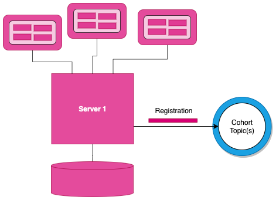
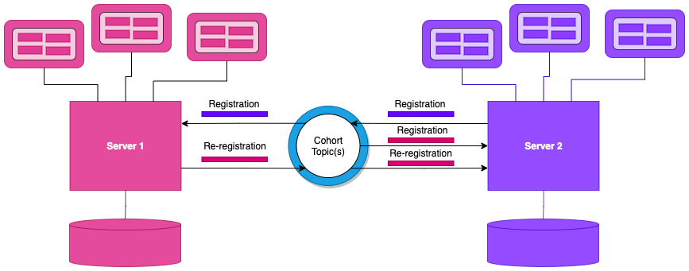
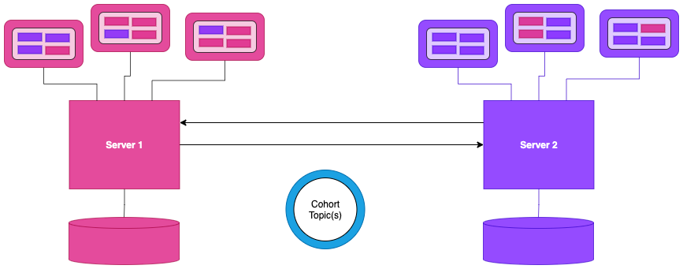
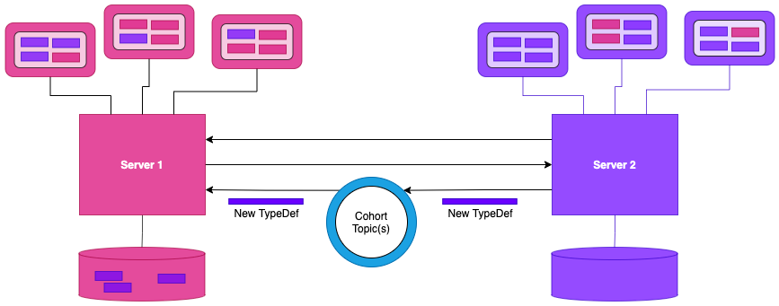

<!-- SPDX-License-Identifier: CC-BY-4.0 -->
<!-- Copyright Contributors to the ODPi Egeria project. -->

# Open Metadata Repository Cohort

An **open metadata repository cohort** is a collection of [servers](https://egeria-project.org/concepts/cohort-member)
sharing metadata using the **[Open Metadata Repository Services (OMRS)](..)**.
This sharing is peer-to-peer.
Once a server becomes a member of the cohort, it can share
metadata with, and receive metadata from, any other member.

OMRS needs to be flexible to support different performance and availability requirements.
For example, where metadata is changing
rapidly (such as in a data lake), this metadata should be dynamically queried
from the repository where it was created and is being maintained  because
the rate of updates mean it would cost a lot of network traffic to keep a
copy of this metadata up to date.  The repository where a piece of metadata
(metadata instance) was created and where it is maintained is called
its **[home metadata repository](home-metadata-repositories.md)**.

On the other hand, governance definitions
(such as policies) and glossary terms rarely change.
They are often administered centrally by the governance team and then
linked to all metadata that describes the organization's data resources.
Thus it makes sense for this metadata to be replicated across the repositories
within the cohort.
These copies are called **[reference copies](home-metadata-repositories.md)** of
the metadata and they are read-only.

The role of the OMRS is to optimize access to metadata across the cohort by using
a combination of replication and federated queries, driven by
the metadata workload from the connected tools.

## Formation of a Cohort

Cohort membership is established dynamically.  This is through the [Cohort Topic(s)](omrs-event-topic.md).

To join an open metadata repository cohort, a server must integrate
with the OMRS module. OMRS then manages the metadata exchange. When OMRS running inside the server is
[configured to join a cohort](https://egeria-project.org/guides/admin/servers/configuring-registration-to-a-cohort)
it first adds a [Registration Event](event-descriptions/registry-events.md) to the Cohort Topic(s).
This event identifies the server, its metadata repository (if any) and its capabilities (see figure 1).

> **Figure 1:** The first server to join the cohort issues a registration request and waits for others to join.

When another server joins the cohort (figure 2), it also adds its registration event to the Cohort Topic(s)
and begins to receive the registration events from other members.  The other members respond with
[Re-Registration Events](event-descriptions/registry-events.md) to ensure the new member has the latest
information about the originator's capabilities.  The exchange of registration information causes all members to verify
that they have the latest information about their peers.  This is maintained in their own
[Cohort Registry Store](https://egeria-project.org/concepts/cohort-registry-store-connector)
so that they can reconfigure themselves on restart
without needing the other members to resend their registration information.

> **Figure 2:** When another server joins the cohort they exchange registration information.

Once the registration information is exchanged and stored in each member's cohort registry store, it is ready to issue
federated queries across the cohort, and respond to requests for metadata from other members.
These requests can both retrieve metadata and maintain metadata in the [home metadata repository](home-metadata-repositories.md).

The management of federated queries and the routing of maintenance requests is managed by OMRS's
[Enterprise Repository Services](subsystem-descriptions/enterprise-repository-services.md).
The enterprise repository services are configured with the registration information from across the cohort at the
same time as the cohort registry store is updated.  This process is managed by the [Cohort Registry](https://egeria-project.org/concepts/cohort-registry)
component (see figure 3).

> **Figure 3:** Once the registration is complete the cohort members can issue federated queries.

Once the cohort membership is established, the server begins publishing information using
[Instance Events](event-descriptions/instance-events.md) about changes to the
[home metadata instances](home-metadata-repositories.md) in their repository.
These events can be used by other members to maintain a cache of reference copies of this metadata to improve
availability of the metadata and retrieval performance.  Updates to this metadata will, however, be automatically
routed to the home repository by the enterprise repository services (figure 4).

> **Figure 4:** Metadata can also be replicated through the cohort to allow caching for availability and performance.

Finally, as type definitions (TypeDefs) are added and updated, the cohort members send out
events to allow the other members to verify that this type does not conflict with any of their types (figure 5).
Any conflicts in the types causes [audit log messages](https://egeria-project.org/concepts/audit-log) to be logged in all the
members, prompting action to resolve the conflicts.

> **Figure 4:** TypeDef validation.

## Enabling Cohort Membership

Egeria provides a number or pre-built
[cohort members](https://egeria-project.org/concepts/cohort-member).

One of them, the [repository proxy](https://egeria-project.org/concepts/repository-proxy)
provides a simple way to integrate a third party server into a cohort 
by creating an [OMRS Repository Connector and optional Event Mapper Connector](../../adapters/open-connectors/repository-services-connectors/open-metadata-collection-store-connectors)
to map between the third party APIs/events and the repository service's equivalents

A more bespoke integration involves:

* Creating an [OMRS Repository Connector and optional Event Mapper Connector](../../adapters/open-connectors/repository-services-connectors/open-metadata-collection-store-connectors)
* Designing how to configure the OMRS Services for your metadata repository.
Typically, this is done by extending the existing administration services of the
metadata repository, but Egeria also offers
some pre-built **[administration services](../../admin-services)** that
can be used or modified.
* Plugging the OMRS and any administration services into the metadata repository's security
module so that requests to the server can be secured against unauthorized access.
* Integrating the OMRS, administration and security capability into your product.

There are different integration patterns available to help you choose the best approach for your product.
Each method is optimized for specific use cases and so the metadata repository can only play a full role in the open 
metadata use cases if it supports all integration methods.  These are:

* Support for an OMRS repository connector to allow open metadata API calls to the 
repository to create, query, update and delete metadata stored in the repository.  
The OMRS connectors support the Open Connector Framework (OCF) to provide a call interface to 
the metadata repositories.  The OMRS Repository Connector API is a standard interface for all 
metadata repositories.  This enables services such as the Enterprise OMRS Repository Connector 
to interact with 1 or many metadata repositories through the same interface.  
The connection configuration it passes to the OCF determines which type of OMRS connector is 
returned by the OCF.

* Support for the OMRS event notifications that are used to synchronize selective metadata 
between the metadata repositories. 

## Cohort registration

The OMRS protocols are peer-to-peer.
Each repository in the cohort has an [OMRS Cohort Registry](https://egeria-project.org/concepts/cohort-registry) that 
supports the registration of the metadata
repositories across the cohort.   Through the registration process, each OMRS Cohort Registry 
assembles a list of all the members of the cohort.  This is saved in the 
[OMRS Cohort Registry Store](https://egeria-project.org/concepts/cohort-registry-store-connector).  The list of connections to the remote members of the cohort are passed to the OMRS Enterprise Connector Manager that in turn manages the configuration of the Enterprise OMRS Repository Connectors.

The Enterprise OMRS Connector provides federated query support across the metadata cohort
for the Open Metadata Access Services (OMAS).

When a metadata repository registers with the OMRS Cohort Registry,
the administrator may either supply a unique server identifier, or ask the OMRS to generate one.
This server identifier (called the metadata collection identifier) is used in the OMRS event notifications,
and on OMRS repository connector calls to identify the location of the home copy of the metadata entities and
to identify which repository is requesting a service or supports a particular function.

Once the metadata repository has registered with the OMRS Cohort Registry,
it is a member of the metadata repository cohort and it can synchronize and share metadata
with other repositories in the cohort through the OMRS Topic.

Note: A single metadata repository can register with multiple metadata cohorts as long as its server
identifier is unique across all cohorts that it joins and it manages the posting of events to the
appropriate OMRS Topic for each cohort it register with.
This capability is useful for a metadata repository that is aggregating reference
copies of metadata from multiple open metadata repository cohorts.

----

* Return to the [repository services overview](.)

----
License: [CC BY 4.0](https://creativecommons.org/licenses/by/4.0/),
Copyright Contributors to the ODPi Egeria project.
