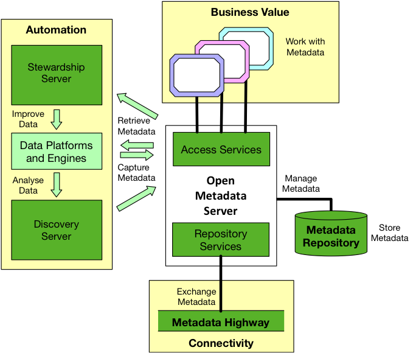

<!-- SPDX-License-Identifier: CC-BY-4.0 -->
<!-- Copyright Contributors to the ODPi Egeria project. -->
  
# The Objectives of Egeria

ODPi Egeria implements a set of open APIs, [metadata types](open-metadata-types/README.md),
frameworks, connectors and interchange protocols to allow all types of tools and
metadata repositories to share and exchange metadata.

It is essentially a comprehensive toolkit for integrating and
distributing metadata between different tools and technologies.  In addition, it has a multi-tenant platform
that supports horizontal scale-out in Kubernetes and yet is light enough to run
as an edge server on a Raspberry Pi.  This platform is
used to host the integration and metadata exchange capabilities
along with open governance,
discovery and access services to automate the collection, management and
use of metadata across an enterprise.  

The result is an enterprise catalog of
data and IT resources that are transparently assessed, governed and consumed 
through many types of tools and technologies in order to
deliver maximum value to the enterprise.

## Why open source?

Delivering this capability as open source is a critical part of the project
since multiple vendors must buy into this ecosystem.
They are not going to do this if one organization dominates the technology base.
Thus the open metadata and governance technology must be freely available with
an open source governance model that allows a community of organizations and
practitioners to develop and evolve the base and then use it in their offerings
and deployments.

# Project Objectives

Figure 1 summarizes the objectives of Egeria:
**Automation**, **Business Value** and **Connectivity**.

> Figure 1: The ABC of open metadata and governance

* **Automation**
  
  It is expensive (and error prone) to expect individuals to
  maintain a metadata catalog by hand.  Egeria helps to
  automate metadata management through its specialist
  [governance servers](../../open-metadata-implementation/governance-servers)
  that extract and synchronize metadata with different technologies.
  Figure 1 shows two of these servers, the **Stewardship Server** and
  **Discovery Server** managing metadata and storing it in an open
  metadata repository.

* **Business Value**

  Once metadata is integrated, new insight is possible into
  the data and services owned by the enterprise.
  Egeria provides access services
  and open lineage services that use federated metadata 
  queries to create this enterprise view.
  
* **Connectivity**

  Finally, the automation and and business value would not be possible
  without the ability to integrate and distribute metadata.
  Connectivity enables a peer-to-peer Metadata Highway offering
  open metadata exchange, linking and federation between
  heterogeneous metadata repositories.

# Further reading

* **[Open Metadata Types](open-metadata-types/README.md)** - The open metadata types provide
an overview of the scope of metadata that Egeria is covering.
* **[Open Metadata Labs](../../open-metadata-resources/open-metadata-labs)** - The open metadata labs provide
the means to get hands on experience with Egeria.
* **[OMAG Server Configuration Guide](../../open-metadata-implementation/admin-services/docs/user)** - The administration guide describes how to configure Egeria.
* **[OMAG Server Platform Overview](omag-server)** - the OMAG Server Platform Overview describes the operation of Egeria's software platform.

# Technical Components 

These are the principle technical components of Egeria

* **[Open Metadata Repository Services (OMRS)](../../open-metadata-implementation/repository-services)** - Open metadata repository APIs and notifications to enable metadata repositories to exchange metadata in a peer-to-peer metadata repository cohort.  This capability is located in each metadata repository and collectively they enable what is referred to as the "metadata highway".
* **[Open Metadata Access Services (OMAS)](../../open-metadata-implementation/access-services)** - Consumer-centric APIs and notifications for specific classes of tools and applications.  The OMAS services call the OMRS to access metadata from any open metadata repository.
* New frameworks:
  * **[Audit Log Framework (ALF)](../../open-metadata-implementation/frameworks/audit-log-framework)** - provides factories for connectors with access APIs for data resources and metadata together.  The OMRS is also built as a set of metadata repository connectors and the OMAS services use the OCF to connect to the appropriate OMRS connector.
  * **[Open Connector Framework (OCF)](../../open-metadata-implementation/frameworks/open-connector-framework)** - provides factories for connectors with access APIs for data resources and metadata together.  The OMRS is also built as a set of metadata repository connectors and the OMAS services use the OCF to connect to the appropriate OMRS connector.
  * **[Open Discovery Framework (ODF)](../../open-metadata-implementation/frameworks/open-discovery-framework)** - provides management for automated processes and analytics to analyze the content of data resources and update the metadata about them.
  * **[Governance Action Framework (GAF)](../../open-metadata-implementation/frameworks/governance-action-framework)** - provides audit logging and governance enforcement services for implementing enforcement points in data engines, security managers such as Apache Ranger, and APIs.  It also adds stewardship services for analyzing audit logs and resolving issues identified in exceptions raised by the enforcement services.
* **[Open Metadata Graph Repository](../../open-metadata-implementation/adapters/open-connectors/repository-services-connectors/open-metadata-collection-store-connectors/graph-repository-connector)** - A set of stores linked together with a graph database.  These stores provide linkage between business, technical and operational metadata along with logs for auditing, operational lineage, metering and exception management.
* **[Governance Servers](../../open-metadata-implementation/governance-servers)** for automating the management, governance and use of metadata with different tools, platforms and engines.
* **[View Servers](../../open-metadata-implementation/view-services)** for REST APIs that support user interfaces.
* **[Open Lineage Services](../../open-metadata-implementation/governance-servers/open-lineage-services)** - Services for collecting and querying lineage information across multiple heterogeneous metadata repositories.
* **[Administration Services](../../open-metadata-implementation/admin-services)** for configuring Egeria
* **[Platform Services](../../open-metadata-implementation/platform-services)** for querying the status of the servers running on the platform.
* **[Common Services](../../open-metadata-implementation/common-services)** for common services such as security and first failure data capture (FFDC).
* **[Adapters](../../open-metadata-implementation/adapters)** connectors and plugins for different types of technologies.
* **[Server Chassis](../../open-metadata-implementation/server-chassis)** the base component of the OMAG Server Platform.

# Further Help

* [Tutorials and Hands on Labs](../../open-metadata-resources/open-metadata-tutorials)
* [Samples](../../open-metadata-resources/open-metadata-samples)
* [Trouble shooting](trouble-shooting)
* [Glossary of Terms about Egeria](open-metadata-glossary.md)
* [Contributing to Egeria](../../Community-Guide.md)

# Additional contributions by the ODPi Community

* [Ode to Egeria](fun/ode-to-egeria.md)

----
License: [CC BY 4.0](https://creativecommons.org/licenses/by/4.0/),
Copyright Contributors to the ODPi Egeria project.
