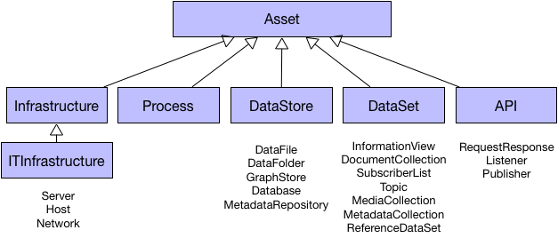

<!-- SPDX-License-Identifier: Apache-2.0 -->

# What is an asset?

An asset is either digital or physical and it provides value to the
organization that owns it.  We keep metadata about an asset in order to
manage it throughout its lifecycle to get the maximum value from it.

In the open metadata model, there is a common abstract type called
**Asset** that appears in the
**[base model](../open-metadata-types/0010-Base-Model.md)**.

Inheriting from asset is a hierarchy of increasingly specialized definitions
for different types of Assets.  Each definition adds more properties
about the Asset.  Figure 1 shows some of the key assets.

**Figure 1:** Asset hierarchy

* **Infrastructure** covers physical assets from machinery, sensors and networks.
There is a subclass called **ITInfrastructure** that is where IT hosts and
services ar located.

* **Process** describes processing from simple software components to
multi-task workflows.

* **DataStore** a physical store of data such as a file.

* **DataSet** describes a logical collection of data.  These are created
from a combination of processes and physical data stores.
They tend to be the collections of data that are of interest to the
organization.

* **API** the means to access digital capability consisting of infrastructure,
processes, data stores and data sets.

**[Area 2](../open-metadata-types/a)** is where the asset definitions are built out.

Much governance is centered around an organization's assets since they
represent tangible value.  However 