<!-- SPDX-License-Identifier: CC-BY-4.0 -->
<!-- Copyright Contributors to the ODPi Egeria project 2020. -->

# The contents of an asset catalog

Asset catalogs can start simple and evolve into a rich and valuable source of knowledge
for your organization.  This page describes the different types of information
that can be stored about an asset and the capabilities that each new piece of information
enables.

* [Basic Asset Properties](#Basic-Asset-Properties)
* [Asset Connections](#Asset-Connections)
* [Asset Schemas](#Asset-Schemas)
* [Asset Ownership](#Asset-Ownership)
* [Asset Zone Membership](#Asset-Zone-Membership)
* [Asset Location](#Asset-Location)
* [Asset External Identifiers](#Asset-External-Identifiers)
* [Asset Licenses and Certifications](#Asset-Licenses-and-Certifications)
* [Asset Classifiers](#Asset-Classifiers)
* [Asset Feedback](#Asset-Feedback)
* [Asset Note Logs](#Asset-Note-Logs)
* [Asset External Descriptions](#Asset-External-Descriptions)
* [Asset Lineage](#Asset-Lineage)
* [Related Assets](#Related-Assets)

In general, additional information in the catalog aims to provide at least one of the
following benefits:

* Making it easier to locate the right asset for a task.
* Improving an individual's understanding about how an asset can be used and how it should be maintained.
* Identifying assets that are supporting specific situations and business contexts.
* Providing a perspective on how many assets of a certain type or situation are owned by the organization.
* Providing encoded information that enables automation to be used to maintain and protect the assets.

----
## Basic Asset Properties

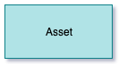
 
Each instance of an asset, no matter what its physical type, is represented by an **Asset**
(or a subtype of this element -
see [Assets](../../../open-metadata-implementation/access-services/docs/concepts/assets)
for a list of the supported sub types) in the catalog.
 
The Asset contains the following properties:
* **Open Metadata Unique identifier (GUID)** - this a globally unique id across all metadata
  instances.  It is a string of letters and numbers and typically looks something like this 
  `40d9520b-dbc0-4cc4-9bad-03ab72d027f3` and is assigned by Egeria.

* **Qualified Name** - this is a globally unique name of the asset - it is unique across all assets
  It is assigned by the creator of the asset.

* **Display Name** - typically qualified names are long in order to make them unique.
  The display name is a short name used in
  reports and other displays of asset information.

* **Description** - description of the asset.

* **Additional Properties** - names and values of additional properties that the organization
  wants to record about the asset.

#### Usage

With the basic asset properties defined, the asset catalog provides a searchable list of 
the assets of the organization.   The content provides in the names, descriptions
and additional properties will determine how easy it is to retrieve specific assets.

----
## Asset Connections

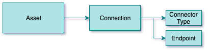

A connection can be attached to the asset.  This provides the information
necessary to create a connector to the asset.

The connector is a client to both the data and the information
about the asset stored in open metadata.  Some connectors use the metadata
about the asset to control what data can be retrieved from the asset depending on the caller.

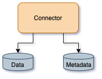

The connection object includes a connector type - containing information about the
type of connector to create - and an endpoint detailing the network address and
access protocol of the physical asset.

There are API options to request that Egeria creates a default connection
that matches the specific asset type.  In addition there are options
to explicitly set up the connection object, or leave the asset with no connection
attached.

#### Usage

The connector that is generated from the connection object enables both tools and
applications to use the asset through a governed interface that provides metadata,
data and, in some cases, metadata-driven access control. 

----
## Asset Schemas

A schema describes the individual data fields and operations of the asset.
It is organized to reflect the internal organization of the asset and
so acts as a guide to the types of content in the asset and how to navigate around it.

#### Usage

With the schema in place, it is possible to search for assets based on the
type of data, or type of operations that the asset supports.

----
## Asset Ownership

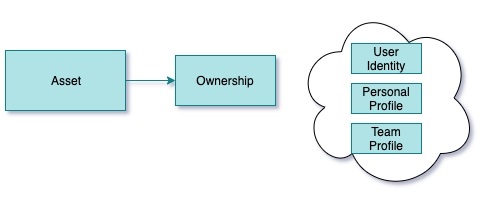

Asset ownership defines who is responsible for the asset.
This covers ensuring the catalog entry is correct,
the contents of the asset are complete and correct and controlling access
to the asset.

The owner can be defined as a user identity, a personal profile or a team profile.
These definitions are managed by the
[Community Profile OMAS](../../../open-metadata-implementation/access-services/community-profile).

#### Usage

With an owner established, it records who is responsible for the protection and quality of the asset.
It is possible to route requests from the consumers of the asset
to the owner.  An example of this is in managing queries about the content of the
asset and requests for access to its contents.

----
## Asset Zone Membership

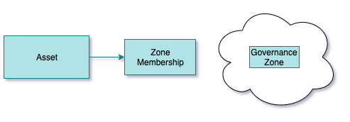

Governance Zones allow assets to be grouped according to their usage.  
Governance Zones are defined by the
[Governance Program OMAS](../../../open-metadata-implementation/access-services/governance-program)
It is possible to
assign supported zones to assets through the  to limit the scope
of assets that are returned from searches.
More information on Governance Zones if described [here](../../../open-metadata-implementation/access-services/docs/concepts/governance-zones)

#### Usage

Using governance zones allows the organization to scope the assets that are returned to a community
of users who are using the asset catalog.

The governance zones can also be used to define the group of assets that an automated process should process.

----
## Asset Location

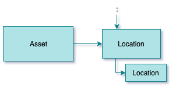

Egeria supports the definition of a location model that divides both physical and digital space into
hierarchies with cross links between the hierarchies.  This means it is possible to link the
assets to their location(s)

#### Usage

Attaching assets to location definitions means it is possible to use details of the location
as part of the search for assets.
 
Knowing the asset location, whether it is a physical or digital location can also help with demonstrating that
data sovereignty is being respected and the level of risk that is allocated in a location.

----
## Asset External Identifiers

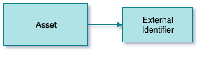
 
A specific asset may be represented in different tools using different names.  It is possible to add details of
these external identifiers to the Asset.

#### Usage

Knowing the names of an asset means that the asset catalog can support searches for assets using the
name that specific communities of people know.

It also helps automated process that are operating on the physical asset through a tool or API can
look up the appropriate identifier for the asset for that tool/API.

----
## Asset Licenses and Certifications

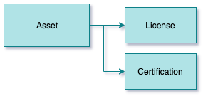
 
An asset can have its license and/or certifications attached to it.

The license determines the terms and conditions of use for the asset.  This
becomes important particularly when assets come from an external organization.
Certifications typically relate to a regulation or standard.  When the certification
is tied to the asset it means that the asset has passed the requirements.

#### Usage

Attaching licences and certifications to assets raises awareness of the
any restrictions on the use of the assets and to what
standards they are managed to.
If the licenses and certifications are machine readable, automated
processes can used them to control the way that they manage the assets.

----
## Asset Classifiers

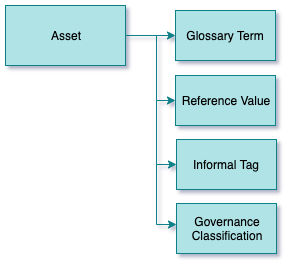

Classifiers add labels and properties to the asset that identifies them as part of
a specific group, or having specific characteristics.

The classifiers can be added to the whole asset or a field or operation in the
schema.

The types of classifiers are:

* Glossary terms define the meaning of concepts and activities.  When a glossary
  term is attached to a data field in the assets schema, it signifies that 
  the data stored in that field has the meaning described in the glossary term.
  
* Reference values identify sets of valid values of specific characteristics
  of the assets.  For example,
  attaching a reference code for "personal data" to an asset indicates that
  it contains personal data.
 
* Informal tags are labels that asset consumers create and attach to the asset and
  its data fields/operations.  This is effectively a way of crowd sourcing knowledge about
  the asset.
  
* Search keywords are typically attached to an asset by the asset owner to improve
  the findability of an asset - particularly if it has a name that is difficult to
  remember.
  
* Governance classifications provide formal classifiers for confidentiality,
  retention, confidence and criticality for the asset. The impact classification
  is typically used with reports that link to the asst such as incident reports.

#### Usage

Classifiers help to make assets more findable.
They also identify which assets should be treated to certain types of processing.
For example, data fields marked as sensitive could be masked when added to
a sandbox.

----
## Asset Feedback

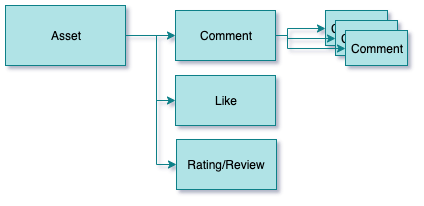

Feedback, such as comments, likes, star ratings and reviews
can be added to an asset, typically by consumers of the asset
to share experiences, expertise and concerns about the asset.

The author of the feedback can choose whether it is public or private
feedback.  Public feedback is visible by everyone.  Private feedback is
visible to the author of the feedback and the owner of the asset.

Feedback can only be changed by the author of the feedback.
It can be added to an asset through
[Asset Consumer OMAS](../../../open-metadata-implementation/access-services/asset-consumer),
[Asset Owner OMAS](../../../open-metadata-implementation/access-services/asset-owner) and
[Digital Architecture OMAS](../../../open-metadata-implementation/access-services/digital-architecture).

#### Usage

Feedback helps to share expertise and use the experience of the
assets' consumers to improve the quality of both the asset contents
and its description.

----
## Asset Note Logs

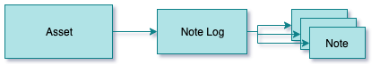

Note logs consist of a series of posts (called notes)
that are added over time (like a blog).
An asset's note log can be maintained through the
[Asset Owner OMAS](../../../open-metadata-implementation/access-services/asset-owner),
[Digital Architecture OMAS](../../../open-metadata-implementation/access-services/digital-architecture)
and
[IT Infrastructure OMAS](../../../open-metadata-implementation/access-services/it-infrastructure).

#### Usage

Note logs can be used by the asset owner or operations team to post status or usage
information about the asset to inform individuals who are using the asset
of important information.

----
## Asset External Descriptions

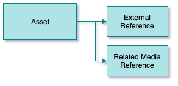

Not everything that is known about an asset is stored in Egeria.
There may be documents, web resources, images, videos and audio files
that provide more detail. 
Through [Asset Owner OMAS](../../../open-metadata-implementation/access-services/asset-owner)
it is possible to add links to external resources and media.

#### Usage

Using the links to external resources, an individual is able to
learn a lot more about the asset they are considering to use to
complete their task.

----
## Asset Lineage

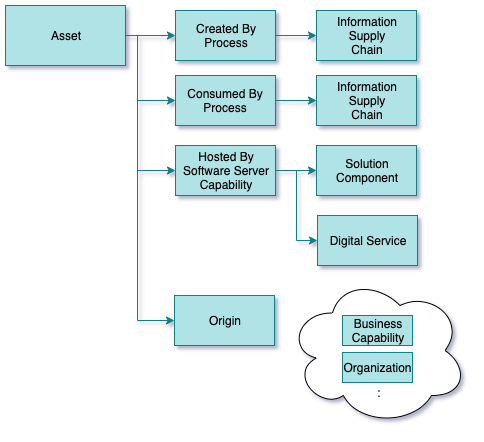
 
Lineage describes the origin of the data that is held by the asset.  There are different perspectives
on what is meant by 'origin'.

In general an asset is being accessed by processes.  They are either adding/updating/deleting data or 
reading it. So one perspective of lineage is to see the processes that are providing and using the asset.

Data often flows from asset to asset via the processes, as they read data from one asset, do some
processing and store the results in a different asset.  The end-to-end flow of data is called
an information supply chain.  Information supply chains can be modeled and linked to the
processes through the
[Digital Architecture OMAS](../../../open-metadata-implementation/access-services/digital-architecture)
This offers more of an enterprise view of where the data originated from.

The asset itself is hosted by a software capability that is part of a server.
Another perspective on the asset's origin is the server capability that is hosting it.

Software server capabilities can be linked to a solution component by the 
[Digital Architecture OMAS](../../../open-metadata-implementation/access-services/digital-architecture).
Solution components are descriptions produced by architects to document the purpose and
behavior of a component.  These descriptions add business context to the software
server capability definitions.  They are linked to the software server capability when it is deployed
into the IT landscape.

Similarly, the software server capability hosting an asset can be linked to the digital service it is a
part of.  Digital Services are anchors for information about the digital services
(also known as offerings or products) that the organization is operating.
This is a business view of the service that the asset is a part of.

Finally, the asset can include identifiers of other metadata elements from the catalog and related
properties in the **AssetOrigin** Classification.
This includes:
* Unique identifier (GUID) of the business capability that owns the asset.  Examples of 
a business capabilities include "Finance", "Human Resources", "Manufacturing", "Sales", etc 
* Unique identifier (GUID) of the organization that owns the asset.  This could be
a unit within the organization or an external organization.

Both organization and business capability information is maintained through the
[Community Profile OMAS](../../../open-metadata-implementation/access-services/community-profile)
and documented in the asset by the
[Asset Owner OMAS](../../../open-metadata-implementation/access-services/asset-owner).

#### Usage

Lineage information helps consumers (individuals and/or automated processes) make choices about
which is the appropriate asset to use for a certain task.  It gives a sense of whether the asset
contains data from an authoritative source/business capability/organization/process.

Regulations that require specific types of reports often require lineage as well as the report
to help the regulators validate that the report is correct.

----
## Related Assets

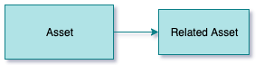

Related assets returns other assets that are linked together or are part of the same collection.

Collections allow individuals and automated processes to maintain
groups of related assets. For example, an individual may
maintain a collection of their favorite assets.  A project team may maintain a
collection of the assets in use by the project.
An automated process may use the retention classification to build a collection of
assets that need to be archived.
These types of collections are maintained through the following
Open Metadata Access Services (OMASs):

* [Asset Consumer OMAS](../../../open-metadata-implementation/access-services/asset-consumer)
* [Community Profile OMAS](../../../open-metadata-implementation/access-services/community-profile)
* [Project Management OMAS](../../../open-metadata-implementation/access-services/project-management)

In addition, there are natural relationships between assets that are created as the asset
is cataloged.  For example,
a file is related to the folder (also known as a directory) it is located in.  Both the file and
the folder could be assets in the asset catalog and they would be automatically linked together
by the [Asset Owner OMAS](../../../open-metadata-implementation/access-services/asset-owner)
when these assets were created.

#### Usage

The related assets enables individuals or automated services to locate assets that are related.
For example, a process may use the related assets to step through and process the
cataloged files in a folder, or the assets in a specific collection.

----
Return to [main article](.).

----
License: [CC BY 4.0](https://creativecommons.org/licenses/by/4.0/),
Copyright Contributors to the ODPi Egeria project.