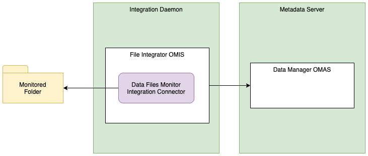

<!-- SPDX-License-Identifier: CC-BY-4.0 -->
<!-- Copyright Contributors to the ODPi Egeria project. -->

# Data Files Monitor Integration Connector

* Connector Category: [Integration Connector](../../../open-metadata-implementation/governance-servers/integration-daemon-services/docs/integration-connector.md)
* Hosting Service: [Files Integrator OMIS](../../../open-metadata-implementation/integration-services/files-integrator)
* Hosting Server: [Integration Daemon](../../../open-metadata-implementation/admin-services/docs/concepts/integration-daemon.md)
* Source Module: [files-integration-connectors](../../../open-metadata-implementation/adapters/open-connectors/integration-connectors/files-integration-connectors)
* Jar File Name: files-integration-connectors.jar

## Overview

The **Data Files Monitor** integration connector monitors changes in a file directory (folder) and updates the open metadata
repository/repositories to reflect the changes to both the files and folders underneath it.

Specifically, a [DataFile](../open-metadata-types/0220-Files-and-Folders.md) asset is created and then maintained for each file in the folder (or any sub-folder).
When a new file is created, a new DataFile asset is created.  If a file is modified, the lastModified property
of the corresponding DataFile asset is updated.  When a file is deleted, its corresponding DataFile asset is either:

* Archived - this means the asset is no longer returned on standard asset catalog searches but it is still visible in 
[lineage graphs](../lineage). This is the default behavior.

* Deleted - this means that all metadata associated with the data file is removed. Only use this option if lineage
is not important for these file.

Figure 1 shows the set up for the data files monitor integration connector.


> **Figure 1:** Operation of the data files monitor integration connector

A [FileFolder](../open-metadata-types/0220-Files-and-Folders.md) metadata asset for the monitored folder is created
when the first file is catalogued, if it does not already exist.

## Configuration

This connector uses the [Files Integrator OMIS](../../../open-metadata-implementation/integration-services/files-integrator)
running in the [Integration Daemon](../../../open-metadata-implementation/admin-services/docs/concepts/integration-daemon.md).

This is its connection definition to use on the 
[administration commands that configure the Files Integrator OMIS](../../../open-metadata-implementation/admin-services/docs/user/configuring-the-integration-services.md).
Replace `{folderName}` with the path name of the folder where the files will be located.
The `configurationProperties` are optional and are used to override the connector's default behavior:

* If `templateQualifiedName` is present in the configuration properties then `{templateQualifiedName}` must be set to the qualified name
of a [DataFile](../open-metadata-types/0220-Files-and-Folders.md) metadata element that should be used as a
template for the catalog entry for new files discovered by this connector.  The base properties, schema, connection,
classifications and any other attachments connected to the template are copied to the new metadata element for the file.
(See [templated cataloging](../cataloging-assets/templated-cataloging.md) for more information on the use of templates.)

* If `allowCatalogDelete` is present in the configuration properties then the metadata element for a file is deleted
when the file is deleted.  If this property is not in the configuration properties, then the metadata element
is archived (by adding the [Memento](../open-metadata-types/0010-Base-Model.md) classification to its entry).
The archived element is no longer returned in standard catalog queries,
but it is still visible in [lineage](../lineage).  Do not set `allowCatalogDelete` if lineage of
these files is important.


```json
{
   "connection" : { 
                      "class" : "Connection",
                      "connectorType" : 
                      {
                           "class" : "ConnectorType",
                           "connectorProviderClassName" : "org.odpi.openmetadata.adapters.connectors.integration.basicfiles.DataFilesMonitorIntegrationProvider"           
                      },
                      "endpoint" :
                      {
                           "class" : "Endpoint",
                           "address" : "{folderName}"
                      },
                      "configurationProperties" : 
                      {
                           "templateQualifiedName" : "{templateQualifiedName}",
                           "allowCatalogDelete" : ""         
                      }
                  }
}
```

## Examples of use

* [Open Metadata Labs](../../../open-metadata-resources/open-metadata-labs): this connector is configured
in the `exchangeDL01` integration daemon server.

----
* Return to [Connector Catalog](.)

----
License: [CC BY 4.0](https://creativecommons.org/licenses/by/4.0/),
Copyright Contributors to the ODPi Egeria project.