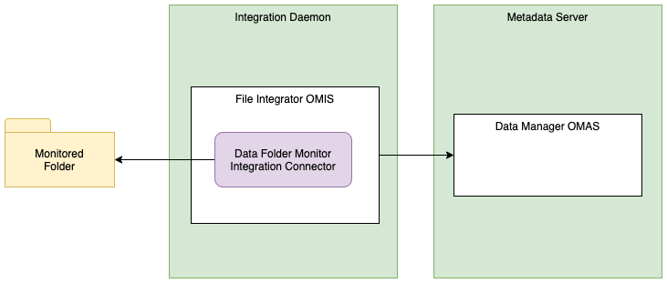

<!-- SPDX-License-Identifier: CC-BY-4.0 -->
<!-- Copyright Contributors to the ODPi Egeria project. -->

# Data Files Monitor Integration Connector

* Connector Category: [Integration Connector](../../../open-metadata-implementation/governance-servers/integration-daemon-services/docs/integration-connector.md)
* Hosting Service: [Files Integrator OMIS](../../../open-metadata-implementation/integration-services/files-integrator)
* Hosting Server: [Integration Daemon](../../../open-metadata-implementation/admin-services/docs/concepts/integration-daemon.md)
* Source Module: [files-integration-connectors](../../../open-metadata-implementation/adapters/open-connectors/integration-connectors/files-integration-connectors)
* Jar File Name: files-integration-connectors.jar

## Overview

The data folder monitor integration connector monitor changes in a file directory (folder) and maintains a 
[DataFolder](../open-metadata-types/0220-Files-and-Folders.md)
asset for the folder.
The files and directories
underneath it are assumed to be elements/records in the DataFolder asset and so each time there is a change to the
files and directories under the monitored directory, it results in an update to the lastModified property
of the corresponding DataFolder asset.


> **Figure 1:** Operation of the data folder monitor integration connector

This connector assumes that the DataFolder asset is already defined.  If it can not retrieve the
DataFolder asset, it ignores file changes.


## Configuration

This connector uses the [Files Integrator OMIS](../../../open-metadata-implementation/integration-services/files-integrator)
running in the [Integration Daemon](../../../open-metadata-implementation/admin-services/docs/concepts/integration-daemon.md).

This is its connection definition to use on the 
[administration commands that configure the Files Integrator OMIS](../../../open-metadata-implementation/admin-services/docs/user/configuring-the-integration-services.md).
Replace `{folderName}` with the path name of the folder to monitor.


```json
{
   "connection" : { 
                      "class" : "Connection",
                      "connectorType" : 
                      {
                           "class" : "ConnectorType",
                           "connectorProviderClassName" : "org.odpi.openmetadata.adapters.connectors.integration.basicfiles.DataFolderMonitorIntegrationProvider"           
                      },
                      "endpoint" :
                      {
                           "class" : "Endpoint",
                           "address" : "{folderName}"
                      }
                  }
}
```

## Examples of use

* [Open Metadata Labs](../../../open-metadata-resources/open-metadata-labs): this connector is configured
in the `exchangeDL01` integration daemon server.

----
* Return to [Connector Catalog](.)

----
License: [CC BY 4.0](https://creativecommons.org/licenses/by/4.0/),
Copyright Contributors to the ODPi Egeria project.