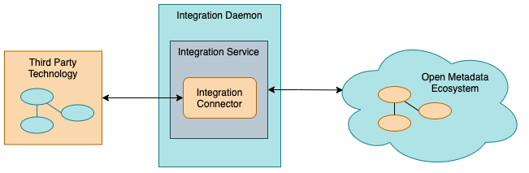
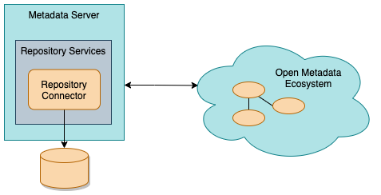
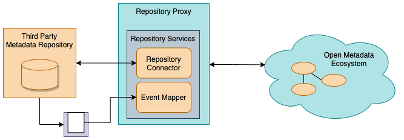
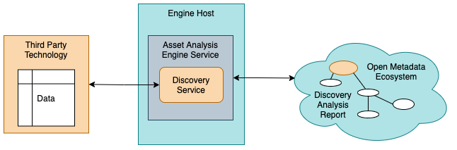
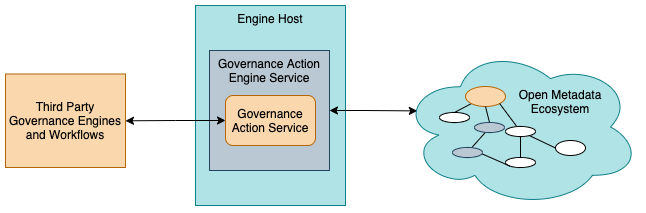

<!-- SPDX-License-Identifier: CC-BY-4.0 -->
<!-- Copyright Contributors to the Egeria project. -->

# Connectors supporting the exchange and maintenance of metadata

These connectors help to accelerate the rollout of your open metadata
ecosystem since they can be used to automate the extraction and
distribution of metadata to the third party technologies.

## Integration Connectors

The integration connectors support the exchange of metadata with third party technologies.  This exchange
may be inbound, outbound, synchronous, polling or event-driven.

> **Figure 1:** Integration Connectors

Details of how integration connectors work is
described in [this article](../../../open-metadata-implementation/governance-servers/integration-daemon-services/docs/integration-connector.md).

#### Files

The files integration connectors run in the 
[Files Integrator Open Metadata Integration Service (OMIS)](../../../open-metadata-implementation/integration-services/files-integrator)
hosted in the [Integration Daemon](../../../open-metadata-implementation/admin-services/docs/concepts/integration-daemon.md).

* The [Data Files Monitor Integration Connector](data-files-monitor-integration-connector.md)
  maintains a DataFile asset for each file in the directory (or any subdirectory).
  When a new file is created, a new DataFile asset is created.  If a file is modified, the lastModified property
  of the corresponding DataFile asset is updated.  When a file is deleted, its corresponding DataFile asset is also deleted 
  (or archived if it is still needed for lineage).

* The [DataFolderMonitorIntegrationConnector](data-folder-monitor-integration-connector.md)
  maintains a DataFolder asset for the directory.  The files and directories
  underneath it are assumed to be elements/records in the DataFolder asset and so each time there is a change to the
  files and directories under the monitored directory, it results in an update to the lastModified property
  of the corresponding DataFolder asset.

#### Databases

The database integration connectors run in the 
[Database Integrator Open Metadata Integration Service (OMIS)](../../../open-metadata-implementation/integration-services/database-integrator)
hosted in the [Integration Daemon](../../../open-metadata-implementation/admin-services/docs/concepts/integration-daemon.md).

* The [PostgreSQL database integration connector](https://github.com/odpi/egeria-database-connectors/tree/main/postgres-connector)
  automatically maintains the open metadata instances for the databases hosted on a [PostgreSQL server](https://www.postgresql.org).
  This includes the database schemas, tables, columns, primary keys and foreign keys.

#### Security Enforcement Engines

The security integration connectors run in the 
[Security Integrator Open Metadata Integration Service (OMIS)](../../../open-metadata-implementation/integration-services/security-integrator)
hosted in the [Integration Daemon](../../../open-metadata-implementation/admin-services/docs/concepts/integration-daemon.md).

## Repository and Event Mapper Connectors

The repository connectors provide the ability to integrate a third party metadata repository
into an [open metadata repository cohort](../../../open-metadata-implementation/repository-services/docs/open-metadata-repository-cohort.md).

Figure 2 shows the repository connector providing a native open metadata repository
that uses a particular type of store within an Egeria [Metadata Server](../../../open-metadata-implementation/admin-services/docs/concepts/metadata-server.md).

> **Figure 2:** Repository connector supporting a native open metadata repository

* The [JanusGraph OMRS Repository Connector](../../../open-metadata-implementation/adapters/open-connectors/repository-services-connectors/open-metadata-collection-store-connectors/graph-repository-connector)
  provides a native repository for a [Metadata Server](../../../open-metadata-implementation/admin-services/docs/concepts/metadata-server.md).
  
* The [CRUX OMRS Repository Connector](https://github.com/odpi/egeria-connector-crux)
  provides a native repository for a [Metadata Server](../../../open-metadata-implementation/admin-services/docs/concepts/metadata-server.md) that supports historical queries.
  
* The [In-memory OMRS Repository Connector](../../../open-metadata-implementation/adapters/open-connectors/repository-services-connectors/open-metadata-collection-store-connectors/inmemory-repository-connector)
  provides a simple native repository implementation that "stores" metadata in hash maps within the JVM. 
  It is used for testing, or for environments where metadata maintained in other repositories
  needs to be cached locally for performance/scalability reasons.

* The [Read-only OMRS Repository Connector](../../../open-metadata-implementation/adapters/open-connectors/repository-services-connectors/open-metadata-collection-store-connectors/inmemory-repository-connector)
  provides a native repository implementation 
  that does not support the interfaces for create, update, delete.  However it does support the search interfaces
  and is able to cache metadata.  This means it can be loaded with open metadata archives to provide
  standard metadata definitions.
  

Figure 3 shows the repository connector providing a native open metadata repository
that uses a particular type of store within an Egeria [Metadata Server](../../../open-metadata-implementation/admin-services/docs/concepts/metadata-server.md).

> **Figure 3:** Repository connector and optional event mapper supporting an adapter to a third party metadata catalog

* The [Apache Atlas OMRS Repository Connectors](https://github.com/odpi/egeria-connector-hadoop-ecosystem) 
  implements read-only connectivity to the Apache Atlas metadata repository.
  
* The [IBM Information Governance Catalog (IGC) OMRS Repository Connector](https://github.com/odpi/egeria-connector-ibm-information-server)
  implements read-only connectivity to the metadata repository within the 
  [IBM InfoSphere Information Server](https://www.ibm.com/analytics/information-server) suite.

* The [SAS Viya OMRS Repository Connector](https://github.com/odpi/egeria-connector-sas-viya)
  implements metadata exchange to the metadata repository within the 
  [SAS Viya Platform](https://support.sas.com/en/software/sas-viya.html).
  

## Open Discovery Services

[Open Discovery Services](../../../open-metadata-implementation/frameworks/open-discovery-framework/docs/discovery-service.md) 
are connectors that analyze the content of resources in the digital landscape and create annotations
that are attached to the resource's Asset metadata element in the open metadata repositories in the form of an open discovery report.

> **Figure 4:** Discovery Services

The interfaces used by a discovery service are defined in
the [Open Discovery Framework (ODF)](../../../open-metadata-implementation/frameworks/open-discovery-framework)
along with a guide on how to write a discovery service.

* [CSV Discovery Service](../../../open-metadata-implementation/adapters/open-connectors/discovery-service-connectors)
  extracts the column names from the first line of the file, counts up the number of records in the file
  and extracts its last modified time.
  
* [Sequential Discovery Pipeline](../../../open-metadata-implementation/adapters/open-connectors/discovery-service-connectors)
  runs nested discovery services in a sequence. 
  [More information on discovery pipelines](../../../open-metadata-implementation/frameworks/open-discovery-framework/docs/discovery-pipeline.md).
      

## Governance Action Services

[Governance Action Services](../../../open-metadata-implementation/frameworks/governance-action-framework/docs/governance-action-service.md) 
are connectors that perform monitoring of metadata changes, validation of metadata, triage of issues, 
assessment and/or remediation activities on request.

> **Figure 5:** Governance Action Services

They run in the
[Governance Action Open Metadata Engine Service (OMES)](../../../open-metadata-implementation/engine-services/governance-action)
hosted by the
[Engine Host OMAG Server](../../../open-metadata-implementation/admin-services/docs/concepts/engine-host.md).

* [Generic Element Watchdog Governance Action Service](generic-element-watchdog-governance-action-service.md)
  listens for changing metadata elements and initiates governance action processes when certain events occur.
  
* [Generic Folder Watchdog Governance Action Service](generic-folder-watchdog-governance-action-service.md)
  listens for changing assets linked to a DataFolder element.  This may be for DataFiles directly linked to the folder or
  in sub-folders.  It initiates governance action processes when specific events occur.
  
* [Move/Copy File Provisioning Governance Action Service](move-copy-file-provisioning-governance-action-service.md)
  moves or copied files from one location to another and maintains the lineage of the action.
  
* [Origin Seeker Remediation Governance Action Service](origin-seeker-remediation-governance-action-service.md) walks
  backwards through the lineage mappings to discover the origin of the data.

## Further information

* [Link to the OMAG Server Platform](../../../open-metadata-implementation/admin-services/docs/concepts/omag-server-platform.md) for information on Egeria's principle runtime.
* [Link to the Open Metadata Repository Services](../../../open-metadata-implementation/repository-services/docs) for information on how the different store connectors are used.
* [Link to the Administration Guide](../../../open-metadata-implementation/admin-services/docs/user) for information on how to configure connectors into Egeria's runtime.

----

* [Return to the Connector Catalog](..)

----
License: [CC BY 4.0](https://creativecommons.org/licenses/by/4.0/),
Copyright Contributors to the Egeria project.