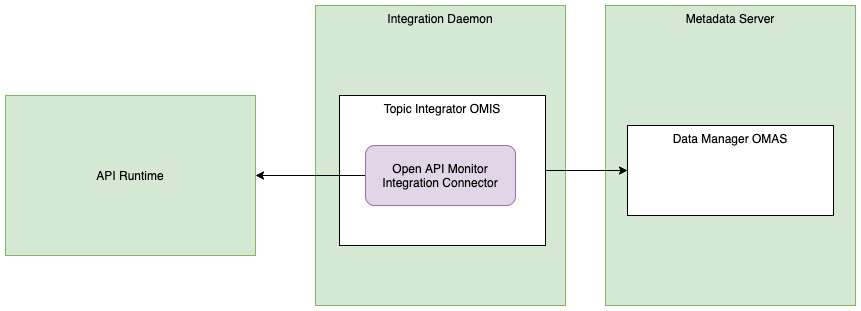

<!-- SPDX-License-Identifier: CC-BY-4.0 -->
<!-- Copyright Contributors to the ODPi Egeria project. -->

# Open API Monitor Integration Connector

* Connector Category: [Integration Connector](../../../open-metadata-implementation/governance-servers/integration-daemon-services/docs/integration-connector.md)
* Hosting Service: [API Integrator OMIS](../../../open-metadata-implementation/integration-services/topic-integrator)
* Hosting Server: [Integration Daemon](../../../open-metadata-implementation/admin-services/docs/concepts/integration-daemon.md)
* Source Module: [openapi-integration-connector](../../../open-metadata-implementation/adapters/open-connectors/integration-connectors/openapi-integration-connector)
* Jar File Name: openapi-integration-connector.jar

## Overview

The Open API monitor integration connector connects to an endpoint and
extracts the open API specification through the `GET {serverURL}/v3/api-docs`
request.
creates a 
[DeployedAPI](../open-metadata-types/0212-Deployed-APIs.md)
asset for each API Tag that is known to the server.
A new [APIOperation](../open-metadata-types/0536-API-Schemas.md) is create
for each combination of path name and operation (GET, POST, PUT, DELETE).


> **Figure 1:** Operation of the Open API monitor integration connector


## Configuration

This connector uses the [API Integrator OMIS](../../../open-metadata-implementation/integration-services/api-integrator)
running in the [Integration Daemon](../../../open-metadata-implementation/admin-services/docs/concepts/integration-daemon.md).

This is its connection definition to use on the 
[administration commands that configure the API Integrator OMIS](../../../open-metadata-implementation/admin-services/docs/user/configuring-the-integration-services.md).
Replace `{serverURL}` with the network address of the process (for example, `localhost:9443`).


```json
{
   "connection" : 
                { 
                    "class" : "Connection",
                    "qualifiedName" : "APIMonitorConnection",
                    "connectorType" : 
                    {
                        "class" : "ConnectorType",
                        "connectorProviderClassName" : "org.odpi.openmetadata.adapters.connectors.integration.openapis.OpenAPIMonitorIntegrationProvider"
                    },
                    "endpoint" :
                    {
                        "class" : "Endpoint",
                        "address" : "{serverURL}"
                    }
                }
}
```

----
* Return to [Connector Catalog](.)

----
License: [CC BY 4.0](https://creativecommons.org/licenses/by/4.0/),
Copyright Contributors to the ODPi Egeria project.