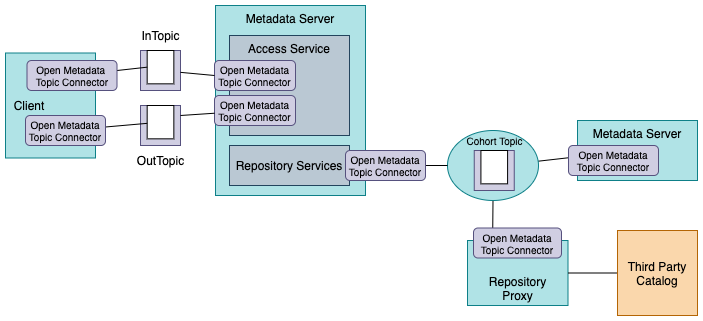
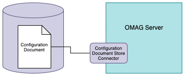
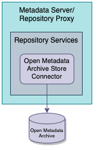
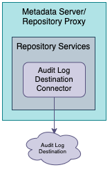
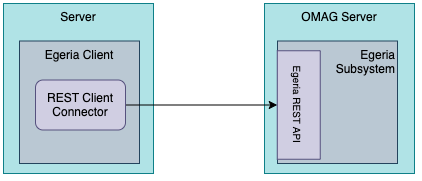
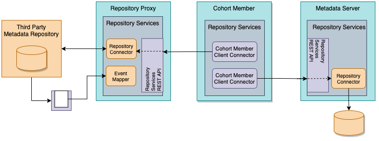

<!-- SPDX-License-Identifier: CC-BY-4.0 -->
<!-- Copyright Contributors to the Egeria project. -->

# Egeria's runtime connectors

Connectors enable Egeria to operate in many environments by providing plug-in points for the runtime services
it needs to operate.  Most of these connectors relate to persistent storage, or connections to distributed services.

### Open Metadata Topic Connectors

The Open Metadata Topic Connectors are used by Egeria to read and write 
[events](../basic-concepts/event.md) to a
[topic](../basic-concepts/topic.md) managed by an
[event broker](../basic-concepts/event-broker.md).
These events contain notifications relating to changes in metadata and the topic provides
an asynchronous event exchange service hosted in the event broker.

> **Figure 1:** Open Metadata Topic Connectors

The Open Metadata Topic Connectors connect servers into an [open metadata repository cohort](../../../open-metadata-implementation/admin-services/docs/concepts/cohort-member.md)
and exchange notifications through the [Open Metadata Access Services (OMAS)'s](../../../open-metadata-implementation/access-services)
topics called the
[InTopic](../../../open-metadata-implementation/access-services/docs/concepts/client-server/in-topic.md) and
[OutTopic](../../../open-metadata-implementation/access-services/docs/concepts/client-server/out-topic.md).

Egeria provides a single implementation of an open metadata connector for Apache Kafka that it uses by default.

* The [Kafka Open Metadata Topic Connector](../../../open-metadata-implementation/adapters/open-connectors/event-bus-connectors/open-metadata-topic-connectors/kafka-open-metadata-topic-connector) implements 
an [Apache Kafka](https://kafka.apache.org/) connector for a topic that exchanges
Java Objects as JSON payloads.

The definition of the connector interface for these connectors is
defined in the [repository-services-api](../../../open-metadata-implementation/repository-services/repository-services-apis) module
in the
[org.odpi.openmetadata.repositoryservices.connectors.openmetadatatopic](https://github.com/odpi/egeria/tree/master/open-metadata-implementation/repository-services/repository-services-apis/src/main/java/org/odpi/openmetadata/repositoryservices/connectors/openmetadatatopic) Java package.

It is configured in the Egeria
[OMAG Servers](../../../open-metadata-implementation/admin-services/docs/concepts/omag-server.md) through the [Event Bus Configuration](../../../open-metadata-implementation/admin-services/docs/concepts/event-bus.md).

## Configuration Document Store Connectors

The configuration store connectors contain the connector implementations that manage
the [Configuration Documents](../../../open-metadata-implementation/admin-services/docs/concepts/configuration-document.md)
for [OMAG Servers](../../../open-metadata-implementation/admin-services/docs/concepts/omag-server.md).

> **Figure 2:** Configuration Document Store Connector

There is one configuration document store connector defined for each
[OMAG Server Platform](../../../open-metadata-implementation/admin-services/docs/concepts/omag-server-platform.md).

There are two implementations of the configuration document store connector provided by Egeria: one for an encrypted store (default) and the other for a plain text store.

* **[Encrypted File Configuration Store Connector](../../../open-metadata-implementation/adapters/open-connectors/configuration-store-connectors/configuration-encrypted-file-store-connector)** stores each
configuration document as an encrypted JSON file.

* **[File Configuration Store](../../../open-metadata-implementation/adapters/open-connectors/configuration-store-connectors/configuration-file-store-connector)** stores each
configuration document as a clear text JSON file.

The definition of the connector interface for these connectors is
defined in the [admin-services-api](../../../open-metadata-implementation/admin-services/admin-services-api) module in the
[org.odpi.openmetadata.adminservices.store](https://github.com/odpi/egeria/tree/master/open-metadata-implementation/admin-services/admin-services-api/src/main/java/org/odpi/openmetadata/adminservices/store) Java package.

Configuring a configuration store connector in the
OMAG Server Platform is described in the [Administration Guide](../../../open-metadata-implementation/admin-services/docs/user/configuring-the-configuration-document-store.md).
If no connector is configured, the OMAG Server Platform uses the Encrypted File Configuration Store Connector.

## Cohort Registry Store Connectors

The cohort registry store connectors store the
[open metadata repository cohort](../../../open-metadata-implementation/repository-services/docs/open-metadata-repository-cohort.md)
membership details used and maintained by the [cohort registry](../../../open-metadata-implementation/repository-services/docs/component-descriptions/cohort-registry.md).
The cohort protocols are peer-to-peer and hence there is a cohort registry
(with a [cohort registry store](../../../open-metadata-implementation/repository-services/docs/component-descriptions/connectors/cohort-registry-store-connector.md))
for each [member of a cohort](../../../open-metadata-implementation/admin-services/docs/concepts/cohort-member.md).

> **Figure 3:** Open Metadata Topic Connectors

Egeria provides a single implementation of a
cohort registry store connector:

* [Cohort Registry File Store Connector](../../../open-metadata-implementation/adapters/open-connectors/repository-services-connectors/cohort-registry-store-connectors/cohort-registry-file-store-connector)
  provides the means to store the cohort registry membership details as a JSON file.
  
The definition of the connector interface for these connectors is
defined in the [repository-services-api](../../../open-metadata-implementation/repository-services/repository-services-apis) module
in the
[org.odpi.openmetadata.repositoryservices.connectors.stores.cohortregistrystore](https://github.com/odpi/egeria/tree/master/open-metadata-implementation/repository-services/repository-services-apis/src/main/java/org/odpi/openmetadata/repositoryservices/connectors/stores/cohortregistrystore) Java package.

  
## Open Metadata Archive Store Connectors

The open metadata archive store connectors can
read and write [open metadata archives](../../../open-metadata-resources/open-metadata-archives).
Open metadata archives store open metadata types and instances for sharing,
or for back up.
These archives can be
[loaded into an OMAG Server at start up](../../../open-metadata-implementation/admin-services/docs/user/configuring-the-startup-archives.md) or
[added to a running OMAG Server](../../../open-metadata-implementation/admin-services/docs/user/adding-archive-to-running-server.md).

> **Figure 4:** Open Metadata Archive Store Connector

Egeria provides a single implementation of the open metadata archive store connector:

* [Open Metadata Archive File Store Connector](../../../open-metadata-implementation/adapters/open-connectors/repository-services-connectors/open-metadata-archive-connectors/open-metadata-archive-file-connector)
  stores an open metadata archive as a plain text JSON file.

The definition of the connector interface for these connectors is
defined in the [repository-services-api](../../../open-metadata-implementation/repository-services/repository-services-apis) module
in the
[org.odpi.openmetadata.repositoryservices.connectors.stores.archivestore](https://github.com/odpi/egeria/tree/master/open-metadata-implementation/repository-services/repository-services-apis/src/main/java/org/odpi/openmetadata/repositoryservices/connectors/stores/archivestore) Java package.

## Audit Log Destination Connectors

The audit log destination connectors support different destinations for audit log records.
Multiple of these connectors can be [active in an OMAG Server](../../../open-metadata-implementation/admin-services/docs/user/configuring-the-audit-log.md)
at any one time and they can each be configured to only process particular types of audit log records.

> **Figure 5:** Audit Log Destination Connector

Below are the connector implementations provided by Egeria

* [Console Audit Log Connector](../../../open-metadata-implementation/adapters/open-connectors/repository-services-connectors/audit-log-connectors/audit-log-console-connector)
  writes selected parts of each audit log record to stdout.

* [slf4j Audit Log Connector](../../../open-metadata-implementation/adapters/open-connectors/repository-services-connectors/audit-log-connectors/audit-log-slf4j-connector)
  writes full log records to the slf4j ecosystem.

* [File Audit Log Connector](../../../open-metadata-implementation/adapters/open-connectors/repository-services-connectors/audit-log-connectors/audit-log-file-connector)
  creates log records as JSON files in a shared directory.

* [Event Topic Audit Log Connector](../../../open-metadata-implementation/adapters/open-connectors/repository-services-connectors/audit-log-connectors/audit-log-event-topic-connector)
  sends each log record as an event on the supplied event topic.

The definition of the connector interface for these connectors is
defined in the [repository-services-api](../../../open-metadata-implementation/repository-services/repository-services-apis) module
in the
[org.odpi.openmetadata.repositoryservices.connectors.stores.auditlogstore](https://github.com/odpi/egeria/tree/master/open-metadata-implementation/repository-services/repository-services-apis/src/main/java/org/odpi/openmetadata/repositoryservices/connectors/stores/auditlogstore) Java package.

There is more information on the use of audit logging in the [Diagnostic Guide](../diagnostic-guide).

## REST Client Connectors

Egeria makes extensive use of [REST API calls](../basic-concepts/api.md) for synchronous (request-response) communication with
its own deployed runtimes and third party technologies.  The client connectors are used to issue
the REST API calls.  Egeria provides a single implementation for Spring.

* [Spring REST Client Connector](../../../open-metadata-implementation/adapters/open-connectors/rest-client-connectors/spring-rest-client-connector)
  uses the Spring RESTClient to issue REST API calls.
  
This is embedded in Egeria's [clients](../developer-guide/using-egeria-clients.md).

> **Figure 6:** REST Client Connector

The definition of the connector interface for these connectors is
defined in the [rest-client-connector-api](../../../open-metadata-implementation/adapters/open-connectors/rest-client-connectors/rest-client-connectors-api) module in the
[org.odpi.openmetadata.adapters.connectors.restclients](https://github.com/odpi/egeria/tree/master/open-metadata-implementation/adapters/open-connectors/rest-client-connectors/rest-client-connector-api/src/main/java/org/odpi/openmetadata/adapters/connectors/restclients) Java package.

## Cohort Member Client Connector

Members of an [Open Metadata Repository Cohort](../../../open-metadata-implementation/admin-services/docs/concepts/cohort-member.md)
provide the other cohort members with a
Connection to a connector that supports the OMRSRepositoryConnector interface during the cohort registration process.
This connector translates calls to retrieve and maintain metadata in the member's repository into
remote calls to the real repository.

> **Figure 7:** Cohort Member Client Connector used for federating queries across the cohort

Egeria's [Open Metadata Repository Services (OMRS)](../../../open-metadata-implementation/repository-services) provides a default REST API
implementation and a corresponding client:

* [REST Cohort Client Connector](../../../open-metadata-implementation/adapters/open-connectors/repository-services-connectors/open-metadata-collection-store-connectors/omrs-rest-repository-connector)
  supports remote calls to the OMRS REST API.
  
The connection for this connector is configured in the `LocalRepositoryRemoteConnection` property of the
cohort member's [Local Repository Configuration](../../../open-metadata-implementation/admin-services/docs/user/configuring-the-local-repository.md).

The definition of the connector interface for these connectors is
defined in the [repository-services-api](../../../open-metadata-implementation/repository-services/repository-services-apis) module
in the
[org.odpi.openmetadata.repositoryservices.connectors.stores.metadatacollectionstore.repositoryconnector](https://github.com/odpi/egeria/tree/master/open-metadata-implementation/repository-services/repository-services-apis/src/main/java/org/odpi/openmetadata/repositoryservices/connectors/stores/metadatacollectionstore/repositoryconnector) Java package.
It is the same interface as the [repository connectors](exchange-connectors.md#Repository and Event Mapper Connectors) that are used to provide the local repository to a metadata server
so that the Open Metadata Repository Services (OMRS)
issue calls to the same interface irrespective of whether the call is to the local repository or a remote cohort member.

## Further information

* [Link to the OMAG Server Platform](../../../open-metadata-implementation/admin-services/docs/concepts/omag-server-platform.md) for information on Egeria's principle runtime.
* [Link to the Open Metadata Repository Services](../../../open-metadata-implementation/repository-services/docs) for information on how the different store connectors are used.
* [Link to the Administration Guide](../../../open-metadata-implementation/admin-services/docs/user) for information on how to configure connectors into Egeria's runtime.

----

* [Return to the Connector Catalog](.)

----
License: [CC BY 4.0](https://creativecommons.org/licenses/by/4.0/),
Copyright Contributors to the Egeria project.