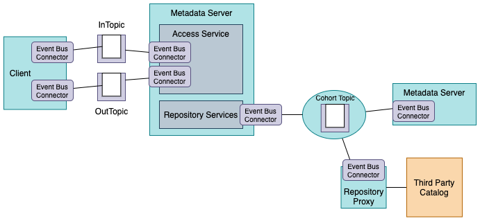

<!-- SPDX-License-Identifier: CC-BY-4.0 -->
<!-- Copyright Contributors to the Egeria project. -->

# Egeria's runtime connectors

Connectors enable Egeria to operate in many environments by providing plug-in points for the runtime services
it needs to operate.  Most of these connectors relate to persistent storage, or connections to distributed services.

### Event Bus Connectors

The event bus connectors are used by Egeria to connect to an event bus to support event exchange
in topics.  

> **Figure 1:** Event Bus Connectors

They are used to connect servers into an [open metadata repository cohort](../../../open-metadata-implementation/admin-services/docs/concepts/cohort-member.md)
and to exchange notifications through the [Open Metadata Access Services (OMAS)'s](../../../open-metadata-implementation/access-services)
topics called the
[InTopic](../../../open-metadata-implementation/access-services/docs/concepts/client-server/in-topic.md) and
[OutTopic](../../../open-metadata-implementation/access-services/docs/concepts/client-server/out-topic.md).

Egeria provides a single implementation of an event bus connector for Apache Kafka that it uses by default.

* The [Kafka Open Metadata Topic Connector](../../../open-metadata-implementation/adapters/open-connectors/event-bus-connectors/open-metadata-topic-connectors/kafka-open-metadata-topic-connector) implements 
an [Apache Kafka](https://kafka.apache.org/) connector for a topic that exchanges
Java Objects as JSON payloads.

## Configuration Document Stores

[OMAG Servers](../../../open-metadata-implementation/admin-services/docs/concepts/omag-server.md)
are configured using a
[configuration document](../../../open-metadata-implementation/admin-services/docs/concepts/configuration-document.md).
The configuration document store provides the place where the configuration documents are persisted.

By default, Egeria uses a file for each configuration document.  There are two implementations: one for an encrypted store (default) and the other for a plain text store.

* [cohort-registry-file-store-connector](../../../open-metadata-implementation/adapters/open-connectors/repository-services-connectors/cohort-registry-store-connectors/cohort-registry-file-store-connector)
  provides the means to store the cohort registry membership details as a JSON file.

## Cohort Registry Stores

The cohort registry store connectors are connectors that store the
[open metadata repository cohort](../../../open-metadata-implementation/repository-services/docs/open-metadata-repository-cohort.md)
membership details used and maintained by the [cohort registry](../../../open-metadata-implementation/repository-services/docs/component-descriptions/cohort-registry.md).
The cohort protocols are peer-to-peer and hence there is a cohort registry
(with a [cohort registry store](../../../open-metadata-implementation/repository-services/docs/component-descriptions/connectors/cohort-registry-store-connector.md))
for each [member of a cohort](../../../open-metadata-implementation/admin-services/docs/concepts/cohort-member.md).

Egeria provides a single implementation of a
cohort registry store connector:

* [cohort-registry-file-store-connector](../../../open-metadata-implementation/adapters/open-connectors/repository-services-connectors/cohort-registry-store-connectors/cohort-registry-file-store-connector)
  provides the means to store the cohort registry membership details as a JSON file.
  
## Open Metadata Archive Stores

The open metadata archive connectors support connectors that can
read and write [open metadata archives](../../../open-metadata-resources/open-metadata-archives).
Open metadata archives store open metadata types and instances for sharing,
or for back up.
These archives can be
[loaded into an OMAG Server at start up](../../../open-metadata-implementation/admin-services/docs/user/configuring-the-startup-archives.md) or
[added to a running OMAG Server](../../../open-metadata-implementation/admin-services/docs/user/adding-archive-to-running-server.md).

Egeria provides a single implementation of
this type of connector:

* [Encrypted configuration file store](../../../open-metadata-implementation/adapters/open-connectors/configuration-store-connectors/configuration-encrypted-file-store-connector)
  stores an open metadata archive as an encrypted JSON file.

* [Plain text configuration file store](../../../open-metadata-implementation/adapters/open-connectors/configuration-store-connectors/configuration-file-store-connector)
  stores an open metadata archive as a plain text JSON file.

## Audit Log Connectors

The audit log store connectors support different destinations for audit log record.
Multiple of these connectors can be [active in an OMAG Server](../../../open-metadata-implementation/admin-services/docs/user/configuring-the-audit-log.md)
at any one time and they can each be configured to only process particular types of audit log records.

* [Console Audit Log Connector](../../../open-metadata-implementation/adapters/open-connectors/repository-services-connectors/audit-log-connectors/audit-log-console-connector)
  writes selected parts of each audit log record to stdout.

* [slf4j Audit Log Connector](../../../open-metadata-implementation/adapters/open-connectors/repository-services-connectors/audit-log-connectors/audit-log-slf4j-connector)
  writes full log records to the slf4j ecosystem.

* [File Audit Log Connector](../../../open-metadata-implementation/adapters/open-connectors/repository-services-connectors/audit-log-connectors/audit-log-file-connector)
  creates log records as JSON files in a shared directory.

* [Event Topic Audit Log Connector](../../../open-metadata-implementation/adapters/open-connectors/repository-services-connectors/audit-log-connectors/audit-log-event-topic-connector)
  sends each log record as an event on the supplied event topic.

There is more information on the use of audit logging in the [Diagnostic Guide](../diagnostic-guide).

## REST Client Connectors

Egeria makes extensive use of REST API calls for synchronous (request-response) communication with
its own deployed runtimes and third party technologies.  The client connectors are used to issue
the REST API calls.  Egeria provides a single implementation for Spring.

* [Spring REST Client Connector](../../../open-metadata-implementation/adapters/open-connectors/repository-services-connectors/audit-log-connectors/audit-log-console-connector)
  writes selected parts of each audit log record to stdout.

## Cohort Member Client Connector

Members of an [Open Metadata Repository Cohort](../../../open-metadata-implementation/admin-services/docs/concepts/cohort-member.md)
provide the other cohort members with a
Connection to a connector that supports the OMRSRepositoryConnector interface during the cohort registration process.
This connector translates calls to retrieve and maintain metadata in the member's repository into
remote calls to the real repository.

Egeria's [Open Metadata Repository Services (OMRS)](../../../open-metadata-implementation/repository-services) provides a default REST API
implementation and a corresponding client:

* [REST Cohort Client Connector](../../../open-metadata-implementation/adapters/open-connectors/repository-services-connectors/open-metadata-collection-store-connectors/omrs-rest-repository-connector)
  supports remote calls to the OMRS REST API.
  
The connection for this connector is configured in the `LocalRepositoryRemoteConnection` property of the
cohort member's [Local Repository Configuration](../../../open-metadata-implementation/admin-services/docs/user/configuring-the-local-repository.md).

## Further information

* [Link to the OMAG Server Platform](../../../open-metadata-implementation/admin-services/docs/concepts/omag-server-platform.md) for information on Egeria's principle runtime.
* [Link to the Open Metadata Repository Services](../../../open-metadata-implementation/repository-services/docs) for information on how the different store connectors are used.
* [Link to the Administration Guide](../../../open-metadata-implementation/admin-services/docs/user) for information on how to configure connectors into Egeria's runtime.

----

* [Return to the Connector Catalog](..)

----
License: [CC BY 4.0](https://creativecommons.org/licenses/by/4.0/),
Copyright Contributors to the Egeria project.