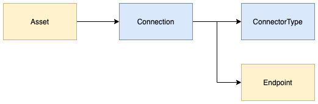
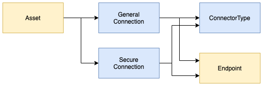
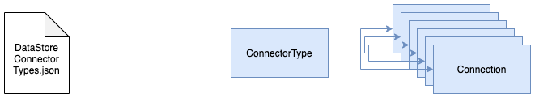
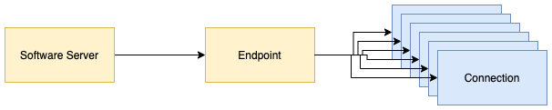

<!-- SPDX-License-Identifier: CC-BY-4.0 -->
<!-- Copyright Contributors to the Egeria project. -->

# Working with connectors to digital resources

Connectors can be created through the following clients:

* [Asset Consumer OMAS](../../../open-metadata-implementation/access-services/asset-consumer)
* [Asset Owner OMAS](../../../open-metadata-implementation/access-services/asset-owner)


The code sample below uses the Asset Consumer OMAS client to retrieve a list of assets from a
metadata server and then create a connector to each one using the `getConnectorToAsset` method.

This method assumes that there is a connection object with a connector type and endpoint linked to the requested asset
in the metadata repository as shown in figure 1.


> **Figure 1:** An asset with a connection

An exception is thrown if an asset does not have a connection. 

In the sample, the connector returned by the Asset consumer OMAS client is then cast to the CSV File Connector (`CSVFileConnector`).
Assets that are not CSV files
will have a different connector implementation and so the casting to CSVFileConnector also results in an exception.

Assets that do not have a CSV File Connector are ignored.
The result is that the sample method returns a connector for the first CSV file asset retrieved from the metadata repository.

```java
    /**
     * This method uses Asset Consumer OMAS to locate and create an Open Connector Framework (OCF) connector
     * instance.
     *
     * @return connector to first CSVFile located in the catalog
     */
    private CSVFileStoreConnector getConnectorUsingMetadata()
    {
        try
        {
            /*
             * The Asset Consumer OMAS supports a REST API to extract metadata from the open metadata repositories
             * linked to the same open metadata cohort as the Asset Consumer OMAS.  It also has a Java client that
             * provides an equivalent interface to the REST API plus connector factory methods supported by an
             * embedded Connector Broker.  The Connector Broker is an Open Connector Framework (OCF) component
             * that is able to create and configure instances of compliant connectors.  It is passed a Connection
             * object which has all of the properties needed to create the connector.  The Asset Consumer OMAS
             * extracts the Connection object from the open metadata repositories and then calls the Connector Broker.
             */
            AssetConsumer client = new AssetConsumer(serverName, serverURLRoot);

            /*
             * This call extracts the list of assets stored in the open metadata repositories that have a name
             * that matches the requested filename.
             */
            List<String>   knownAssets = client.findAssets(clientUserId, ".*", 0, 4);

            if (knownAssets != null)
            {
                System.out.println("The open metadata repositories have returned " + knownAssets.size() + " asset definitions for the requested file name " + fileName);

                for (String assetGUID : knownAssets)
                {
                    if (assetGUID != null)
                    {
                        try
                        {
                            /*
                             * The aim is to return a connector for the first matching asset.  If an asset of a different
                             * type is returned, on one where it is not possible to create a connector for, then an
                             * exception is thrown and the code moves on to process the next asset.
                             */
                            return (CSVFileStoreConnector) client.getConnectorForAsset(clientUserId, assetGUID);
                        }
                        catch (Exception error)
                        {
                            System.out.println("Unable to create connector for asset: " + assetGUID);
                        }
                    }
                }
            }
            else
            {
                System.out.println("The open metadata repositories do not have an asset definition for the requested file name " + fileName);
            }
        }
        catch (Exception error)
        {
            System.out.println("The connector can not be created from metadata.  Error message is: " + error.getMessage());
        }

        return null;
    }
    
```

The sample code snippets come from this code sample:

* [CSVFileReader](https://github.com/odpi/egeria/blob/master/open-metadata-resources/open-metadata-samples/access-services-samples/asset-management-samples/asset-reader-csv-sample/src/main/java/org/odpi/openmetadata/accessservices/assetconsumer/samples/readcsvfile/CSVFileReaderSample.java)


## Advanced topics

### Supporting connections to assets with different levels of security

It is possible that an asset can have multiple connections, each with different levels of
security access encoded see (figure 2).  Egeria is able to determine which one to use by calling the
`validateUserForAssetConnectionList` method of the
[Server Security Metadata Connector](../../../open-metadata-implementation/common-services/metadata-security).



> **Figure 2:** Multiple connections for an asset


### What else links to the connection

Open metadata is a large connected network (graph) of information.  The connector type and endpoint
that a connection object links to are typically shared with many connections.
This creates some interesting insight.

For example, there is typically one connector type for each connector implementation.
By retrieving the relationships from the connector type to the connections,
it is possible to see the extent to which the connector is used.

#### Connector Types


> **Figure 3:** Uses of a connector implementation

The connector types for Egeria's data store connectors are available in an open metadata archive
called DataStoreConnectorTypes.json that can be loaded into the server.
This approach can be used for all of your connector implementations to create the connector type objects
in our metadata repository.  See the
[Open Connector Archives](../../../open-metadata-resources/open-metadata-archives/open-connector-archives)
for more detail.


#### Endpoints

The endpoints are typically linked to the software server that is called by the connector.
By navigating from the Endpoint to the linked connections it is possible to trace the callers to
the software server.



> **Figure 4:** Connections to a software server

Software servers and endpoints are set up
through the [IT Infrastructure OMAS](../../../open-metadata-implementation/access-services/it-infrastructure).


## Further Information

* [Link to the connector catalog](../connector-catalog/data-connectors.md) for a list of connectors to digital resources.

----

* [Return to the Developer Guide](.)

----
License: [CC BY 4.0](https://creativecommons.org/licenses/by/4.0/),
Copyright Contributors to the Egeria project.