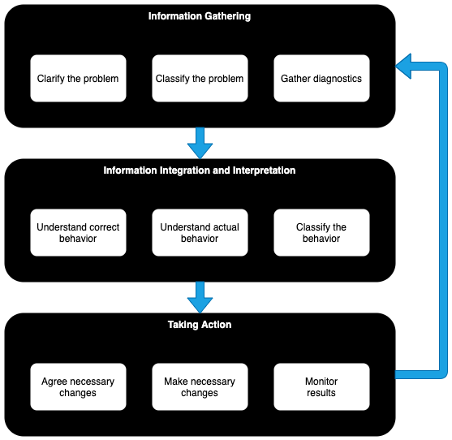

<!-- SPDX-License-Identifier: CC-BY-4.0 -->
<!-- Copyright Contributors to the ODPi Egeria project 2020. -->

# Egeria diagnostic guide

This guide focuses on diagnosing and fixing issues running Egeria's
[OMAG Server Platform](../../../open-metadata-implementation/admin-services/docs/concepts/omag-server-platform.md)
and the [OMAG Servers](../../../open-metadata-implementation/admin-services/docs/concepts/omag-server.md)
that run on it.

If you are having problems building Egeria, please see the
[Building Egeria](../../../open-metadata-resources/open-metadata-tutorials/building-egeria-tutorial) tutorial.

## The diagnosis process

The OMAG Server Platform has many functions itself, and is typically be embedded in complex deployment environments.
This means that diagnosing (and most importantly fixing them) needs to be done in a
systematic way.  

Figure 1 shows a view of the diagnostic process.  

> **Figure 1:** The diagnostic process

The diagram shows three phases linked together in sequence with a return arrow from the third phase,
looping back to the first.  It is an example of process that appears rational in hindsight.
When you are in the middle of the process you may find that you are iterating backwards and
forwards between the different stages, particularly if it is a puzzling problem.
However, it is often helpful to step back and look at each step in the process and
assemble your thoughts along these lines.  The diagnostic guide is organized according to
this process and at the very least, it will help you to find the information that you need.

So now consider each phase of the process.

* **Information Gathering** - The first phase is to gather the information needed to understand the nature of the problem.

    * **Clarify the problem** - Create a clear picture in your mind of the symptoms of your problem.  Be as precise as possible since that will simplify your work at a later stage.
    Ask yourself:
        * What is not working?  Did something fail? Or is it unresponsive, or creating the wrong results?
        * Has it ever worked or has it just stopped working?
        * If it has just stopped working, what has changed recently?
        * Who does it affect?  Everyone?  Specific users?  Running in specific environments?
        * What is the context of the problem?  For example, what is the deployment topology in terms of the machines,
       containers, OMAG Server Platforms, OMAG Services and connected services (such as Apache Kafka).
  
    * **Classifying the problem** - Identifying the type of problem guides you to which diagnostics will be helpful.
       For example, consider the following options, and also identify whether this is a consistent or intermittent error.
       
        * The platform failed to start
        * The platform failed while it was running
        * A server failed to start
        * A server failed while it was running
        * A connector within a server failed to start up properly
        * A connector within a server detected and error
        * A request to a server failed with an exception
        * A request to a server hangs
        * A request to a server produces the wrong results
        * A server is failing to join a cohort
        * Metadata is not being shared across the cohort
        * Requests are running slowly
            
    * **Gather diagnostics** - This is where you are looking to capture the evidence that may identify
    both the source of the error and the nature of the failure.
    The different types of diagnostics that are available are described [here](diagnostic-sources.md).
    If the problem is in the Egeria code,
    rather than its runtime environment, then the 
    [Egeria diagnostics may also defined how to fix the problem](ffdc.md).
    
* **Information Integration and Interpretation** - The second phase uses the evidence gathered in the
  to make a diagnosis to determine which component is in error and what it is doing that is incorrect.
  To do this, you need to:
  
  * **Understand the correct behavior** - how should it be working?  If the desired capability
  is in the Egeria code, what is the status of the module and is the function that you are using complete
  and expected to work.
  
  * **Understand the actual behavior** - compare and contrast how it is actually working with
  how it should be working.
  
  * **Classify the behavior** - identify the nature of the behavior you are seeing. 
  For example:
    * **Not Implemented** - The desired behavior is not yet implemented - or in development.
    * **Bad Environment** - The OMAG Server Platform's runtime (container) environment is incorrect or failing or lacking resources.
    * **Bad Platform Configuration** - The OMAG Server Platform is incorrectly configured.
    * **Bad Server Configuration** - The OMAG Server is incorrectly configured.  This may be its subsystems, or tis connectors.
    * **Failing dependent service** - A service being called by the platform or a server (for example, Kafka, LDAP) is not running correctly.
    * **Insufficient security access** - A platform, server or user does not have security authorization to complete a request.
    * **Caller error** - An error in the caller to Egeria's request
    * **Bad connector implementation** - An error in the implementation of a connector.
    * **Egeria platform bug** - one of the subsystems of Egeria is not operating correctly.
    
  With this information, it may be possible to match what is occurring in your environment with
  descriptions of common errors, or errors found by other users of Egeria.  These will hopefully
  also include a description of how to fix the problem.
  
* **Taking Action** - Once the cause of the problem is understood, you next need to fix it. There are three parts to this: 

  * **Agree necessary changes** - Sometimes the diagnostics describe how to fix the problem, sometimes that are
  choices to be agreed with the people responsible for the components/configuration that needs fixing.
  
  * **Make necessary changes** - Once the approach has been agreed, the changes need to be made.
  
  * **Monitor results** - Finally the changes need to be tested to ensure the problem is fixed and
  there are no unwanted side-effects.  If the solution did not work, then begin again with the
  information gathering process.  It may also be a time to request help from the 
  [Egeria community](../../../Community-Guide.md).  If the situation is worse, you may wish to back out the changes
  you have made before trying the diagnosis process again.

The description above is an overview of what to do to diagnose and fix a problem.
This may be enough to help you resolve the issues you are seeing.
However, whilst some problems are frequently encountered, others are unique to your situation.
What follows are some descriptions of the diagnostics for problems that are frequently seen.
These can help you to eliminate the obvious causes.  

* [Examples of OMAG Server Platform startup errors](examples-of-platform-start-up-errors.md)
* [Examples of OMAG Server startup errors](examples-of-server-start-up-errors.md)
* [Examples of Open Metadata Repository Cohort errors](examples-of-cohort-errors.md)
* [Examples of REST API call failures](examples-of-common-rest-api-errors.md)

## Further information

* [First Failure Data Capture (FFDC)](ffdc.md)
* [Integration Daemon Diagnostics Guide](integration-daemon-diagnostic-guide.md)
* [Administration Guide](../../../open-metadata-implementation/admin-services/docs/user)

----
Return to [Home Page](../../../index.md)

----
License: [CC BY 4.0](https://creativecommons.org/licenses/by/4.0/),
Copyright Contributors to the ODPi Egeria project.