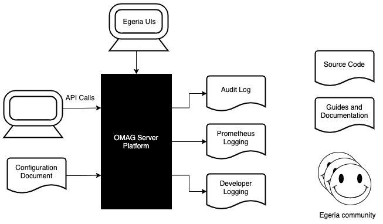

<!-- SPDX-License-Identifier: CC-BY-4.0 -->
<!-- Copyright Contributors to the Egeria project. -->

# Diagnostic Sources

## OMAG Server Platform

Figure 1 shows the choices you have when [gathering diagnostics](.) for a problem related to the
OMAG Server Platform and the servers and services that run on it.
These are in addition to the diagnostics from the container services, and the services that either call or are
called by the services running on the OMAG Server Platform.

> **Figure 1:** Diagnostic sources for the OMAG Server Platform

Specifically they are:

* **Audit Log** - the audit log provides diagnostic information for a running OMAG Server.
  This includes the start up and shutdown of services, unexpected exceptions, events sent and processed,
  and processing errors.  It is the primary source of diagnostic for issues relating to an OMAG Server
  and the Open Metadata Repository Cohort.  [More information ...](ffdc.md).
  
* **Prometheus Logging** - the OMAG Server Platform supports a Prometheus Endpoint that logs the
  REST API calls to the platform itself and the servers running on it.  This logging information
  is available through a [Prometheus service](https://prometheus.io/docs/introduction/overview/) and visualization
  services
  such as [Grafana](https://prometheus.io/docs/visualization/grafana/) can display a dashboard of
  the REST Services performance and usage.
  
* **Developer Logging** - Developer logging can be used in developer and test environments
  to understand how the code is running.  It is enabled through the OMAG Server Platform's 
  `application.properties` and is activated when the platform starts up.
  [More information ...](../../../open-metadata-implementation/admin-services/docs/user/omag-server-platform-logging.md).

* **Configuration Document** - the configuration document describes the services and connectors
  defined for a particular OMAG Server.  It helps you to confirm that a server is configured correctly.
  [More information ...](../../../open-metadata-implementation/admin-services/docs/concepts/configuration-document.md).

* **Guides and Documentation** - documentation for Egeria includes design information to help you understand
  how the technology should work, administration guides and guides on using the services.
  [More Information ...](https://egeria-project.org/)
  
* **API Calls** - The Egeria API calls can be used to understand the state of a particular repository, OMAG Server and/or
  OMAG Server Platform.
  [More Information ...](diagnostic-apis.md)

* **Egeria UIs** - The Egeria UIs help to visualize the state of the repositories and the Egeria Ecosystem.
  [More Information ...](https://github.com/odpi/egeria-react-ui)

* **Source Code** - The Egeria source code can help you determine exactly how a capability is implemented (or not).
  It is available on GitHub.  The primary repository is
  [https://github.com/odpi/egeria](https://github.com/odpi/egeria).

* **Egeria Community** - If you are completely stuck, or believe there is a bug in the Egeria content,
  You can [raise an issue](https://github.com/odpi/egeria/issues) that describes the problem you are seeing,
  a description of your runtime topology, the diagnostics you have collected, the conclusions you have come to
  and the help that you need.
  More information on the Egeria community can be found [here](../../../Community-Guide.md).

----

* Return to [diagnostic guide](.)

----
License: [CC BY 4.0](https://creativecommons.org/licenses/by/4.0/),
Copyright Contributors to the Egeria project.