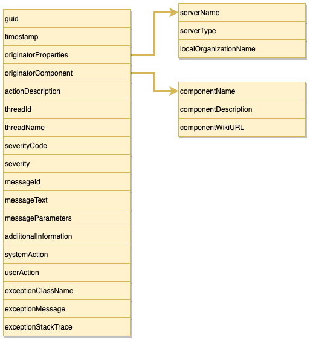

<!-- SPDX-License-Identifier: CC-BY-4.0 -->
<!-- Copyright Contributors to the Egeria project. -->


# First failure data capture (FFDC)

Egeria will typically be embedded in complex deployment environments.
Because of this, we try to practice First Failure Data Capture (FFDC).

First Failure Data Capture (FFDC) is an approach to error handling that aims to guide
the support team to the cause of an error based on the output of a single, or small number of,
messages, rather than relying on tracing through the logic flow.

This is not always possible, particularly for bugs and unexpected
runtime conditions, but it is a worthy goal because it is rarely practical
to turn on debug tracing in a production system.

FFDC typically requires as much information as possible to be gathered
at the point where the error is first detected.  This information is added to as the
call unwinds.  This way we know:
 * What went wrong precisely
 * What was the server doing when it went wrong
 * What is the consequence of this failure to the caller, or others

FFDC requires careful design by the developer because they need to anticipate
the likely errors and design the error handling accordingly.
Many modules have more error handling code than "happy path code".
In addition, there is wide spread use of two important components
throughout Egeria.

* The [FFDC Services](../../../open-metadata-implementation/common-services/ffdc-services) -
  provides base services for implementing FFDC in an Egeria module.

     * Common audit log messages and exception codes.
     * Common exceptions and base exceptions.
     * Common REST Structures.
     * Invalid parameter handler for common parameter types.
     * REST Call logger for debug messages and performance logging.
     * Handler for common exceptions.
     
* The [Audit Log Framework (ALF)](../../../open-metadata-implementation/frameworks/audit-log-framework) -
  provides interface definitions and classes to enable connectors to support natural language enabled
  diagnostics such as exception messages and audit log messages.

The result is the consistent availability of detailed diagnostics when things go wrong.

In addition the [Open Metadata Repository Services (OMRS)](../../../open-metadata-implementation/repository-services/docs/component-descriptions/audit-log.md)
provides an extension to the ALF's audit log destination that supports multiple
[audit log store connectors](../../../open-metadata-implementation/adapters/open-connectors/repository-services-connectors/audit-log-connectors).
This means that an OMAG Server can be configured to route 
audit log messages to multiple destinations.


Details of the supported audit log store connectors and
how to set them up are described in
[Configuring the Audit Log](../../../open-metadata-implementation/admin-services/docs/user/configuring-the-audit-log.md).

## FFDC principles practised by the Egeria community

* Each type of message has a unique identifier and
  the parameters embedded in it are sufficient to determine the
  call parameters and the code path to the exact point where the error
  is detected.

* All parameters are validated both client side and server side.

* APIs use different types of exceptions to separate:
  * Invalid parameters from the caller
  * User security errors that need administrator action
  * Temporary problems in the server
  * Bugs and logic errors (ie reaching a point in the path that should be impossible).
  
  Typically, the modules use checked exceptions for the first three types of errors and
  runtime exceptions for the last.
  
* Where there is no direct external caller, errors are logging the Audit Log
  rather than throwing an exception in a background thread.
  
* Exception objects containing stack traces never leave the OMAG Server Platform.
  The full exception is added to the Audit Log so the stack trace can be analysed by the platform team.
  Important diagnostic information - such as the exception type, message, system action and user action
  is captured in the REST response.
  If the calling program is an Egeria client, it recreates the exception (minus the stack trace of course)
  and throws it to its caller.
  That way, all information about the exception is preserved without compromising the security of the server platform.


## Exceptions

### An example of a response from a REST API call

This is how an exception is passed from the OMAG Server Platform to a calling program.  

```json
{
    "class": "VoidResponse",
    "relatedHTTPCode": 400,
    "exceptionClassName": "org.odpi.openmetadata.frameworks.connectors.ffdc.PropertyServerException",
    "exceptionCausedBy": "java.lang.NullPointerException",
    "actionDescription": "refreshService",
    "exceptionErrorMessage": "OMAG-COMMON-400-016 An unexpected java.lang.NullPointerException exception was caught by refreshService; error message was null",
    "exceptionErrorMessageId": "OMAG-COMMON-400-016",
    "exceptionErrorMessageParameters": [
        "java.lang.NullPointerException",
        "refreshService",
        "null"
    ],
    "exceptionSystemAction": "The system is unable to process the request and has returned an exception to the caller.",
    "exceptionUserAction": "Review the error message.  Also look up its full message definition which includes the system action and user action.  This is most likely to describe the correct action to take to resolve the error.  If that does not help, look for other diagnostics created at the same time.  Also validate that the caller is a valid client of this server and is operating correctly."
}
```

and another example:

```json
{
    "class": "VoidResponse",
    "relatedHTTPCode": 404,
    "exceptionClassName": "org.odpi.openmetadata.frameworks.connectors.ffdc.InvalidParameterException",
    "actionDescription": "refreshService",
    "exceptionErrorMessage": "OMAG-MULTI-TENANT-404-001 The OMAG Server exchangeDL01 is not available to service a request from user garygeeke",
    "exceptionErrorMessageId": "OMAG-MULTI-TENANT-404-001",
    "exceptionErrorMessageParameters": [
        "exchangeDL01",
        "garygeeke"
    ],
    "exceptionSystemAction": "The system is unable to process the request because the server is not running on the called platform.",
    "exceptionUserAction": "Verify that the correct server is being called on the correct platform and that this server is running. Retry the request when the server is available.",
    "exceptionProperties": {
        "serverName": "exchangeDL01",
        "parameterName": "serverName"
    }
}
```

Additional examples of common errors are shown [here](examples-of-common-rest-api-errors.md).

## Audit Log Messages

The diagram below illustrates the structure of the audit log records:



### Audit Log Record Severities

The audit log severities supported by the OMAG Servers are as follows:

* **Information** - The server is providing information about its normal operation.
* **Event** - An event was received from another member of the open metadata repository cohort.
* **Decision** - A decision has been made related to the interaction of the local metadata repository and the rest of the cohort.
* **Action** - An Action is required by the administrator. At a minimum, the situation needs to be investigated and 
  if necessary, corrective action taken.
* **Error** - An error occurred, possibly caused by an incompatibility between the local metadata repository
  and one of the remote repositories. The local repository may restrict some of the metadata interchange
  functions as a result.
* **Exception** - An unexpected exception occurred.  This means that the server needs some administration
  attention to correct configuration or fix a logic error because it is not operating as a proper peer in the
  open metadata repository cohort.
* **Security** - Unauthorized access to a service or metadata instance has been attempted.
* **Startup** - A new component is starting up.
* **Shutdown** - An existing component is shutting down.
* **Asset** - An auditable action relating to an asset has been taken.
* **Types** - Activity is occurring that relates to the open metadata types in use by this server.
* **Cohort** - The server is exchanging registration information about an open metadata repository cohort that
  it is connecting to.
* **Trace** - This is additional information on the operation of the server that may be
  of assistance in debugging a problem.  It is not normally logged to any destination, but can be added when needed.,
* **PerfMon** - This log record contains performance monitoring timing information for 
  specific types of processing. It is not normally logged to any destination, but can be added when needed.
* **\<Unknown\>** - Uninitialized Severity

### Example of an audit log message
Below is an example of the types of information captured in an audit log record.
```json
{
    "guid": "bfc4ebe9-0550-4c33-b3d6-aa760401b400",
    "timeStamp": 1583442856062,
    "originatorProperties": {
        "Server Name": "findItDL01",
        "Organization Name": "Coco Pharmaceuticals",
        "Server Type": "Open Metadata and Governance Server"
    },
    "originatorComponent": {
        "componentId": 2000,
        "componentName": "Discovery Engine Services",
        "componentWikiURL": "https://egeria.odpi.org/open-metadata-implementation/governance-servers/discovery-engine-services/",
        "componentType": "Run automated discovery services"
    },
    "actionDescription": "Register configuration listener",
    "threadId": 116,
    "threadName": "org.odpi.openmetadata.governanceservers.discoveryengineservices.handlers.DiscoveryConfigurationRefreshHandler",
    "severityCode": 5,
    "severity": "Error",
    "messageId": "DISCOVERY-ENGINE-SERVICES-0028",
    "messageText": "Failed to refresh configuration for discovery engine AssetQuality.  The exception was org.odpi.openmetadata.frameworks.connectors.ffdc.PropertyServerException with error message DISCOVERY-ENGINE-SERVICES-400-014 Properties for discovery engine called AssetQuality have not been returned by open metadata server cocoMDS1 to discovery server cocoMDS1",
    "messageParameters": [
        "AssetQuality",
        "org.odpi.openmetadata.frameworks.connectors.ffdc.PropertyServerException",
        "DISCOVERY-ENGINE-SERVICES-400-014 Properties for discovery engine called AssetQuality have not been returned by open metadata server cocoMDS1 to discovery server cocoMDS1"
    ],
    "additionalInformation": [
        "PropertyServerException{reportedHTTPCode=400, reportingClassName='org.odpi.openmetadata.governanceservers.discoveryengineservices.handlers.DiscoveryEngineHandler', reportingActionDescription='refreshConfig', errorMessage='DISCOVERY-ENGINE-SERVICES-400-014 Properties for discovery engine called AssetQuality have not been returned by open metadata server cocoMDS1 to discovery server cocoMDS1', reportedSystemAction='The discovery server is not able to initialize the discovery engine and so it will not de able to support discovery requests targeted to this discovery engine.', reportedUserAction='This may be a configuration error or the metadata server may be down.  Look for other error messages and review the configuration of the discovery server.  Once the cause is resolved, restart the discovery server.', reportedCaughtException=null, relatedProperties=null}"
    ],
    "systemAction": "The discovery engine is unable to process any discovery requests until its configuration can be retrieved.",
    "userAction": "Review the error messages and resolve the cause of the problem.  Either wait for the discovery server to refresh the configuration, or issue the refreshConfigcall to request that the discovery engine calls the Discovery Engine OMAS to refresh the configuration for the discovery service.",
    "exceptionClassName": "org.odpi.openmetadata.frameworks.connectors.ffdc.PropertyServerException",
    "exceptionMessage": "DISCOVERY-ENGINE-SERVICES-400-014 Properties for discovery engine called AssetQuality have not been returned by open metadata server cocoMDS1 to discovery server cocoMDS1",
    "exceptionStackTrace": "PropertyServerException{reportedHTTPCode=400, reportingClassName='org.odpi.openmetadata.governanceservers.discoveryengineservices.handlers.DiscoveryEngineHandler', reportingActionDescription='refreshConfig', errorMessage='DISCOVERY-ENGINE-SERVICES-400-014 Properties for discovery engine called AssetQuality have not been returned by open metadata server cocoMDS1 to discovery server cocoMDS1', reportedSystemAction='The discovery server is not able to initialize the discovery engine and so it will not de able to support discovery requests targeted to this discovery engine.', reportedUserAction='This may be a configuration error or the metadata server may be down.  Look for other error messages and review the configuration of the discovery server.  Once the cause is resolved, restart the discovery server.', reportedCaughtException=null, relatedProperties=null}\n\tat org.odpi.openmetadata.governanceservers.discoveryengineservices.handlers.DiscoveryEngineHandler.refreshConfig(DiscoveryEngineHandler.java:154)\n\tat org.odpi.openmetadata.governanceservers.discoveryengineservices.handlers.DiscoveryConfigurationRefreshHandler.run(DiscoveryConfigurationRefreshHandler.java:140)\n\tat java.lang.Thread.run(Thread.java:748)\n",
    "originator": {
        "serverName": "findItDL01",
        "serverType": "Open Metadata and Governance Server",
        "organizationName": "Coco Pharmaceuticals"
    },
    "reportingComponent": {
        "componentId": 2000,
        "componentName": "Discovery Engine Services",
        "componentWikiURL": "https://egeria.odpi.org/open-metadata-implementation/governance-servers/discovery-engine-services/",
        "componentType": "Run automated discovery services"
    }
}
```

## Further information

* [Configuring the audit log destinations](../../../open-metadata-implementation/admin-services/docs/user/configuring-the-audit-log.md).


----

* Return to [diagnostic guide](.)


----
License: [CC BY 4.0](https://creativecommons.org/licenses/by/4.0/),
Copyright Contributors to the Egeria project.