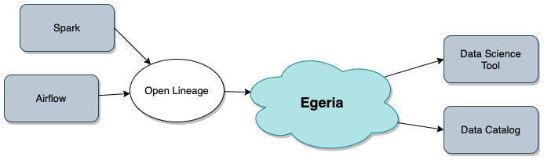
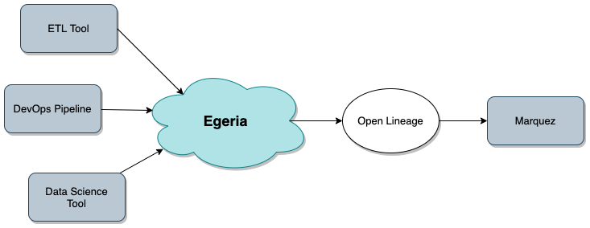
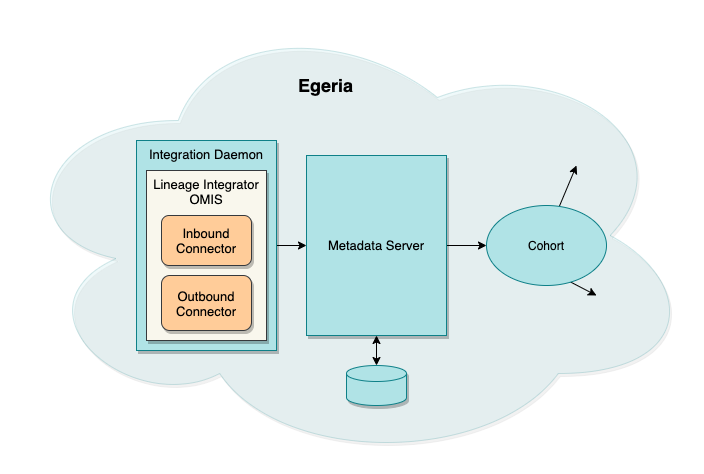

<!-- SPDX-License-Identifier: CC-BY-4.0 -->
<!-- Copyright Contributors to the ODPi Egeria project. -->

# Lineage

Lineage shows how data flows from its origins to its various destinations.
This includes details of the processing along the way.  It is used both to understand:
 
* whether the data used in reports and analytics models has come from the correct sources and has passed through
  the correct processing (traceability of data).
  
* what would be the impact on downstream processing and consumers if something was changed (impact analysis).

## The lineage graph

Lineage is typically envisaged as a graph showing processes interacting with different data stores.  
Some processes copy data from one store to another.  Other processes may retrieve data
from multiple stores and combine them to produce a new value that is stored in another store.
The result is that a logical flow of data emerges from the interaction. 

Figure 1 shows some examples of different types of processes and data stores.

On the left here is an Apache Spark job that reads from a file, looks up a value in an Apache Hive table,
makes a calculation and writes the results to an Apache Kafka topic.
On the right, an API is called that invokes a microservice.  The microservice updates a data store.
This data store is also loaded by an ETL job and any changes to it are copied to other stores via
a data replication service.  This second example illustrates that the data in the data store
may have come from two sources, either the API caller or the data sources used by the ETL job.

> **Figure 1:** Examples of processes

As the importance of lineage is understood, it is becoming common that individual technologies
provide a lineage view of their processing similar to figure 1.  This is very useful to the immediate users of that technology.
However from an enterprise perspective these technologies do not run in isolation.
Enterprises need to be able to link the lineage from these technologies together to to show how data flows from
its original sources to its ultimate destinations.

Figure 2 shows a flow of data through multiple technologies.  It begins with a Relational Database (RDB).
This is read by an ETL job that writes all or some of its contents to an Apache Hive table.
An Apache Spark job is initiated through an API that reads from the Apache Hive table
and invokes an Apache Airflow DAG (process) that writes the information into an Apache Avro file
and an event to an Apache Kafka topic. 

> **Figure 2:** The lineage graph emerges

You can also imagine that this flow is only a part of something much bigger.  For example,
what is responsible for maintaining the data in the relational database?  Which technologies are
consuming the events in the Apache Kafka topic.  Lineage graphs can get very large.

Figure 3 abstracts the example shown in figure 2.  From this you can see that the flow is not a simple
progression from left to right.  API calls can pass data in either direction for example. 

> **Figure 3:** The abstract lineage graph

There are also often systems that act as a hub, with many processes extracting data, performing processing and
then storing the results back into the same system.  Other stores act as a consolidation point, receiving
data from many systems and then distributing to multiple downstream stores.  So the graph also involves
loops and fan-in-fan-out structures.

## Lineage management

Figure 4 shows Egeria's architecture for lineage.  There are three parts to it:

* **Lineage capture** - through the [Integration Daemon](../../../open-metadata-implementation/admin-services/docs/concepts/integration-daemon.md)
and [Data Engine Proxy](../../../open-metadata-implementation/admin-services/docs/concepts/data-engine-proxy.md) servers,
metadata about data sources and the processing around them is captured and shared through
open metadata.

* **Stewardship** - the lineage information each of the technologies is linked together.
Where the naming of data sources and processes is consistent, this assembling of the
lineage graph is automatic.  However, experience shows that if it can be different, it will be different.
Many technologies make there own choices in naming and so governance action services along with
human stewardship is required to match and link the graph together.  The governance action
services run in the [Engine Host](../../../open-metadata-implementation/admin-services/docs/concepts/engine-host.md)
server.  They automatically add the relationships between the lineage contributions from each technology
which may need to be verified by a human steward.  The human steward may also add relationships where there is no
well known pattern that can be encoded in a governance action services.

* **Preservation and Use** - Once the lineage graphs are assembled, the lineage can be viewed an analysed.
This may be through standard open metadata queries.
Since the lineage data is large, lineage may also be automatically captured and stored in
the [Open Lineage Server](../../../open-metadata-implementation/admin-services/docs/concepts/open-lineage-server.md) server.
This captures and optimizes the lineage graphs for quick retrieval and analysis.
Its presence allows lineage data to be regularly archived
from the operational open metadata ecosystem.  This is particularly important in regulated industries
where lineage for critical reports may need to be kept for many years.

The three parts of the lineage architecture are summarized in figure 4.

> **Figure 4:** The lineage architecture showing the three phases of (1) lineage capture, 
(2) stewardship to stitch the lineage contributions together and finally (3) its preservation and use

## Open Lineage

[Open Lineage](https://github.com/OpenLineage/OpenLineage) is a sister open source project to Egeria that is also part of the
[LF AI and Data Foundation](https://lfaidata.foundation/).  It defines a standard for lineage produced by data processing
engine as well as a collection point for this lineage data.

Egeria has work in progress to capture lineage from any technology using the open lineage standard
Figure 5 shows Apache Airflow and Apache Spark producing open lineage events that are picked up
by Egeria and distributed to different tools and catalogs that are linked into the open metadata ecosystem.

> **Figure 5:** Inbound open lineage capture for distributing within the open metadata ecosystem

There are also other data catalogs, for example, [Marquez](https://marquezproject.github.io/marquez/)
another of Egeria's sister projects at the LF AI and Data, also listens for open lineage events.
Egeria's outbound open lineage support will publish lineage information that has been collected
via other lineage capture mechanisms to the open lineage consumers.  Thus, lineage information
passes both ways between the open lineage world and the open metadata ecosystem.

> **Figure 6:** Outbound open lineage distribution to other open lineage consumers

Figure 7 shows the open lineage integration connectors running in the
[Lineage Integrator OMIS](../../../open-metadata-implementation/integration-services/lineage-integrator)
within the Integration Daemon.

> **Figure 7:** Open lineage implementation showing the inbound and outbound integration connectors
hosted by the Lineage Integrator OMIS running in an Integration Daemon.

## Summary

Egeria's lineage support is comprehensive both in its capability and reach.
Since the lineage is an integral part of the open metadata type system, metadata captured
for lineage is useful for other purposes such as governance and quality management.
Similarly, metadata captured to support a data catalog becomes part of the lineage graph.

By using open metadata, metadata is captured once and used for many purposes.

## Further reading

* [Lineage representation](lineage-representation.md) using Open Metadata Types
* [File Lineage solution using Egeria](../solutions/file-lineage)

APIs for capturing lineage
* [Asset Manager Open Metadata Access Service (OMAS)](../../../open-metadata-implementation/access-services/asset-manager)
* [Open Metadata Integration Services (OMISs)](../../../open-metadata-implementation/integration-services)

APIs for retrieving lineage
* [Open Lineage Services](../../../open-metadata-implementation/governance-servers/open-lineage-services)
* [Asset Owner](../../../open-metadata-implementation/access-services/asset-owner) and
[Asset Consumer](../../../open-metadata-implementation/access-services/asset-consumer) through the
[Open Connector Framework (OCF)](../../../open-metadata-implementation/frameworks/open-connector-framework).

----
License: [CC BY 4.0](https://creativecommons.org/licenses/by/4.0/),
Copyright Contributors to the ODPi Egeria project.