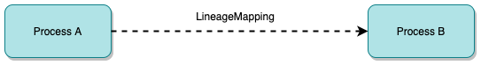
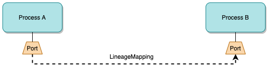
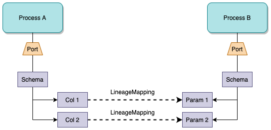

<!-- SPDX-License-Identifier: CC-BY-4.0 -->
<!-- Copyright Contributors to the ODPi Egeria project. -->

# Lineage

Lineage shows how data flows from its origins to its various destinations.
This includes details of the processing along the way.  It is used both to understand:
 
* whether the data used in reports and analytics models has come from the correct sources and has passed through
  the correct processing (traceability of data).
  
* what would be the impact on downstream processing and consumers if something was changed (impact analysis).

## The lineage graph

Lineage is typically envisaged as a graph showing processes interacting with different data stores.  
Figure 1 shows some examples of different types of processes and data stores.

> **Figure 1:** Examples of processes

Some processes copy data from one store to another.  Other processes may retrieve data
from multiple stores and combine them to produce a new value that is stored in another store.
The result is that a logical flow of data emerges from the interaction. 

> **Figure 2:** The lineage graph emerges

## Lineage Capture

Since there is no over-arching controller, lineage capture involves contributions from many
technologies that have to be stitched together to created the overall flow.

Each technology contributes what they know to open metadata
and the open metadata services stitch it together.  The stitching process is a mixture of automated matching and
human stewardship.  Consistency in naming and use of open metadata types increases the
effectiveness of the stitching process.

Figure 3 abstracts the example shown in figure 2.  From this you can see that the flow is not a simple
progression from left to right.  API calls can pass data in either direction for example. 

> **Figure 3:** The abstract lineage graph

There are also often systems that act as a hub, with many processes extracting data, performing processing and
then storing the results back into the same system.  Other stores act as a consolidation point, receiving
data from many systems and then distributing to multiple downstream stores.  So the graph also involves
loops and fan-in-fan-out structures.

## Lineage mapping

The [LineageMapping](../open-metadata-types/0770-Lineage-Mapping.md) relationship is used to link
metadata elements from one process/data store (collectively known as [Assets](../cataloging-assets)).

For critical processes, an organization may need to trace the journey of a particular data field
as it flows between processes and data stores.  For this to work, lineage needs to capture details of the inner
workings of processes as well the parameters of APIs and schemas of data stores.
However, not all technologies support this level of and so the lineage graph is often a mixture of
different levels of detail.

Figure 4 shows the lineage mapping between processes.
This shows the flow of control between processes but no details about the
processing inside the processes.

> **Figure 4:** Lineage mapping between processes

Figure 5 shows lineage mapping between ports on the processes.  This detail is useful for
more complex processes where different subsets of data fields are received and sent by the
process through different interfaces.

> **Figure 5:** Lineage mapping between ports

Figure 6 shows detailed mapping between data fields.  This level of lineage means that it is possible to
trace what is happening with specific data fields.

> **Figure 6:** Lineage mapping between the data fields

Figure 7 shows lineage across multiple technologies where the lineage mapping is done at different levels
of detail.

> **Figure 7:** Lineage mapping between the data fields

## Lineage capture for Dynamic landscapes

In some situations, particularly when working with files, there are data sources that only
have an existence for a short period of time.

When an asset is deleted from the open metadata repositories, all of its
relationships with other elements are also deleted.
This includes the lineage relationships.
So we do not want to delete the asset if it is needed for lineage.
Similarly if we just leave it unchanged, it suggests that there is a file in the landing area
which would be confusing to users of the catalog.

It is possible to move assets out of the
[governance zones](../../../open-metadata-implementation/access-services/docs/concepts/governance-zones) where
active users are working with assets.  This ensures the assets are no longer
visible to these users.  However it also means they are not visible for the lineage graph either.

There is an option to mark assets as deleted whilst sill keeping them in the
active governance zones.
This involves adding the [Memento](../open-metadata-types/0010-Base-Model.md) 
classification to the asset.  With this classification in place, the
asset is only returned on lineage queries.

The Memento classification is set in APIs such as the
`archiveDataFileInCatalog()` methods on the 
[Data Manager Open Metadata Access Service (OMAS)](../../../open-metadata-implementation/access-services/data-manager)
and
[Files Integrator Open Metadata Integration Service (OMIS)](../../../open-metadata-implementation/integration-services/files-integrator).

## Further reading

* [Modeling technology using open metadata types](../modelling-technology)
* [File Lineage solutions using Egeria](../solutions/file-lineage)

APIs for capturing lineage
* [Asset Manager Open Metadata Access Service (OMAS)](../../../open-metadata-implementation/access-services/asset-manager)
* [Lineage Integrator Open Metadata Integration Server (OMIS)](../../../open-metadata-implementation/integration-services/lineage-integrator)

APIs for retrieving lineage
* [Open Lineage Services](../../../open-metadata-implementation/governance-servers/open-lineage-services)

----
License: [CC BY 4.0](https://creativecommons.org/licenses/by/4.0/),
Copyright Contributors to the ODPi Egeria project.