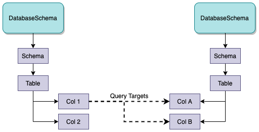
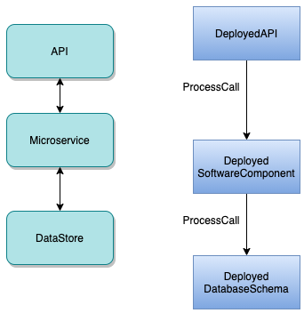
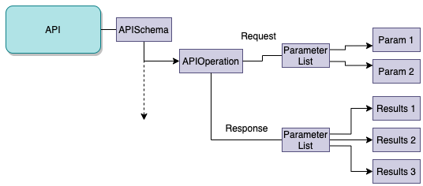

<!-- SPDX-License-Identifier: CC-BY-4.0 -->
<!-- Copyright Contributors to the ODPi Egeria project. -->

# Lineage Representation

[Lineage](.) shows the flow of data between different technologies.
When it is represented in open metadata, many of the metadata elements involved
describe the structure of the different technologies and the software components
that use them.  This can include relationships to other technologies that
a component depends on.  For example, Figure 1 shows the representation of
a derived column (Col 1) in a database with relationships to the columns in another
table (Col A and Col B) that contains the data used to calculate the values in the derived column.
Col A and Col B are called query targets and the relationships used to
link them to Col 1 are of type [DerivedSchemaTypeQueryTarget](../open-metadata-types/0512-Derived-Schema-Elements.md).

These query target relationships form part of the lineage for Col 1.

> **Figure 1:** Query Target relationships

Similarly if we consider an API that calls a microservice that retrieved data from a data store,
then the metadata that captures these relationships is part of the lineage of the API.

Figure 2 shows this API call stack on the left and the open metadata elements used to represent
then on the right.
[DeployedAPI](../open-metadata-types/0212-Deployed-APIs.md) represents the API,
[DeployedSoftwareComponent](../open-metadata-types/0215-Software-Components.md) represents the microservice and
[DeployedDatabaseSchema](../open-metadata-types/0224-Databases.md) represents the data store (assuming the data store is a database).

The [ProcessCall](../open-metadata-types/0750-Data-Passing.md) relationships that link them together
is part of the lineage for these components.

> **Figure 2:** API call hierarchy with metadata representation on the right hand side

These structural relationships are augmented by lineage mapping relationships that
connect the lineage graph together.

## Lineage mapping (stitching)

The [LineageMapping](../open-metadata-types/0770-Lineage-Mapping.md) relationship is used to:
* link metadata elements from one independent process/data store to another.
* Link schema elements that describe the structure of the data supported by these [assets](../cataloging-assets)
to show the corresponding flow of data items.

It can be used to show linkage between different levels of detail.

Figure 3 shows the lineage mapping between processes.
This shows the flow of control between processes but no details about the
processing inside the processes.

> **Figure 3:** Lineage mapping between processes

Figure 4 shows lineage mapping between ports on the processes.  This detail is useful for
more complex processes where different subsets of data fields are received and sent by the
process through different interfaces.

> **Figure 4:** Lineage mapping between ports

For critical processes, an organization may need to trace the journey of a particular data field
as it flows between processes and data stores.  For this to work, lineage needs to capture details of the inner
workings of processes as well the parameters of APIs and schemas of data stores.
However, not all technologies support this level of and so the lineage graph is often a mixture of
different levels of detail.

Figure 5 shows detailed mapping between data fields.  This level of lineage means that it is possible to
trace what is happening with specific data fields.

> **Figure 5:** Lineage mapping between the data fields

APIs can also be described to a detailed level where the data fields that flow
in the requests and responses are detailed out.  This is shown in figure 6.

> **Figure 6:** Full API specification showing the operations and the parameters and responses

Lineage mappings can then be added between the data fields as calls are made between APIs.
This is show in figure 7.

> **Figure 7:** Lineage mapping between the data fields

Figure 8 shows lineage across multiple technologies where the lineage mapping is done at different levels
of detail.

> **Figure 8:** Lineage mapping between the data fields

## Lineage representation for dynamic landscapes

In some situations, particularly when working with files, there are data sources that only
have an existence for a short period of time.

When an asset is deleted from the open metadata repositories, all of its
relationships with other elements are also deleted.
This includes the lineage relationships.
So we do not want to delete the asset if it is needed for lineage.
Similarly if we just leave it unchanged, it suggests that there is a file in the landing area
which would be confusing to users of the catalog.

It is possible to move assets out of the
[governance zones](../../../open-metadata-implementation/access-services/docs/concepts/governance-zones) where
active users are working with assets.  This ensures the assets are no longer
visible to these users.  However it also means they are not visible for the lineage graph either.

There is an option to mark assets as deleted whilst sill keeping them in the
active governance zones.
This involves adding the [Memento](../open-metadata-types/0010-Base-Model.md) 
classification to the asset.  With this classification in place, the
asset is only returned on lineage queries.

The **Memento** classification is set in APIs such as the
`archiveDataFileInCatalog()` methods on the 
[Data Manager Open Metadata Access Service (OMAS)](../../../open-metadata-implementation/access-services/data-manager)
and
[Files Integrator Open Metadata Integration Service (OMIS)](../../../open-metadata-implementation/integration-services/files-integrator).

## Further reading

* [Modeling technology using open metadata types](../modelling-technology)

APIs for capturing lineage
* [Asset Manager Open Metadata Access Service (OMAS)](../../../open-metadata-implementation/access-services/asset-manager)
* [Lineage Integrator Open Metadata Integration Server (OMIS)](../../../open-metadata-implementation/integration-services/lineage-integrator)

APIs for retrieving lineage
* [Open Lineage Services](../../../open-metadata-implementation/governance-servers/open-lineage-services)

----
License: [CC BY 4.0](https://creativecommons.org/licenses/by/4.0/),
Copyright Contributors to the ODPi Egeria project.