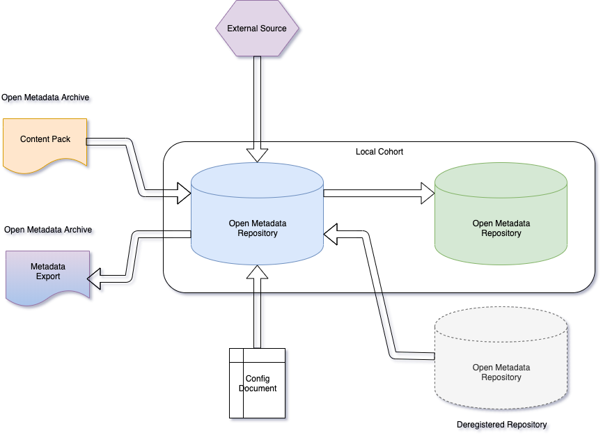

<!-- SPDX-License-Identifier: CC-BY-4.0 -->
<!-- Copyright Contributors to the ODPi Egeria project 2020. -->

# Metadata Provenance

The open metadata ecosystem draws together metadata from many sources.
Metadata provenance provides information about where metadata has come from
and how it can be maintained (that is updated and deleted).

## Metadata Collections

The metadata that a specific technology instance creates and maintains is collectively
referred to as a **metadata collection**.  Each metadata collection has a unique
identifier, called the **metadata collection id** and an optional **metadata collection name**.
When metadata from the collection is shared with the broader open metadata ecosystem,
it includes the metadata collection id and metadata collection name in its header along with
a category name that describes how the metadata was introduced into the open metadata ecosystem.
This category name is called the **Instance Provenance Type** by the
[Open Metadata Repository Services (OMRS)](../../../open-metadata-implementation/repository-services)
and **Element Origin** by the 
[Open Connector Framework (OCF)](../../../open-metadata-implementation/frameworks/open-connector-framework)
and most of the [Open Metadata Access Services (OMASs)](../../../open-metadata-implementation/access-services).
We will use "Element Origin" for the rest of this description since it is the most commonly used name.

Figure 1 shows the different values of Element Origin and how they tie into the mechanism used to
introduce the metadata to the open metadata ecosystem.

> **Figure 1:** What the different values of Element Origin say about the source of metadata

* **Local Cohort** means that the metadata collection comes from a member of one of the
  open metadata repository cohorts that the local server is a member of.  The owning
  cohort member will maintain the metadata and distribute any changes to the other cohort members.
  The metadata collection id and name is set up in the 
  [configuration of the cohort member's OMAG Server](../../../open-metadata-implementation/admin-services/docs/user/configuring-the-local-repository.md).
  
* **Deregistered Repository** means that the metadata collection is owned by a server that used to
  be a member of one of the cohorts that the local server belongs too but is has deregistered from the
  cohort.  This means it is no longer sending updates to the rest of the cohort.  Its metadata is
  still visible because **reference copies** (read only copies) have been kept by the other members.
  There are two routes to making this metadata maintainable again:
     * Connect the original repository back into the cohort.
     * If the original repository has gone forever, re-home the metadata so that it is owned by
       a current active member.
       
* **External Source** means the metadata is managed through an
  [Open Metadata Access Service (OMAS)](../../../open-metadata-implementation/access-services). 
  Typically, the OMAS is called via an 
  [Open Metadata Integration Service (OMIS)](../../../open-metadata-implementation/integration-services) running in an
  [Integration Daemon](../../../open-metadata-implementation/admin-services/docs/concepts/integration-daemon.md).
  The metadata collection id and name is defined in Open Metadata as the
  [unique identifier, or GUID,](../basic-concepts/guid.md) and 
  [unique name, or qualified name,](../../../open-metadata-implementation/access-services/docs/concepts/referenceable.md)
  of a
  [Software Server Capability](../../../open-metadata-implementation/access-services/docs/concepts/server-capabilities)
  representing the source technology.
  
* **Configuration** means the metadata comes from a [Configuration Document](../../../open-metadata-implementation/admin-services/docs/concepts/configuration-document.md). 
  Configuration documents control the capabilities of an [OMAG Server](../../../open-metadata-implementation/admin-services/docs/concepts/omag-server.md).
  This metadata is maintained through Egeria's [Administration Services](../../../open-metadata-implementation/admin-services/docs/user)
  
* **Content Pack** means the metadata comes from an open metadata archive that contains a collection of standard
  definitions.  Content packs could contain glossaries, reference data sets, definitions from regulations and
  other types of standards. The archive documents the metadata collection id and name for the collection.
  In addition, a content pack is used to define [Open Metadata Types](../open-metadata-types).
  The metadata from a content pack can be updated by loading a later version of the content pack.
  Updated instances and types are replaced by the newer versions.
  
* **Metadata Export** is also content from an open metadata archive.  However, it has been exported from a
  repository that has never been a member of the open metadata repository cohorts.  It typically describes
  assets that are being imported from a third party (such as a business partner) that is also providing the
  accompanying metadata. 
  Just as with content packs, this metadata is updated by loading a newer version of the metadata export archive.
  
## Further Information

* Find out more about [membership of a cohort](../../../open-metadata-implementation/admin-services/docs/concepts/cohort-member.md).
* Learn about how [external sources can integrate with the open metadata ecosystem](../../../open-metadata-implementation/admin-services/docs/concepts/integration-daemon.md).
* Set up [metadata solutions that integrate metadata from many sources](../solutions).
* Create and load [Open Metadata Archives](../../../open-metadata-resources/open-metadata-archives) into your open metadata ecosystem.
* Learn about [Configuration Documents](../../../open-metadata-implementation/admin-services/docs/concepts/configuration-document.md)
  and how to set them up.

----
* Return to [Home Page](../../../index.md)
* Return to [Open Metadata Glossary](../open-metadata-glossary.md)

----
License: [CC BY 4.0](https://creativecommons.org/licenses/by/4.0/),
Copyright Contributors to the ODPi Egeria project.