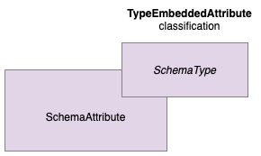
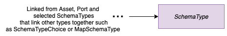

<!-- SPDX-License-Identifier: CC-BY-4.0 -->
<!-- Copyright Contributors to the Egeria project. -->

# Modelling Schemas

A schema describes the structure of the data associated with an [Asset](../cataloging-assets).
The technology that supports the asset often limits the structural choices for data.
For example:
 * A relational database organizes data into collections of tables and columns.
 * Technologies such as JSON or XML, organizes data into nested structures.
 * Graph databases organizes data in nodes and relationships.

These differences need to be represented in the Open Metadata Types.  However, at the same time,
data governance is concerned with the accuracy and appropriate use of individual data values.
This is very expensive if each data item was governed individually so the data governance practices aim to group
like data together so it can governed in a consistent way.  As such, the open metadata types
provide a root set of types that all the specific schema structures inherit from.
The schema root type is called [Schema Element](../open-metadata-types/0501-Schema-Elements.md)
which is then dividing into a **Schema Attribute** (think of this as a variable) and a **Schema Type**.
The schema type describes the structure of the data associated with the schema attribute.

In the early versions of Egeria, the schema attribute and the schema type were represented as
as two separate entities in the open metadata types with a **SchemaTypeForAttribute** relationship to connect them together.
This is shown in figure 1.

> **Figure 1:** Original model for SchemaAttribute and its SchemaType

However, it became obvious that since these two elements need to retrieved together, it is much more
more efficient if the schema type is represented as a classification for the SchemaAttribute since
classifications are typically stored, distributed and retrieved with their entity.
The new classification is called **TypeEmbeddedAttribute** and it contains all of the properties found in
the schema types plus a **typeName** property to identify the corresponding schema type.

Figure 2 shows the new types for representing a schema attribute and its type.

> **Figure 2:** Collapsing SchemaAttribute and SchemaType into an entity with a classification

Schema type entities are still used:
* to connect [Assets](../open-metadata-types/0503-Asset-Schema.md) and [Ports](../open-metadata-types/0520-Process-Schemas.md) to their schemas
* to connect structural schema types such as [maps](../open-metadata-types/0511-Map-Schema-Elements.md)
and [external schemas](../open-metadata-types/0507-External-Schema-Type.md) to other types that represent their contents.

Figure 3 shows the use of the schema type:

> **Figure 3:** The SchemaType is still used as the top level element in a schema and for complex structures

## Specific SchemaTypes

The root SchemaType and SchemaAttribute are specialized to support different structures.
The diagrams show how the structure is represented for a SchemaAttribute on the left and
how it is represented as a SchemaType on the right.

### Primitives

Primitives are single values such a string, characters and numbers.
They are represented by the [PrimitiveSchemaType](../open-metadata-types/0501-Schema-Elements.md).

> **Figure 4:** The PrimitiveSchemaType

### Literals (Constants)

Literals are fixed values, also known as **constants**.
They are represented by the [LiteralSchemaType](../open-metadata-types/0501-Schema-Elements.md).

> **Figure 5:** The LiteralSchemaType

### Enumerations

Enumerations (Enums) define a list of valid values.  The valid values are recorded in a
[ValidValuesSet](../open-metadata-types/0545-Reference-Data.md) linked to an
[EnumSchemaType](../open-metadata-types/0501-Schema-Elements.md).

> **Figure 6:** The EnumSchemaType

### Linking to a standard schema type

External schema types link to a schema type that is reused in multiple assets - typically it is
part of a standard.  The use of an external schema type is represented by an
[ExternalSchemaType](../open-metadata-types/0507-External-Schema-Type.md).

> **Figure 7:** The ExternalSchemaType

### Maps

Maps show how one set of values link to another.  They are often used for look up tables.  The map is
represented by a
[MapSchemaType](../open-metadata-types/0511-Map-Schema-Elements.md) that then links to two other SchemaTypes,
one for the type of the starting value and the other for the type of value it is mapped to.

> **Figure 8:** The MapSchemaType

### Alternative types

In some schemas, it is possible that there are multiple choices for the type of an element.
This is supported by the [SchemaTypeChoice](../open-metadata-types/0501-Schema-Elements.md).
This links to the options for the SchemaType.

> **Figure 9:** The SchemaTypeChoice

### Structures or Records

It is common for an attribute to consist of a collection of other values.  For example
an attribute called employee may consist of multiple values from employee number, name, address, department, ....
These types of attribute are represented by the [StructSchemaType](../open-metadata-types/0505-Schema-Attributes.md).

> **Figure 10:** The StructSchemaType

The relationship between the schema attribute and its nested schema attributes is **NestedSchemaAttribute**.
The relationship between the StructSchemaType and its nested schema attributes is **AttributeForSchema**.

## Related Information

Open Metadata types for connecting schemas to other types of elements:

* **[0503 Asset Schema](../open-metadata-types/0503-Asset-Schema.md)** - for the relationship between an Asset and
its top level SchemaType.
* **[0520 Process Schemas](../open-metadata-types/0520-Process-Schemas.md)** - showing how a schema type can be attached to a process port.

Open Metadata Types for different types of data structures:

* **[0501 Schema Elements](../open-metadata-types/0501-Schema-Elements.md)** - for SchemaElement, SchemaType,
PrimitiveSchemaType, LiteralSchemaType, EnumSchemaType and SchemaTypeChoice.
* **[0505 Schema Attributes](../open-metadata-types/0505-Schema-Attributes.md)** - for SchemaAttribute, ComplexSchemaType,
StructSchemaType.
* **[0507 External Schema Types](../open-metadata-types/0507-External-Schema-Type.md)** - for ExternalSchemaType.
* **[0511 Map Schema Element](../open-metadata-types/0511-Map-Schema-Elements.md)** - for MapSchemaType.
* **[0512 Derived Schema Elements](../open-metadata-types/0512-Derived-Schema-Elements.md)** for DerivedSchemaTypeQueryTarget

Specializations of the main types of schema structures for particular types of technology.
They are used to enable retrieval of technology-specific schema elements.
For example, a query for relational columns with a particular characteristic.

* **[0530 Tabular Schema](../open-metadata-types/0530-Tabular-Schemas.md)** - for TabularSchemaType and TabularColumn.
* **[0531 Document Schemas](../open-metadata-types/0531-Document-Schemas.md)** - for DocumentSchemaType and DocumentSchemaAttribute.
* **[0532 Object Schemas]( ../open-metadata-types/0532-Object-Schemas.md)** - for ObjectSchemaType and ObjectAttribute.
* **[0533 Graph Schema](../open-metadata-types/0533-Graph-Schemas.md)** - for types associated with graph stores.
* **[0534 Relational Schema](../open-metadata-types/0534-Relational-Schemas.md)** for types associated with relational data
* **[0535 Event Schema](../open-metadata-types/0535-Event-Schemas.md)** - for EventTypeList, EventType and EventSchemaAttribute.
* **[0536 API Schemas](../open-metadata-types/0536-API-Schemas.md)** - for types associated with APIs.

APIs that support the definition of schemas:

* [Asset Owner OMAS](../../../open-metadata-implementation/access-services/asset-owner)
* [Asset Manager OMAS](../../../open-metadata-implementation/access-services/asset-manager)
* [Data Manager OMAS](../../../open-metadata-implementation/access-services/data-manager)
* [Governance Engine OMAS](../../../open-metadata-implementation/access-services/governance-engine)
* [Database Integrator OMIS](../../../open-metadata-implementation/integration-services/database-integrator)
* [Files Integrator OMIS](../../../open-metadata-implementation/integration-services/files-integrator)
* [API Integrator OMIS](../../../open-metadata-implementation/integration-services/api-integrator)
* [Topic Integrator OMIS](../../../open-metadata-implementation/integration-services/topic-integrator)
* [Governance Action OMES](../../../open-metadata-implementation/engine-services/governance-action)

Other types of information associated with an Asset:

* [The contents of an asset catalog](../cataloging-assets/asset-catalog-contents.md)

----

* Return to [Modelling Technology](.)

----
License: [CC BY 4.0](https://creativecommons.org/licenses/by/4.0/),
Copyright Contributors to the Egeria project.