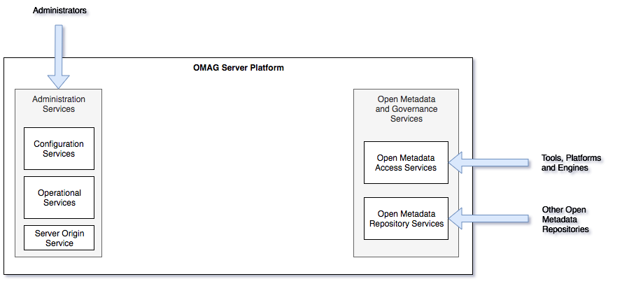
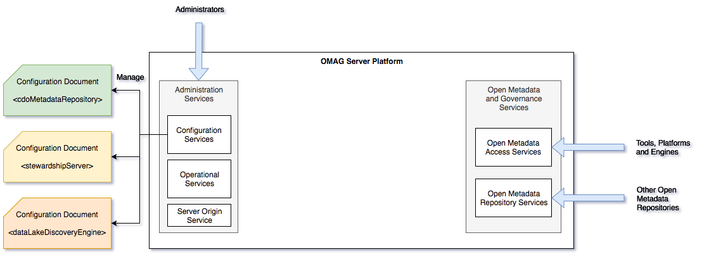
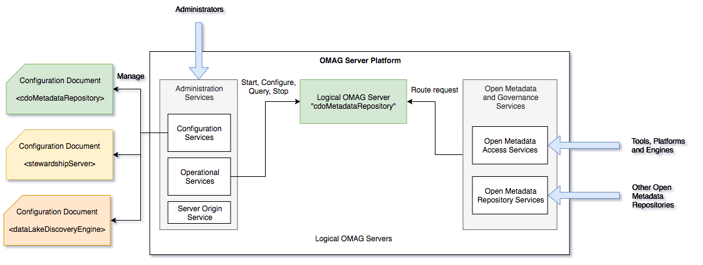
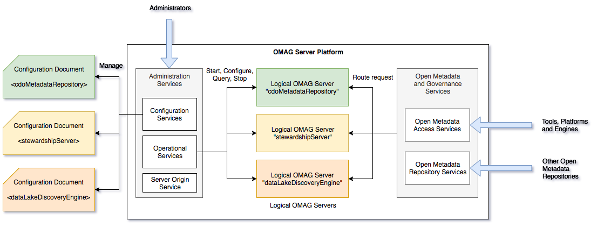

<!-- SPDX-License-Identifier: CC-BY-4.0 -->
<!-- Copyright Contributors to the ODPi Egeria project. -->

# Inside the Open Metadata and Governance (OMAG) Server Platform

The **OMAG server platform** provides the server environment for running open metadata
and governance services.  It hosts one or more **[OMAG servers](omag-server.md)**.  Each server is configured to support specific
open metadata and governance services.  Thus each server performance a specific role in an deployment landscape.

The OMAG server platform is included in the [ODPi Egeria Distribution TAR file](../../../open-metadata-distribution/open-metadata-assemblies)
which can be installed on your machine by following the [Installing ODPi Egeria Tutorial](../../../open-metadata-resources/open-metadata-tutorials/building-egeria-tutorial/task-installing-egeria.md).

The OMAG server platform supports four broad groups of services:

* **Server Origin Service** - used to determine the type and level of the OMAG server platform.
* **Platform Services** - used to determine the servers and their services running on the platform.
* **Administration Services** - used to configure and manage the OMAG servers running inside the OMAG server platform.
* **Open Metadata and Governance Services** - used to work with metadata and govern the assets of an organization.

Figure 1 shows the OMAG server platform when it first starts up.

> Figure 1: OMAG server platform at start up

The server origin service  is operational at this point.  It can be used by operational scripts to determine if the 
OMAG server platform is still running.

The administration services are active at this point, while the open metadata and governance services
will return an error if called since there are no [OMAG servers](../../../open-metadata-implementation/admin-services/docs/concepts/logical-omag-server.md) running.

The configuration services are used to create [configuration documents](../../../open-metadata-implementation/admin-services/docs/concepts/configuration-document.md).  Each configuration document
describes the open metadata and governance services that should be activated in a OMAG server.

Figure 2 shows the configuration services creating three configuration documents:
* one for the **cdoMetadataRepository** OMAG server
* one for the **stewardshipServer** OMAG Server
* one for the **dataLakeDiscoveryEngine** OMAG Server

> Figure 2: Creating configuration documents for OMAG Servers

The [Administration Services User Guide](../../../open-metadata-implementation/admin-services/docs/user)
provides detailed instructions on creating configuration documents.

Once a configuration document for an OMAG server is used by
the operational services initialize the requested services in the OMAG server.
The OMAG server can be started in any OMAG server platform.
It does not have to be the same OMAG server platform that created the configuration document.

Figure 3 shows an OMAG server platform with the **cdoMetadataRepository** local OMAG server
running.

> Figure 3: Starting a OMAG Server through the operational services

Once the OMAG server has initialized successfully, the open metadata and governance services
can route requests to it.

An OMAG server platform can run multiple OMAG servers at one time.  Figure 4 shows an OMAG server platform
running multiple servers.

> Figure 4: An OMAG server platform running multiple OMAG servers

----
License: [CC BY 4.0](https://creativecommons.org/licenses/by/4.0/),
Copyright Contributors to the ODPi Egeria project.
