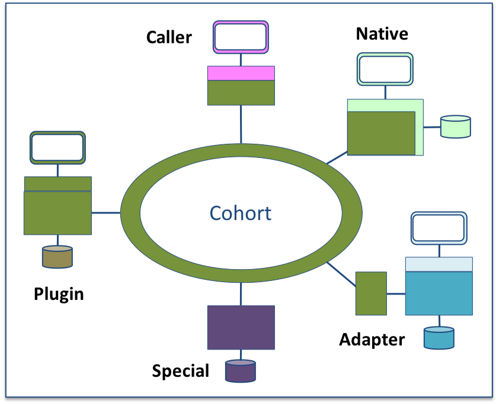

<!-- SPDX-License-Identifier: CC-BY-4.0 -->
<!-- Copyright Contributors to the ODPi Egeria project. -->

# Open Metadata Integration Patterns

Figure 1 shows the different options for integrating an existing (or new) metadata tool/engine/repository into the open metadata and governance ecosystem.
There are five standard patterns:

> Figure 1: open metadata integration patterns

* **[Caller](caller-integration-pattern.md)** - in the Caller pattern, a tool, engine or data management platform integrates with the open metadata and governance ecosystem through the [Open Metadata Access Services (OMASs)](../../../open-metadata-implementation/access-services/README.md).  These APIs and notification services are each specialized for a particular type of consumer.  The integration team selects the appropriate OMAS to use and builds calls to it.  The metadata it creates, stores and consumes is managed in a metadata repository provided by another "product" through the Open Metadata Repository Services (OMRS) [metadata highway](../../../open-metadata-implementation/repository-services/docs/metadata-highway.md).
* **[Native](native-integration-pattern.md)** - in the Native pattern, the tool, engine or data management platform embraces the open metadata and governance APIs natively in its stack.  Its user interfaces (UIs) integrate with the OMAS APIs and it supports the OMRS REST APIs for the connector and the OMRS Event protocols plus its metadata types are based around the open metadata types.  The [Apache Atlas Server](https://cwiki.apache.org/confluence/display/ATLAS/Open+Metadata+and+Governance) supports this pattern.
* **[Adapter](adapter-integration-pattern.md)** - in the Adapter pattern the tool, engine or data management platform already has its own proprietary metadata repository and APIs.  The investment level and adoption is high enough to make replacing them undesirable, so instead, adapter logic is created to map between the proprietary formats and interfaces and the open metadata and governance formats and interfaces.  This mapping is codes into components that run in the Open Metadata Repository Services (OMRS) and building them into a Repository Proxy.  The architecture of the OMRS is designed to minimize the adapter code that is necessary.
* **[Plug-in](plug-in-integration-pattern.md)** - in the Plug-in pattern, the tool, engine or data management platform needs to introduce its function into the open metadata and governance call path.  In this case it needs to implement components that integrate into the open frameworks associated with open metadata and governance.  These are the Open Connector Framework (OCF), the Open Discovery Framework (ODF) and the Governance Action Framework (GAF).
* **[Special](special-integration-pattern.md)** - in the Special pattern, the tool, engine or data management platform implements its own version of the OMRS and OMASs.  This pattern should only be used if it is impossible to use one of the other patterns because it creates an additional test burden on the rest of the Egeria community.