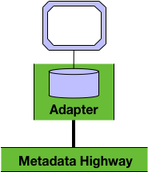
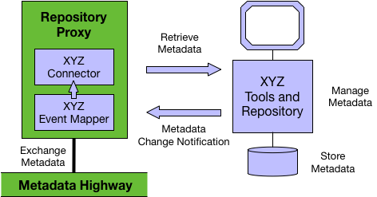

<!-- SPDX-License-Identifier: CC-BY-4.0 -->
<!-- Copyright Contributors to the ODPi Egeria project. -->

# Adapter Integration Pattern

The **Adapter** integration pattern enables existing metadata
repositories and their tool sets to integrate into the open
metadata ecosystem without needing to embed the Egeria
libraries into their servers.

This pattern involves the development of the
[metadata collection connectors](../../../open-metadata-implementation/adapters/open-connectors/repository-services-connectors/open-metadata-collection-store-connectors/README.md) that map between the proprietary metadata formats
and the open metadata formats plus manage notifications around
the activity occurring with the metadata repository.
These connectors are hosted in a special Egeria server
called the **repository proxy**.

A metadata repository needs the following capabilities to support
the adapter pattern:

* A remotely callable interface (API) that allows metadata to be queried, created, updated and deleted.
* The generation of event notifications whenever metadata changes in the metadata repository.

The API is wrapped in an **OMRS Repository Connector** implementation
that maps open metadata repository service calls to the API of
the metadata repository.   
The event notifications are captured and mapped
into calls back to the OMRS by an **OMRS Repository Event Mapper Connector**.
The OMRS then publishes the resulting OMRS Events to the other metadata
repositories in the cohort and to the registered OMASs.

Figure 1 shows the adapter pattern in operation for a fictitious metadata
product called **XYZ**.  
Its OMRS Repository Connector and Event Mapper Connector are running in a Repository Proxy.  The repository proxy manages the OMRS Connector and Event Mapper and ensures they are called at appropriate times.

> Figure 1: High level operation of the adapter pattern

The development steps to implement the Adapter integration pattern are:

* Determine the mapping between your metadata repository and the [open metadata types](../open-metadata-types/README.md).
* Create the [metadata collection connectors](../../../open-metadata-implementation/adapters/open-connectors/repository-services-connectors/open-metadata-collection-store-connectors/README.md) that map between the proprietary metadata formats.
* Package the connectors and appropriate admin services into a repository proxy server.  
  
There are two examples of this integration pattern implemented in Egeria.

* An integration for the [IBM Information Governance Catalog](https://github.com/odpi/egeria-connector-ibm-information-server).
* An integration for [Apache Atlas](https://github.com/odpi/egeria-connector-apache-atlas)

More information on running a repository proxy can be found in the
[Administration Services Documentation](../../../open-metadata-implementation/admin-services/docs/concepts/repository-proxy.md).

----
License: [CC BY 4.0](https://creativecommons.org/licenses/by/4.0/),
Copyright Contributors to the ODPi Egeria project.