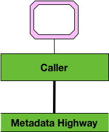
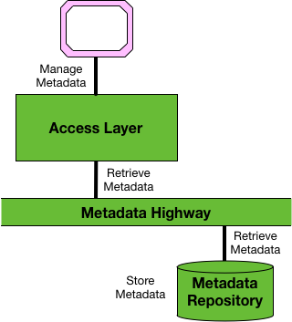

<!-- SPDX-License-Identifier: CC-BY-4.0 -->
<!-- Copyright Contributors to the ODPi Egeria project. -->

# Caller Integration Pattern

The **Caller** integration pattern supports tools,
data management and governance engines and applications that
need to use metadata as part of their operation but do not
want the overhead of managing a private metadata repository.

Egeria provides a set of services that are each specialized for a
particular type of consumer.
These services are called the
[Open Metadata Access Services (OMASs)](../../../open-metadata-implementation/access-services/README.md).  They include Java and REST APIs plus messaging interfaces for asynchronous integration.

To use the caller integration pattern, go to the list of OMASs and select the one that makes the most sense for your use case and code calls to the OMAS from your tool, engine, data platform and/or application.

Note: The Open Metadata and Governance Client Package provides Java classes for using both the call or the messaging interfaces.

> Figure 1: using the caller integration pattern

Figure 1 shows the caller pattern in operation.  The metadata tools connect to an open metadata and governance server that has the access layer enabled.  This access layer implements the OMASs.

The [Open Metadata Repository Services (OMRS)](../../../open-metadata-implementation/repository-services/README.md) manages the calls to the metadata highway to retrieve and update metadata from remote metadata repositories connected to the metadata highway.

----
License: [CC BY 4.0](https://creativecommons.org/licenses/by/4.0/),
Copyright Contributors to the ODPi Egeria project.