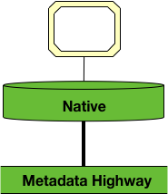
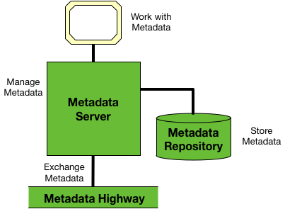

<!-- SPDX-License-Identifier: CC-BY-4.0 -->
<!-- Copyright Contributors to the ODPi Egeria project. -->

# Native Integration Pattern

In the **Native** integration pattern, the tool, engine or data
management platform embraces the full Egeria stack
as a result, all of its APIs and integration points use the
native open metadata and governance interfaces.

> Figure 1: using the native integration

----
License: [CC BY 4.0](https://creativecommons.org/licenses/by/4.0/),
Copyright Contributors to the ODPi Egeria project.
