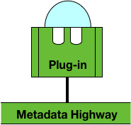
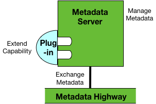
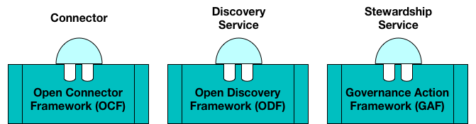
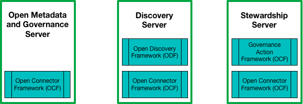

<!-- SPDX-License-Identifier: CC-BY-4.0 -->
<!-- Copyright Contributors to the Egeria project. -->

# Plugin Integration Pattern

The Plug-in Integration Pattern is supported through the open metadata frameworks:

* **[Open Connector Framework (OCF)](../../../open-metadata-implementation/frameworks/open-connector-framework/README.md)** - connecting to data sources and related assets
* **[Open Discovery Framework (ODF)](../../../open-metadata-implementation/frameworks/open-discovery-framework/README.md)** - discovering new metadata
* **[Governance Action Framework (GAF)](../../../open-metadata-implementation/frameworks/governance-action-framework/README.md)** - governing the operational environment

Each framework supports specific types of components that can be provided by third parties as well as Apache Atlas developers.

Figure 1 shows a plug-in component loaded into a server.  The frameworks ensure the plug-in's are called at the appropriate points in the server's operation.
	

> Figure 1: The Plug-in Pattern in action

Figure 2 shows the types of plug-in components supported by each framework.	

> Figure 2: The frameworks and plug-in types

Figure 3 shows which frameworks are available in each server.

> Figure 3: The frameworks in the servers