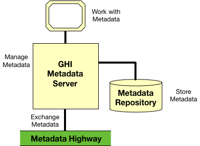

<!-- SPDX-License-Identifier: CC-BY-4.0 -->
<!-- Copyright Contributors to the Egeria project. -->

# Special Integration Pattern

In Figure 1, the fictitious product GHI has build its own server
implementation that supports the
Open Metadata Repository Services (OMRS).

> Figure 1: using the special integration pattern