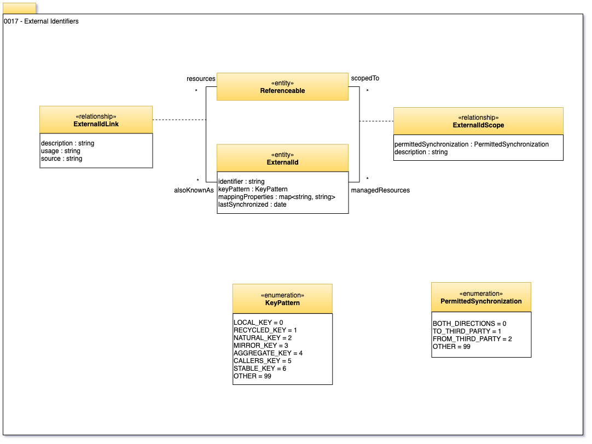

<!-- SPDX-License-Identifier: CC-BY-4.0 -->
<!-- Copyright Contributors to the Egeria project. -->

# 0017 External Identifiers

External Identifiers are identifiers for a Referenceable that are used in external systems.

They are used to correlate information from these other systems with the open metadata.