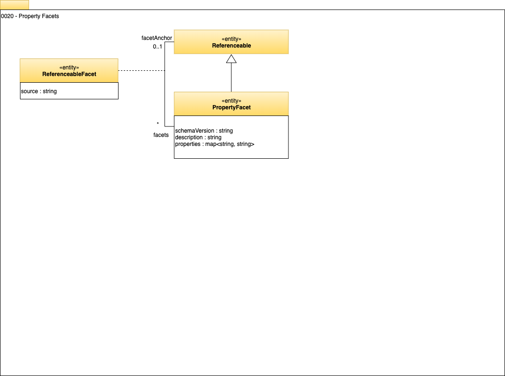

<!-- SPDX-License-Identifier: CC-BY-4.0 -->
<!-- Copyright Contributors to the Egeria project. -->

# 0020 Property Facets

Property facets allow any entity to be extended with additional properties.
This is particularly useful for storing metadata that originated in another type of metadata repository or tool, since it allows vendor-/tool-specific values to be stored.

