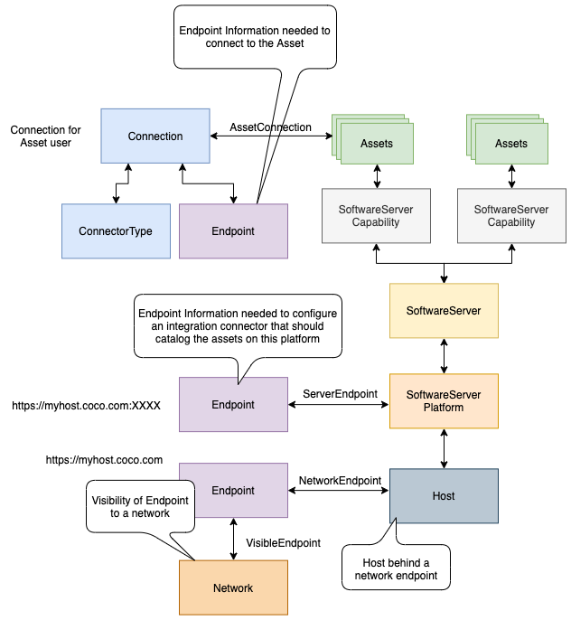

<!-- SPDX-License-Identifier: CC-BY-4.0 -->
<!-- Copyright Contributors to the ODPi Egeria project. -->

# 0026 Endpoints

Endpoints capture the network information needed to connect to a service.
There is a wide variety of approaches to identifying the endpoint and so
its properties will depend on how it is being used.

Endpoints are part of a [Connection](0201-Connectors-and-Connections.md).
The connection provides the information to create an instance of a connector that is accessing a remote asset.
In this situation the **networkAddress** is set up the the URL needed to connect to the specific asset.

Endpoints can also be linked to infrastructure elements using the **ServerEndpoint**
relationship to document their network address(s).  These are often the values needed in the
connection objects configured for [Integration Connectors](../../../open-metadata-implementation/governance-servers/integration-daemon-services/docs/integration-connector.md)
running in an [Integration Daemon](../../../open-metadata-implementation/admin-services/docs/concepts/integration-daemon.md)
and so the endpoint can be looked up either as the integration connector is being configured, or dynamically when the
integration connector is running.

The following picture illustrates the different uses of Endpoint.  The top of the page
shows the endpoint as part of a connection object used to create a connector to the
real resource described by the Assets shown in green.

In the middle is an Endpoint tied to a [SoftwareServerPlatform](0037-Software-Server-Platforms.md)
that is hosting assets.  This endpoint can be queried when configuring integration connectors
that are to connect to the platform and catalog 
the resources (assets) it is hosting.

Finally the **VisibleEndpoint** and **NetworkEndpoint** relationships shown at the bottom of the
help to document the visibility of an endpoint to a particular network and the host behind it.
These relationships are described in model [0070 Networks and Gateways](0070-Networks-and-Gateways.md).

----

* Return to [Area 0](Area-0-models.md).
* Return to [Overview](.).

----
License: [CC BY 4.0](https://creativecommons.org/licenses/by/4.0/),
Copyright Contributors to the ODPi Egeria project.