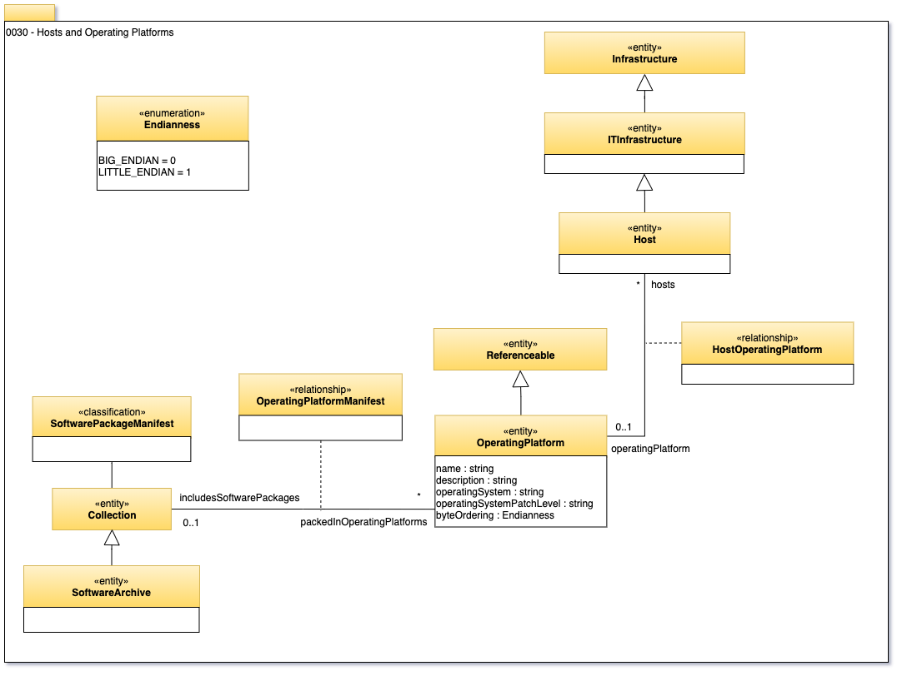

<!-- SPDX-License-Identifier: Apache-2.0 -->

# 0030 Hosts and Platforms

The host and platform metadata entities provide a simple model for the
IT infrastructure (nodes, computers, etc) that data resources are hosted on.

A Host is an IT Infrastructure concept associated with the hardware running the systems.
It provides a mechanism for describing a unit of hardware that provides the ability to host software servers.

The host can be linked to its location through the HostLocation relationship.

The operating platform is an informational structure to describe the
operating system of the host.
Many hosts could have the same operating platform.