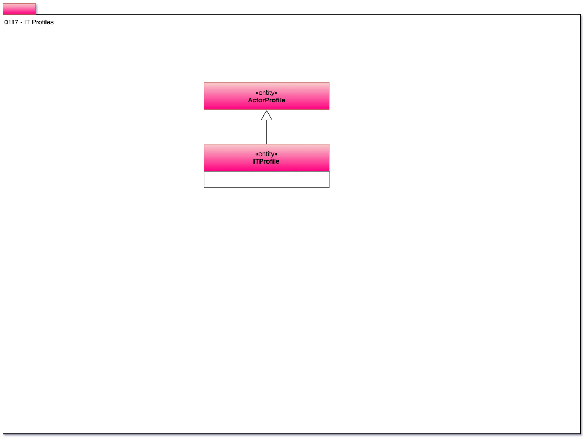

<!-- SPDX-License-Identifier: CC-BY-4.0 -->
<!-- Copyright Contributors to the ODPi Egeria project. -->

# 0117 IT Profiles

Often [engines](../../../open-metadata-implementation/access-services/docs/concepts/server-capabilities/engine.md)
and other IT infrastructure
run as background processes with their own user identity.
The ability to create an IT profile helps to identify which engine is responsible for specific
metadata content.

Figure 1 captures the IT profile.

> Figure 1: Describing an engine's user identities

----
License: [CC BY 4.0](https://creativecommons.org/licenses/by/4.0/),
Copyright Contributors to the ODPi Egeria project.