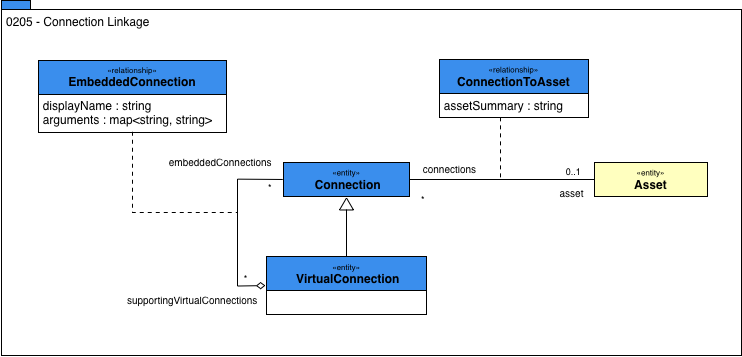

<!-- SPDX-License-Identifier: CC-BY-4.0 -->
<!-- Copyright Contributors to the ODPi Egeria project. -->

# 0205 Connection Linkage

The purpose of a [connector](../../../open-metadata-implementation/frameworks/open-connector-framework/docs/connector.md)
is to access the content and related properties (metadata) about an
[Asset](../assets/README.md) owned or used by an organization.

In order for the connector to provide details of the know properties of an Asset, the open metadata
types support a relationship between a [Connection](../../../open-metadata-implementation/frameworks/open-connector-framework/docs/connection.md) and
the Asset.

Notice that the connection can only be associated with one asset, although an Asset may support multiple
connections, each providing a different class of service, or security permissions to the consumer.

In addition, some connectors are virtual connectors - by that we mean they implement an abstraction to a business level asset
and internally use one of more technical connectors as part of their implementation.
The metadata repository can reflect these connection relationships using a **VirtualConnection**.

----
License: [CC BY 4.0](https://creativecommons.org/licenses/by/4.0/),
Copyright Contributors to the ODPi Egeria project.
 