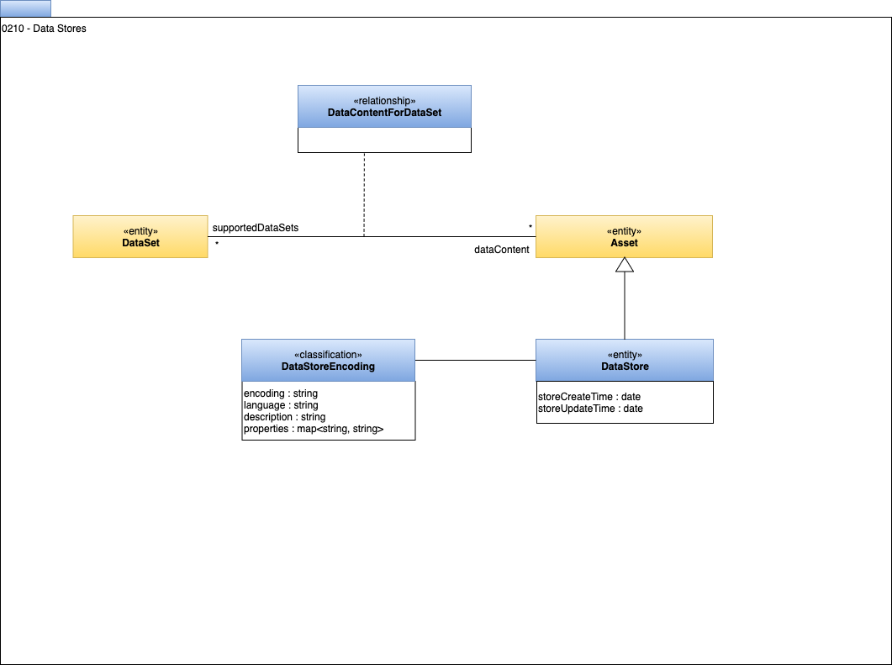

<!-- SPDX-License-Identifier: CC-BY-4.0 -->
<!-- Copyright Contributors to the Egeria project. -->

# 0210 Data Stores

The [base model](0010-Base-Model.md) introduced the concept of a data set (**DataSet**).
The data store definition shows how the data set relates to the server that it is hosted on.

